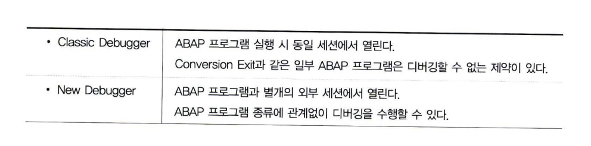
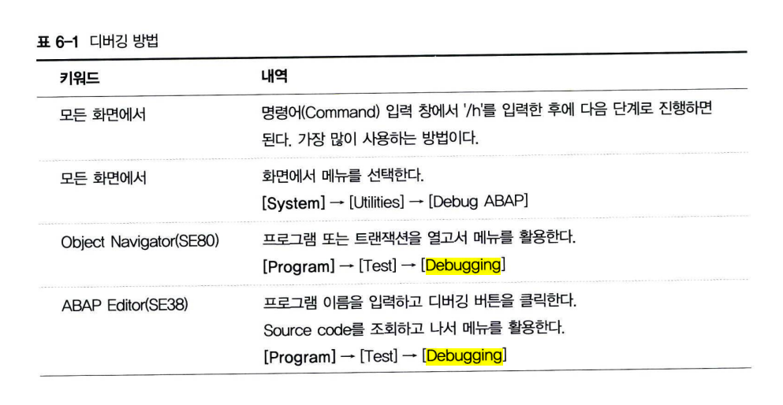
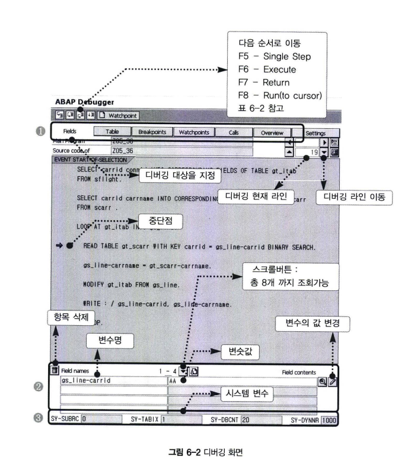

# Classic Debugger
## 1 디버깅
디버깅의 버그는 벌레르 뜻하며, 디버그는 '해충을 잡다'. 라는 뜻이다.  
프로그램의 오류를 벌레에 비유하여 오류를 찾아 수정하는 일이라는 의미로 쓰인다.  
주로 디버그가 오류 수정 프로그램과 그 작업을 통칭하는 반면 작업에 주점을 둔 어휘는 디버깅을 사용한다.  
오류 수정 소프트웨어를 의미할 때는 디버거(debugger)라는 말을 쓴다.  

***ABAP Debugger는 ABAP Workbench에 통합된 TOOL이다.***

ABAP은 COBOL에서 파생된 언어이며, 절차적인 구조를 기본으로 하기 때무에 디버깅이 더 강력한 기능을 수행한다.  
또한, 대부분의 다른 언어에서는 디버깅을 실행하기 위해 독립 프로그램을 실행하여야 하지만  
ABAP은 통합된 환경으로 ABAP 에디터와 디버깅 화면을 자유롭게 변환할 수 있는 장점이 있다.

## 2 Class Debugger 실행하기
ABAP Debugger는 Rel 6.40 버전 이전의 Classic debugger와 Rel 7.0 이후의 New debugger가 있다.  
New debugger는 자체 디버깅 모드가 존재하는 등 Classic 모드보다 더 많은 기능을 제공한다.  
  

New debugger는 기능상으로 보완된 것들이 대부분이기 때문에, Classic Debugger만 제대로 이해하고 활용할 수 있다면  
New Debugger는 쉽게 습득할 수 있다.

  
  

디버깅에서의 기능키 역할
- F5
  - 한 단계씩 다음 단계로 이동
- F6
  - 한 단계씩 다음 단계로 이동하나, Subroutine을 만나게 되면 실행 후 다음 단계로 이동한다.  즉 PERFORM 구문에서 F6 키를 입력하면 FORM 구문의 디버깅을 건너뛰고, 다음라인으로 이동한다.   F6 대신에 F5 키를 입력하면, FORM 구문 안으로 들어간다.
- F7
  - 현재 실행 중인 Subroutine(FORM 구문)을 빠져나오고 다음 단계로 진행한다.
- F8
  - 프로그램을 실행한다. 다음 중단점(또는 관찰점)을 만날 때까지 프로그램이 실행된다.
