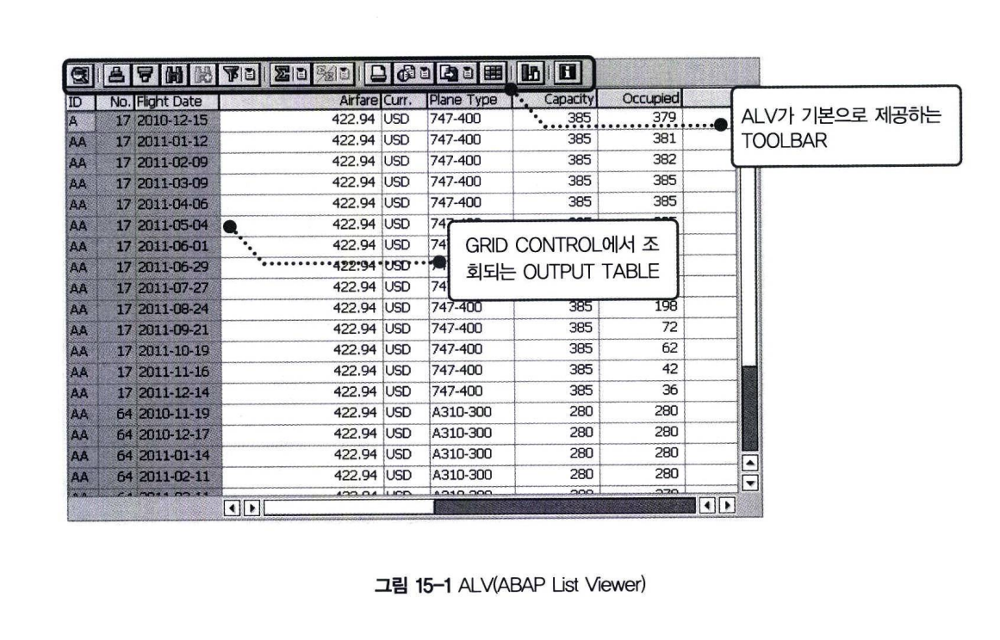
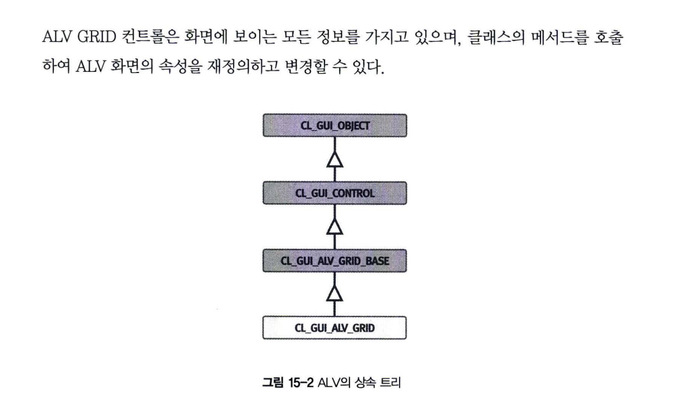
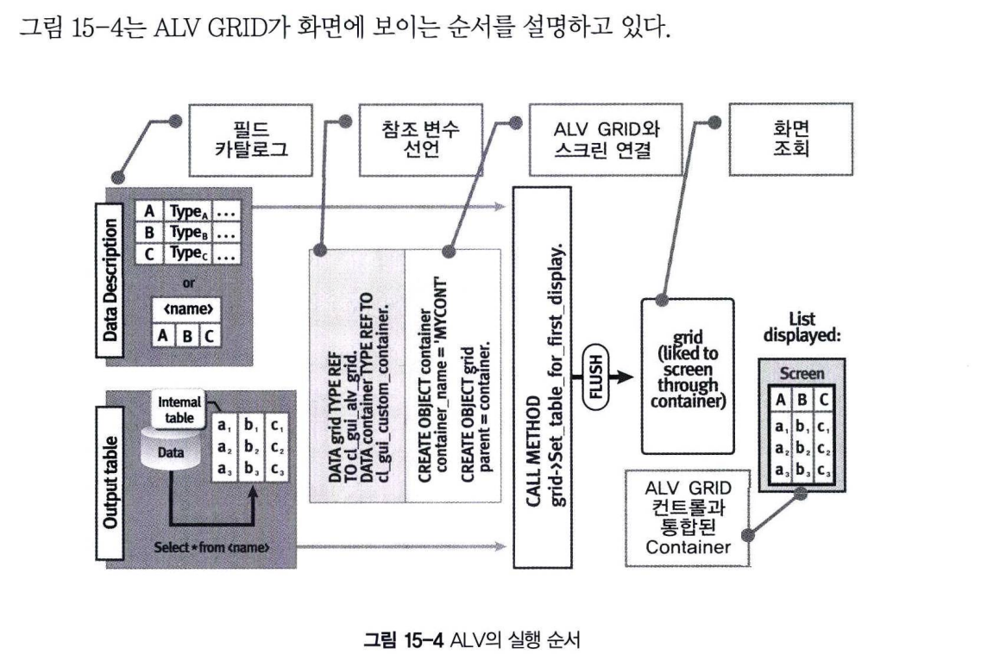
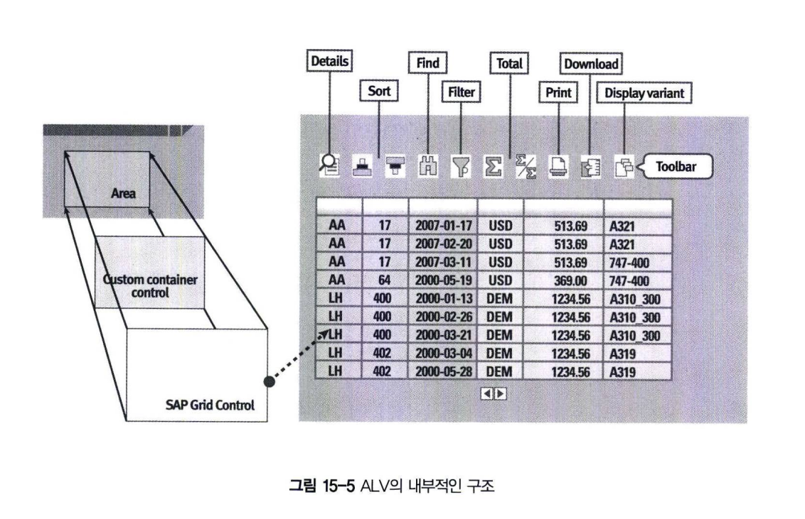

# ALV Overview
## 1 ALV란 무엇인가?
ALV는 ABAP List Viewer의 약자로서 리스트 화면에 데이터를 조회하거나, 조회된 데이터를 수정/변경하는 목적으로 실무에서 많이 사용되는 프로그램이다. <br>
Report Program에서는 WRITE 구문을 이용해서 LIST 화면을 구성할 수 있었다. <BR>
절차적인 프로그램에서 조회된 데이터를 액셀로 내려받는 기능을 추가하려면 먼저 GUI STATUS를 생성해서 버튼을 화면에 추가하고, <BR>
사용자가 버튼을 클릭하면 반응하게 되는 이벤트 스크립트를 기술해야 한다. <BR>
그러나 ALV는 이러한 기본적인 사무용 작업들이 이미 포함된 패키지 프로그램으로 제공된다. <BR>

즉, 액셀 프로그램에서 데이터를 정렬하고, 합계를 구하고, 원하는 정보만 필터링 하는 등의 기본적인 작업들은 스크립트를 구현하지 않고 자유롭게 사용할 수 있다.

## 2 ALV의 종류
ALV에는 크게 함수를 이용하는 방법과 GRID 컨트롤을 이용하는 방법 두 가지가 있는데, <BR>
이 두가지 방식은 내부적으로 유사한 구조와 기능을 가지고 있다. <BR>
물론, SALV(New ALV)도 존재한다. <br>
이러한 기술들이 개발된 순서는 Function ALV -> GRID ALV -> SALV 이다.

REUSE_ALV_GRID_DISPLAY 함수도 클래스를 기반으로 해서 프로그래밍 되어 있지만, <BR>
SAP사에서 다양한 기능을 통합해서 편리성을 제공하기 위해 Function Module로 제공한 것이다. <br>
함수를 이용해서 ALV 프로그램을 출력하면 화면 제어가 어려워진다. <BR>
이러한 제약 사항들이 있어 ABAP Object를 이용한 ALV GRID 기술이 SAP Release 3.1 버전부터 도입되었다.

ALV를 구현하면 데이터 구조와 인터널 테이블만 활용해서 단시간 내에 리스트 프로그램을 개발할 수 있다. <BR>

ALV GRID컨트롤은 화면 Display에서 SAP사에서 이미 개발한 컨트롤 기술을 사용한다. <br>
다른 모든 컨트롤과 같이 ALV GRID 컨트롤은 전역 클래스를 통해서 속성에 영향을 미칠 수 있는 메서드들을 제공하고 있으며, 이러한 메서드들을 통해 패키지 프로그램인 ALV의 기본기능에 추가적인 사항들을 적용하게 된다. 

또한 ALV GRID 컨트롤은 표준 프로그램의 통합된 기능을 지원하기 위해서 SAP Context 메뉴를 정의해서 사용할 수 있다.


## 3 ALV GRID 컨트롤 인스턴스
ALV 프로그램에서 사용하는 인스턴스는 CL_GUI_ALV_GRID 클래스를 참고하는 변수로 정의되어 있다. <BR>
다음 구문을 이용해서 객체 참조 변수를 선언한다.
```ABAP
DATA : gv_grid TYPE REF TO cl_gui_alv_grid.
```
위 구문의 gv_grid 변수는 CL_GUI_ALV_GRID를 참고하는 객체 참조 변수이다.

그리고 CREATE OBJECT 구문으로 클래스의 생성자를 호출해서 ALV GRID 인스턴스를 생성한다.
```ABAP
CREATE OBJECT gv_grid
```


## 4 ALV GRID 컨트롤의 구조


ALV 를 이용해서 데이터를 화면에 뿌려주려면 최소한 다음 2가지의 작업을 해주어야 한다.

**1&#41; 인터널 테이블 선언** <br>
화면에 보이게 될 인터널 테이블을 선언한다. ALV에서 데이터 저옵를 저장하는 인터널 테이블 영역을 아웃풋 테이블(Output Table)이라고 한다.

**2&#41; 데이터의 구조(필드 카탈로그)** <br>
ALV GRID 컨트롤이 스크린에 조회되는 구조를 정의한다. 즉, ALV GRID 컨트롤에서 정의 되는 데이터의 구조, 기술 속성, 내역과 같은 정보들을 가지고 있다. 일반적으로 ABAP Dictionary의 테이블 또는 구조체를 이용하거나, 인터널 테이블의 구조를 그대로 사용한다.

ALV GRID 컨트롤에 전달되는 아웃풋 테이블에 대한 정보는 ALV GRID 컨트롤이 작동하는 이상은 유용하게 작용한다. <BR>
아웃풋 테이블은 ABAP Dictioanry 오브젝트를 이용할 수도 있지만, 필드 카탈로그만으로 ALV 구조를 생성할 수 있다. <BR>
**필드 카탈로그는 ALV 화면에 보이게 되는 필드들의 정보를 담는 테이블이다.** <BR>
예를 들어, ALV 필드의 타입, 속성, 길이 등을 정의하게 된다. <BR>
필드 카탈로그는 LVC_T_FCAT 타입의 테이블이다.


그림15-5는 ALV가 화면에 보이기까지 내부적으로 구성되는 순서를 보여주고 있다.<BR>
ALV를 물리적으로 화면에 보이게 하려면 먼저 ALV 영역을 지정해야 한다. <BR>
이것은 레이아웃 페인터의 Custom Control을 이용해서 설정하게 된다. <br>
그리고 ALV를 화면에 보이게 하려면 스크린 영역과 ALV를 연결하는 SAP 컨테이너 컨트롤이 반드시 존재해야 한다. <br>
ALV는 화면의 SAP 컨테이너와 연결되어 화면에 뿌려지게 된다. 컨테이너는 'Container'라는 영어 단어의 의미에서 알 수 있듯이 화면 내에서 "무엇을 담는다." 라는 것을 표현한다. <br>
즉, 컨테이너는 Textedit 컨트롤, Picture 컨트롤과 같은 컨트롤 오브젝트를 화면에 보여줄 때 사용하게 되는 상위의 컨트롤이다.