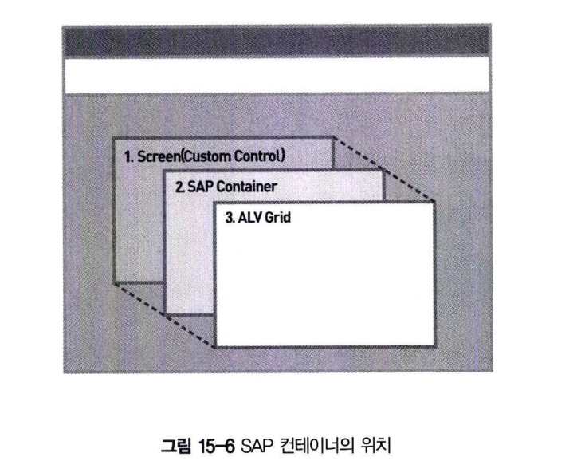

# SAP 컨테이너 생성 및 컨테이너 오브젝트 생성
ALV 인스턴스를 물리적으로 화면에 보이게 하려면 스크린과 ALV GRID 컨트롤의 연결고리 역할을 하는 SAP 컨테이너 컨트롤이 반드시 존재하여야 한다.  
즉, SAP 컨테이너는 Linker로서의 역할을 하도록 SAP 컨트롤을 자기 영역 안에 포함하는 컨테이너 역할을 하게 된다.  
SAP 컨트롤의 종류로는 SAP Tree, SAP Picture, SAP Textedit, SAP Splitter 컨트롤 등이 있다.

SAP 컨테이너도 다른 컨트롤을 포함하는 컨트롤의 하나이며, 부모 컨트롤이라고도 한다. 

ALV 프로그램은 그림15-6에 존재하는 컨테이너 컨트롤을 기반으로 해서 구축하게 된다.  
이러한 컨트롤들을 화면에 보이게 하기 위한 SAP 컨테이너는 아래 표와 같이 5개의 종류가 있다.

- SAP Custom Container
  - 스크린 페인터를 사용하는 일반적인 화면에서 영역을 정의하게 된다.   **클래스 : CL_GUI_CUSTOM_CONTAINER**
- SAP Dialog Box Container
  - Dialog Box 또는 Full screen에서 Dialog Box 형태로 보이도록 한다.   **클래스 : CL_GUI_DIALOGBOX_CONTAINER**
- SAP Docking Container
  - 스크린 영역의 각 모서리에 붙어서 크기를 조절할 수 있게 한다.   ALV 프로그램에서 Custom Container와 함께 자주 사용되는 형태이다.   **클래스: CL_GUI_DOCKING_CONTAINER**
- SAP Splitter Container
  - 여러 영역으로 컨테이너를 분리할 때 사용된다.   **클래스 : CL_GUI_SPLITTER_CONTAINER**
- SAP Easy Splitter Container
  - Splitter 컨트롤과 비슷한 구실을 하며, 분리된 영역을 상하 좌우로 한 번 더 분리할 수 있다.   **클래스 : CL_GUI_EASY_SPLITTER_CONTAINER**

5가지 종류의 컨테이너 중에서 SAP Custom 컨테이너를 중점적으로 학습한다.  
그리고 SAP Docking 컨테이너는 실무에서도 자주 사용되므로 간단하게 기본 구조를 학습하고 실습하는 과정으로 진행한다.  
이외의 컨테이너는 기본 원리가 비슷하며 사용법만 익히면 어려움 없이 적용이 가능하다.

ALV를 화면에 보여주기 위해 화면에서 영역을 지정하고, 이 영역에 ALV를 올리기 위한 작업장을 만드는 것이다.  
먼저, T-CODE:SE38을 이용해서 TYPE-1 유형의 프로그램을 생성하고 스크린 100번을 추가한다.