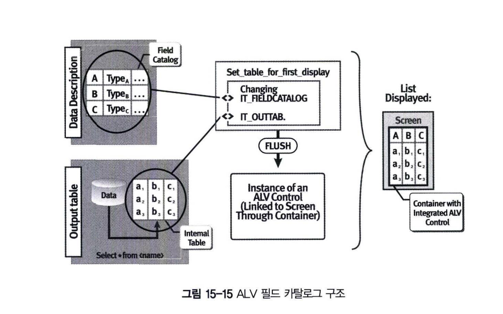

# 필드 카탈로그
필드 카탈로그는 ALV에서 조회되는 칼럼들의 필드 정보를 포함하는 LVC_T_FCAT 타입의 테이블 구조를 가진다. <BR>
ALV는 필드카탈로그 정보를 저장하는 인터널 테이블을 이용해 필드 타입을 인식하게 된다. <BR>
예를 들어 필드가 숫자 타입인지 문자 타입인지 구분하며, 화면에 보여줄 필드 길이를 지정하고, 체크박스-라디오 버튼으로 보이게 하고, 필드 수정이 가능하게 하는 등의 많은 역할을 하게 된다.

아래 그림에서 Data Description 부분은 필드 카탈로그를 의미한다. SELECT 한 결과를 인터널 테이블에 저장하는 아웃풋 테이블 영역과 필드 카탈로그의 필드 정보를 이용해 ALV 화면에 보여준다.<br>


필드 카탈로그를 정의하는 방법은 아래 3가지이다. <br>
- **ABAP Dictionary 오브젝트를 이용하는 방법**
- **프로그램 내에서 스크립트로(수동으로) 구성하는 방법**
- **위 두가지를 혼용**

## 1 ALV 필드 카탈로그를 생성
### 1.1 ABAP Dictionary를 이용하는 방법
ABAP Dictionary 테이블을 그대로 필드 카탈로그로 정의하는 방법은 앞에서 학습하였다. <br>
set_table_for_first_display 메서드의 I_STRUCTURE_NAME 파라미터를 이용하면 <BR>
ABAP Dictionary 오브젝트를 ALV 아웃풋 테이블에 그대로 보여주게 된다. <br>
I_STRUCTURE_NAME 파라미터로 사용할 수 있는 ABAP Dictionary는 다음과 같다.

- **Transparent Table**
- **Structure**
- **View**
- **Append Structure**
- **Cluster Table**
- **Pooled Table**

그러나 대부분의 실무 프로그램에서는 여러 개의 테이블에서 데이터를 가져오기 때문에 테이블 구조를 필드 카탈로그에 그대로 사용할 수 있는 경우는 많지 않다. <br>
이때는 ABAP Dictioanry 레벨에서 구조체를 생성해서 인터널 테이블은 구조체를 참고하여 정의하게 된다. <br>
그러나 하나의 프로그램에서만 필요한 구조체라면 굳이 ABAP Dictionary 구조체를 생성할 필요는 없다. <br>
이럴 때에는 인터널 테이블 구조를 그대로 필드 카탈로그로 정의할 수 있다.

### 1.2 필드 카탈로그를 수동으로 구성하는 방법
ABAP Dictionary의 모든 필드를 필드 카탈로그로 보여주고 싶지 않은 경우가 있다. <br>
그리고 생성된 필드 카탈로그 인터널 테이블의 속성을 변경해서 비가시 속성을 설정할 수도 있다. <br>
그러나 개별 필드 이름, 타입 등을 스크립트로 모두 정의하여야 하므로 프로그램 수정(유지/보수)에 많은 시간이 소요되는 단점이 있다. <br>
필드 카탈로그를 이용하려면 set_table_for_first_display 메서드의 IT_FIELDCATALOG 파라미터를 이용해서 ALV를 호출하게 된다.
```ABAP
CALL METHOD <ref var to CL_GUI_ALV_GRID>->set_table_for_first_display
    EXPORTING
        IS_VARIANT = < structure of type DISVARIANT >
        I_SAVE = < var. of TYPE CHAR01 >
        I_DEFAULT = < var. of TYPE CHAR01 >
        IS_LAYOUT = < structure of type LVC_S_LAYO>
        IS_PRINT = < structure of type LVC_S_PR2STT>
        IT_SPECIAL_GROUPS = < internal table of type LVC_T_SGRP> 
        IT_TOOLBAR_EXCLUDING = < internal table of type UI_FUNCTIONS>
    CHANGING
        IT_OUTTAB = < internal table〉      
        IT_FIELDCATALOG = < internal table of type LVC__T_FCAT> 
        IT_SORT = < internal table of type LVC_T_SORT >
        IT FILTER = < internal table of type LVC__T_FILT>
```

아래 표는 필드 LVC_T_FCAT 타입의 인터널 테이블을 구성할 때, ABAP Dictionary의 테이블과 필드의 속성을 상속받을 것인지 아니면 직접 속성(길이,타입 등)을 정의할 것인지에 대해서 설명하고 있다. <br>

|Dictionary를 참고할 때|Dictionary를 참고하지 않을 때|설명|
|------|---|---|
|FIELDNAME|FIELDNAME|아웃풋 테이블의 필드 이름|
|REF_TABNAME|-|참고할 구조체의 DDIC 이름|
|REF_FIELDNAME|-|참고할 구조체의 DDIC 필드 이름|
|-|INTTYPE|아웃풋 테이블의 DATA TYPE|
|-|OUTPUTLEN|칼럼 길이|
|-|COLTEXT|칼럼 헤더 텍스트|
|-|SELTEXT|Variant 조회 시 칼럼 내역|

### 1.3 구조체와 필드 카탈로그를 동시에 사용
구조체와 필드 카탈로그 두 가지를 혼합해서 사용할 수 있다. 구조체의 필드 이외에 사용자가 정의하는 필드가 추가로 필요한 경우에 사용하기 적합하다. <br>
이때 구조체와 필드 카탈로그에 같은 필드가 존재하게 되면, 필드 카탈로그에서 정의한 필드가 높은 우선 순위를 가지게 된다. <br>
버전에 따라 다르지만, 데이터를 저장하는 인터널 테이블에 company 필드도 추가되어야 한다.

## 2 필드 카탈로그를 이용한 ALV 속성 변경
필드 카탈로그 속성 중 중요한 몇 가지를 이용해서 ALV GRID 속성을 변경해본다.

### 2.1 필드 속성 설정(KEY, FIX_COLUMN)
```ABAP
FORM SETTING_CATALOG.
    FIELD-SYMBOLS : <LS_FCAT> TYPE LVC_S_FCAT.

    LOOP AT GT_FIELDCAT ASSIGNING <LS_FCAT>.

        IF <LS_FCAT>-FIELDNAME EQ 'PRICE'.
            <LS_FCAT>-KEY = 'X'
        ENDIF.

        IF <LS_FCAT>-FIELDNAME EQ 'CURRENCY'.
            <LS_FCAT>-FIX_COLUMN = 'X'.
        ENDIF.

    ENDLOOP.        
ENDFORM.                
```

### 2.2 데이터 포맷 설정(JUST, EDIT_MASK 속성)
```ABAP
REPORT CHS.

FORM SETTING_CATALOG.
    FIELD-SYMBOLS: <LS_FCAT> TYPE VC_S_FCAT.

    LOOP AT GT_FIELDCAT ASSIGNING <LS_FCAT>.
        IF <LS_FCAT>-FIELDNAME EQ 'FLDATE'.
            <LS_FCAT>-EDIT_MASK = '____/__/__'.
        ENDIF.

        IF <LS_FCAT>-FIELDNAME EQ ' CURRENCY'.
            <LS_FCAT>-JUST = 'R'.
        ENDIF.
    ENDLOOP.
ENDFORM.                            
```