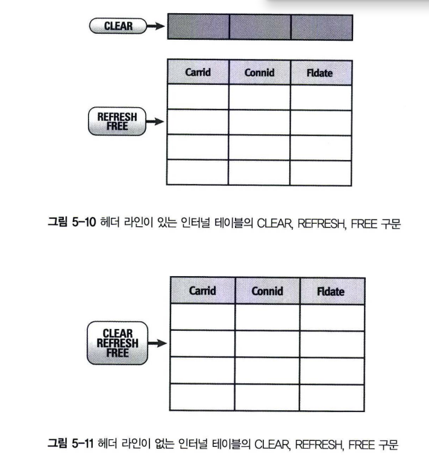
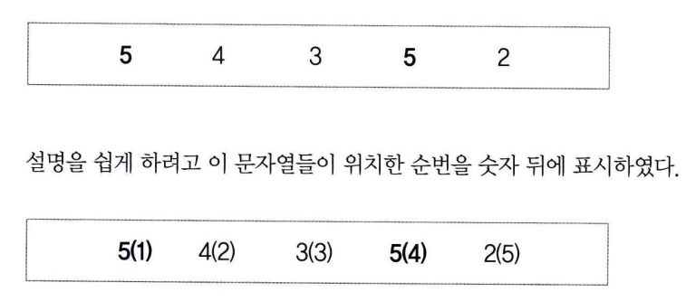
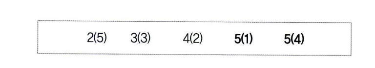

# 인터널 테이블 명령어
## 1 인터널 테이블 값 할당
다른 변수와 같이 인터널 테이블도 MOVE 구문을 사용해서 값을 할당할 수 있다.<br>
**헤더 라인이 있는 인터널 테이블은 헤더 라인 값만 복사된다.**
```abap
MOVE itab1 To itab2. " itab2 = itab1. 구문과 동일
```

다음과 같이 사용해야 Body가 복사된다.
```abap
MOVE itab1[] TO itab2[]. " itab2[] = itab1[]. 구문과 동일
```

위 구문은 인터널 테이블 타입이 같아야 한다. 타입이 다르면 칼럼 순서대로 값을 할당한다. <br>
인터널 테이블 타입이 서로 다른 경우에 프로그램 속성에 Unicode check active 속성이 설정되어 있으면, <br>
문자 타입과 숫자 타입 시에 Alignment Gap이라는 것이 생성되기 때문에 에러가 발생할 수 있다. <br>
Line Type이 다르면 다음 구문을 이용해서 두 오브젝트 간 순서와 관계없이 같은 컬럼 명에만 값을 할당할 수 있다.
```abap
MOVE-CORRESPONDING itab1 TO itab2.
```

```ABAP
REPORT Z05_15.

TYPES : BEGIN OF T_LINE,
    COL1 TYPE I,
    COL2 TYPE I,
END OF T_LINE.

DATA : GT_ITAB1 TYPE STANDARD TABLE OF T_LINE WITH HEADERLINE,
        GT_ITAB2 TYPE STANDARD TABLE OF T_LINE,
        GS_WA LIKE LINE OF GT_ITAB2.

DO 5 TIMES.
    GT_ITAB1-COL1 = SY-INDEX.
    GT-ITAB1-COL2 = SY-INDEX * 2.
    INSERT TABLE GT_ITAB1.
ENDDO.

MOVE GT_ITAB1[] TO GT_ITAB2.

LOOP AT GT_ITAB2 INTO GS_WA.
    WRITE :/ GS_WA-COL1, GS_WA-COL2.
ENDLOOP.    
```

헤더 라인이 있으면 헤더 라인과 인터널 테이블 이름은 같다. 이것을 구분하기 위해 인터널 테이블의 Body를 [] 기호를 이용해서 구분한다. <br>
예제 5-15에서 대괄호 기호는 헤더라인이 있는 인터널 테이블의 Body 내용을 가리킨다. <br>
즉, 헤더 라인이 있는 인터널 테이블의 이름은 헤더 라인을 의미하고, 헤더 라인이 없는 인터널 테이블 이름은 자기 자신이 된다. <br>
이러한 이유 때문에 예제에서는 헤더 라인의 유무에 따라 MOVE gt_itab1[] TO gt_itab2. 구문을 사용한 것이다.

## 2 인터널 테이블 초기화
다른 변수와 같이 인터널 테이블도 CLEAR 할 수 있다. <BR>
인터널 테이블을 초기화하는 구문은 CLEAR, REFRESH, FREE가 있다. <BR>
 <BR>

3가지 구문에 대해서 세부적으로 좀 더 살펴보면 CLAER 구문은 메모리 공간을 반환한다. <BR>
그러나 처음 메모리 양을 요구한 정보는 삭제하지 않는다. <BR>
헤더 라인을 가지는 인터널 테이블이라면 다음의 구문은 인터널 테이블의 헤더 라인만 삭제한다. <BR>
헤더 라인이 없는 테이블은 CLEAR ITAB 만으로도 BODY를 Clear한다.
```ABAP
CLEAR itab.
```
헤더 라인이 있는 인터널 테이블의 BODY 부문을 삭제하려면 대괄호 기호[]를 추가해주어야한다.
```ABAP
CLEAR itab[].
```
CLEAR 구문으로 BODY 삭제가 의심스러우면, 다음 구문을 사용한다.
```ABAP
REFRESH itab.
```

REFRESH 구문은 인터널 테이블의 데이터만 지우고, 메모리 공간은 그대로 가지고 있다. <BR>
메모리 공간을 반환하려면 FREE 구문을 이용한다.

## 3 인터널 테이블 정렬
### 3.1 SORT
Standard 또는 Hashed Type의 인터널 테이블을 정렬할 수 있다. 인터널 테이블 자체가 가지는 Key 값으로 Sort 하려면 다음 구문을 활용한다.
```abap
SORT ITAB [ASCENDING|DESCENDING]
```
테이블 키가 선언되지 않은 경우는 문자 타입을 칼럼들을 구성해서 Key 값으로 만든다. <br>
SORT 정렬의 기본 값은 ASCENDING 이다. <BR>
Sorted Table은 테이블 자체에서 정렬된 데이터를 가지고 있기 때문에 SORT 명령어를 사용하면 Syntax Error를 만나게 된다.

### 3.2 SORT 칼럼 지정
정렬이 필요한 칼럼을 임의로 지정하고 싶을 때는 다음 구문을 사용한다.
```abap
SORT ITAB [ASCENDING|DESCENDING]
        BY f1 [ASCENDING|DESCENDING]
        ...
            fn [ASCENDING|DESCENDING].
```
이 구문을 이용하면 Table Key를 이용하지 않고 f1 ~ fn 칼럼(250개 한정)을 기준으로 정렬한다. <br>
f1. 칼럼의 값 중에 null이 존재하면 그 라인은 무시한다.

### 3.3 Stable SORT
SORT 명령어를 사용할 때마다 Sort Sequence가 계속 변한다. Stable Sort 구문을 활용하면 Sort Sequence가 보존된다. <br>
하지만 정렬 시간이 더 소요되는 단점이 있다.
```abap
SORT itab... STABLE.
```
STABLE 옵션은 같은 데이터라도 처음 위치한 순서가 SORT에 의해서 순번이 변경되지 않도록 하는 것이다. <BR>
예를 들어, 다음과 같이 5개의 숫자가 있다고 가정한다. <BR>
숫자 5는 1번째와 4번째 2개가 존재한다.<br>
 <br>
그리고 이 숫자들은 정렬하게 되면, 처음에 존재했던 5라는 숫자끼리는 위치가 변동되지 않고 정렬 된다. <br>
이것이 STABLE SORT 이다. <br>

```abap
REPORT Z05_17.

DATA : BEGIN OF gs_line,
        col1 TYPE c,
        col2 TYPE i,
       END OF gs_line.

DATA gt_itab LIKE STANDARD TABLE OF gs_line WITH NON-UNIQUE KEY col1.

gs_line-col1 = 'B'
gs_line-col2 = 3.
APPEND gs_line TO gt_itab.

gs_line-col1 = 'C'.
gs_line-col2 = 4.
APPEND gs_line TO gt_itab.

gs_line-col1 = 'A'.
gs_line-col2 = 2.
APPEND gs_line TO gt_itab.

gs_line-col1 = 'A'.
gs_line-col2 = 1.
APPEND gs_line TO gt_itab.

SORT gt_itab.
PERFORM write_data.

SORT gt_itab BY col1 col2.
PERFORM write_data.

SORT gt_itab BY col1 DESCENDING col2 ASCENDING.
PERFORM write_data.

FORM write_data.
    LOOP AT gt_itab INTO gs_line.
        WRITE :/ gs_line-col1, gs_line-col2.
    ENDLOOP.
    ULINE.
ENDFORM.            
```

## 4 인터널 테이블 속성 알아내기
인터널 테이블의 속성을 알고자 할 경우에는 DESCRIBE 구문을 사용한다.
```ABAP
DESCRIBE TABLE itab [LINES gv_line] [OCCURS gv_init] [KIND gv_kine].
```

LINES는 인터널 테이블에 존재하는 현재 라인 수를 반환하고, OCCURS는 인터널 테이블의 초기 라인 수를 반환한다. <br>
KIND는 인터널 테이블의 종류를 반환하며, 'T'는 Standard Table, 'S'는 Sorted Table, 그리고 'H'는 Hashed Table을 각각 의미한다. <br>
인터널 테이블의 속성을 반환하는 이 3가지 옵션 중에서 LINES가 주로 사용된다.
```abap
REPORT Z05_18.

DATA : BEGIN OF gs_line,
    col1 TYPE c,
    col2 TYPE i,
    END OF gs_line.

DATA gt_itab LIKE STANDARD TABLE OF gs_line INITIAL SIZE 10.

DATA : gv_line TYPE i.

DO 20 TIMES.
    gs_line-col1 = sy-index.
    gs_line-col2 = sy-index * 2.
    INSERT gs_line INTO TABLE gt_itab.
ENDDO.

DESCRIBE TABLE gt_itab LINES gv_line.
WRITE :/ 'Internal Table Line is :', gv_line.
```

인터널 테이블에 Line을 삽입하는 명령어는 INSERT, APPEND, COLLECT가 있다. <BR>
INSERT와 APPEND는 인터널 테이블의 마지막 라인에 데이터를 삽입하는 기능은 같지만 INSERT 구문은 Table Type에 따라 <br>
다른 기능을 수행하게 된다. <br>
COLLECT 구문은 Key가 있으면 숫자 타입은 SUM을 수행하고, 없으면 데이터를 추가하게 된다.
인터널 테이블도 ABAP Dictionary 테이블과 유사한 구조로 되어 있기 때문에 INSERT, DELETE, MODIFY와 같은 구문이 SQL과 동일하게 존재한다. <BR>
**단, 사용법이 달라서 두 가지 경우에 혼란을 가져오는 경우가 자주 발생하는데 이때는 F1키를 이용해서 Help Manual을 적극적으로 참고한다.**