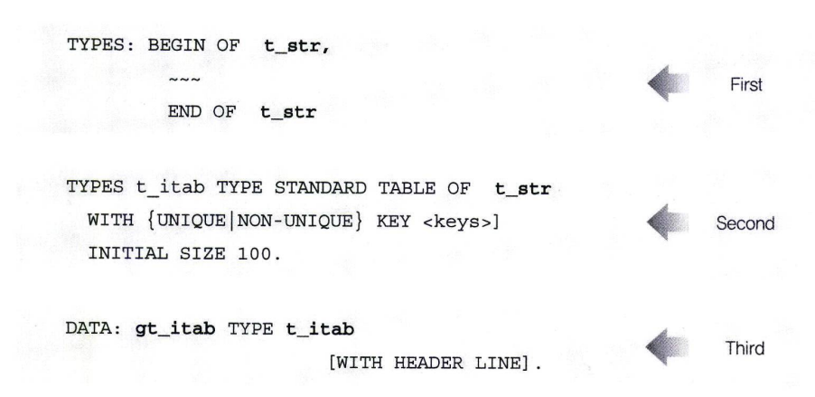

# Internal Table 생성
인터널 테이블은 구조체 타입을 정의하고 나서 그 타입을 참고해서 생성하는 것이 일반적이다.

다음 2가지 방법을 이용해서 인터널 테이블을 생성할 수 있다.
- Local Table Type을 이용한 인터널 테이블 생성
- Global ABAP Dictionary Type을 이용한 인터널 테이블 생성

## Local Table Type을 이용한 인터널 테이블 생성
개별 ABAP 프로그램에만 사용되는 인터널 테이블을 생성하는 경우에 주로 사용된다. <br>
다음과 같이 첫 번째 구조체 타입을 선언하고, <br>
두 번째 구조체 타입을 참고하는 인터널 테이블 타입을 선언하고, <br>
세 번째 이 타입을 참고해서 인터널 테이블을 생성하게 된다. <br>


아래와 같이 실무에서는 구조체 타입을 선언하고, 이 구조체 타입을 참고하는 인터널 테이블을 선언하는 2단계 방법을 많이 사용한다. <br>
즉, 3단계를 통해서 인터널 테이블을 생성하는 방법에서 인터널 테이블 타입을 선언하는 두 번째 단계를 생략하고, 구조체 타입을 참고해서 바로 인터널 테이블을 생성한다.

```abap
REPORT Z05_01.

TYPES : BEGIN OF S_TYPE,
            NO(6)       TYPE C,
            NAME(10)    TYPE C,
            PART(16)    TYPE C,
        END OF S_TYPE.            

DATA GT_ITAB TYPE STANDARD TABLE OF S_TYPE WITH NON-UNIQUE KEY NO WITH HEDAER LINE.

GT_ITAB-NO = '0001'.
GT_ITAB-NAME = 'HANSEONG'
GT_ITAB-PART = 'SAP R&D'
APPEND GT_ITAB.

LOOP AT GT_ITAB.
    WRITE : GT_ITAB-NO, GT_ITAB-NAME, GT_ITAB-PART.
ENDLOOP.    
```

5-1의 예제를 다음 예제와 같이 구조체를 선언한 다음 구조체를 참고해서 인터널 테이블을 선언할 수도 있다. <BR>
이 경우에는 TYPE 대신에 LIKE를 사용한다.
```ABAP
DATA : BEGIN OF GS_TYPE,
            NO(6)   TYPE    C,
            NAME(10) TYPE   C,
            PART(16) TYPE   C,
        END OF GS_TYPE.

DATA GT_ITAB LIKE STAND TABLE OF GS_TYPE WITH NON-UNIQUE KEY NO WITH HEADER LINE.                    
```

## Global ABAP Dictioanry Type을 이용한 인터널 테이블 생성
ABAP Dictionary 테이블이나 구조체를 참고해서 인터널 테이블을 생성하는 방법이다.

```abap
DATA : ITAB TYPE <T_ITAB> WITH [{UNIQUE|NON-UNIQUE} KEY <KEYS>]
                               [INITIAL SIZE <N>] [WITH HEADER LINE].
```

예제 5-2는 SCARR 테이블과 같은 구조를 가지는 인터널 테이블을 선언하였다.

```ABAP
REPORT Z05_02.

DATA : GT_ITAB TYPE SORTED TABLE OF SCARR WITH UNIQUE KEY CARRID.
DATA : GS_STR LIKE LINE OF GT_ITAB.

SELECT * INTO TABLE GT_ITAB
    FROM SCARR.

LOOP AT GT_ITAB INTO GS_STR.
    WRITE :/ GS_STR-CARRID, GS_STR-CARRNAME.
ENDLOOP.        
```

위 두 가지 방법 외에도 ABAP Dictionary Table Type을 이용해서 인터널 테이블을 생성 할 수 있다.