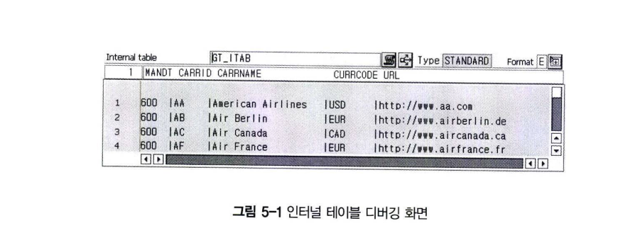

# Internal Table의 정의
그림 5-1은 프로그램 내에서 사용되고 있는 인터널 테이블의 구조를 보여 주고 있다.

Internal Table(인터널 테이블)을 한마디로 정의하면 다음과 같다.

***Internal Table은 프로그램 내에서 정의해서 사용할 수 있는 Local Table이다.***

ABAP 프로그램에서 가장 강력한 기능과 편의성을 제공하는 것 두 가지를 뽑으라면 인터널 테이블과 디버깅이다.  
특히 인터널 테이블의 기능과 역할은 ABAP 프로그래밍의 꽃이라고 해도 과언이 아니다.  
이 두가지 기능만 알고 있어도 Copy & Paste로 ABAP 프로그램을 만들어 낼 수 있을 정도이다.

본론으로 들억사ㅓ 인터널 테이블에 대해서 학습한다.  
먼저 ABAP 프로그램과 C 언어의 구조체 개념부터 이해해보도록 하자.  
인사 정보는 사원 번호, 이름, 소속 부서 등이 있을 것이다.  