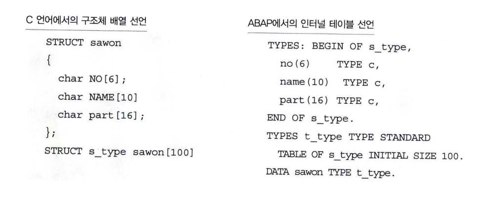

# Structure 배열과 Internal Table

구조체 선언과 유사하게 인터널 테이블(구조체 배열)도 두 언어 사이에 큰 차이가 없다.  
다만 값을 할당하고 사용하는 구문의 차이가 있을 뿐이다.  
C 언어의 구조체 배열은 배열 순번을 지정해서 값을 할당하여 사용한다.  
반면 ABAP 언어의 인터널 테이블은 구조체 배열 (ARRAY)의 개념을 모두 지원하며 추가로 실제 데이터 베이스 테이블의 모습과 유사하게 사용할 수 있도록 구현되었다.

C 언어가 배열을 서언할 때 미리 크기를 지정하는 반면, 인터널 테이블은 INITIAL SIZE 구문으로 테이블 크기만 선언할 뿐 메모리에 Load 하지 않는다.  
따라서 INSERT 또는 APPEND 구문을 사용해서 Line이 추가될 때마다 메모리에 Load 한다.  
이러한 측면에서 인터널 테이블을 동적인 구조체 (Dynamic Data Object)이라고도 정의한다.  
- **Internal Table은 동적인 구조체 배열(Dynamic Data Object)이다.**
- **INITIAL SIZE 구문은 실제로 메모리 공간을 할당하는 것이 아니라 예약(RESERVE)을 한다.**

**ABAP 프로그래밍 언어에서 인터널 테이블은 항상 할당과 추가(APPEND) 구문이 쌍으로 움직여야 함을 명심해야 한다.**  
***'할당하고 추가하고, 할당하고 추가하고'*** 버릇이 되도록 되새겨 보자.

인터널 테이블이 포함할 수 있는 데이터 건수는 메모리 크기로 한정되어 있기 때문에, SAP 설치 시 인터널 테이블이 차지할 수 있는 메모리 공간을 기본 2 Gigabyte로 설정한다.