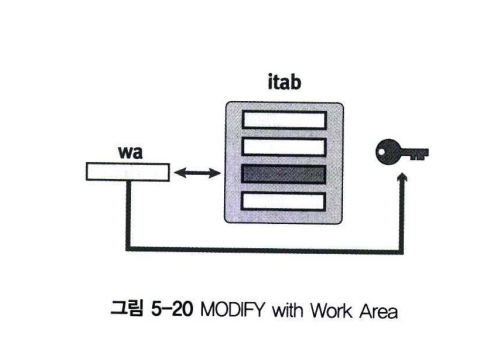
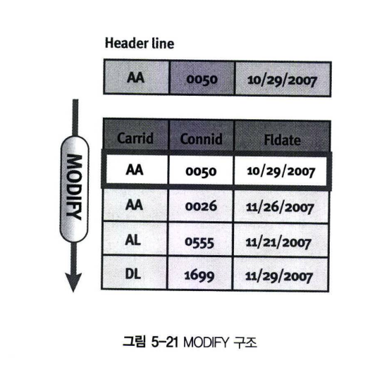
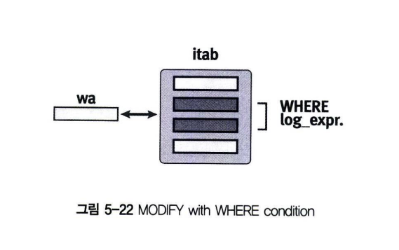
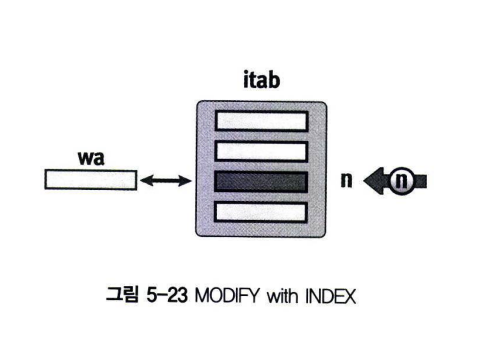

# 인터널 테이블 데이터 변경
인터널 테이블의 한 라인을 변경하려면 MODIFY 구문을 사용한다. 해당 라인을 Key, Index 조건으로 찾아서 변경할 수 있다.

## 1 Table Key를 이용해서 한 라인 변경
다음 구문을 사용해서 Key 값 기준으로 인터널 테이블의 라인을 변경한다. <br>
인터널 테이블이 Non-Unique Key이고 중복된 값이 존재할 때 MODIFY 구문을 수행할 때는 첫 번째 라인이 변경된다. <br>
헤더 라인이 있는 경우는 FROM wa 구문을 생략할 수 있다. <br>
```abap
MODIFY TABLE itab FROM wa [TRANSPORTING f1 f2 ..].
```
 <br>

TRANSPORTING 구문을 이용해서 해당 칼럼만 변경할 수 있다. <BR>
한 라인 전체를 변경하는 거보다 일부 칼럼만 변경하는 것이 당연히 성능이 좋긴 하지만, 영향은 크지 않다.<BR>


```ABAP
REPORT Z05_25.

DATA : BEGIN OF gs_line,
    col1(2) TYPE c,
    col2 TYPE i,
    col3 TYPE sy-datum,
    END OF gs_line.

DATA gt_itab LIKE STANDARD TABLE OF gs_line WITH NON-UNIQUE KEY col1 col2.

gs_line-col1 = 'AA'.
gs_line-col2 = 50.
INSERT gs_line INTO TABLe gt_itab.

gs_line-col1 = 'AA'.
gs_line-col2 = 26.
INSERT gs_line INTO TABLE gt_itab.

gs_line-col1 = 'AA'.
gs_line-col2 = 50.
gs_line-col3 = '20201029'.

MODIFY TABLE gt_itab FROM gs_line.

LOOP AT gt_itab INTO gs_line.
    WRITE :/ gs_line-col1, gs_line-col2, gs_line-col3.
ENDLOOP.    
```

## 2 WHERE 조건을 이용해서 여러 라인 변경
```abap
MODIFY itab FROM wa TRANSPORTING f1 f2 ... WHERE cond.
```

```abap
REPORT Z05_26.

DATA : BEGIN OF gs_line,
    carrid TYPE sflight-carrid,
    carrname TYPE scarr-carrname,
    fldate TYPE sflight-fldate,
    END OF gs_line.

DATA gt_itab LIKE TABLE OF gs_line.

SELECT carrid connid INTO CORRESONDING FIELDS OF TABLE gt_itab FROM sflight.

LOOP AT gt_itab INTO gs_line.

    AT NEW carrid.

        SELECT SINGLE carrname INTO gs_line-carrname FROM scarr WHERE carrid = gs_line-carrid.

    MODIFY gt_itab FROM gs_line TRANSPORTING carrname

    WHERE carrid = gs_line-carrid.

    ENDAT.        

    WRITe :/ gs_line-carrid, gs_line-carrname.

ENDLOOP.    
```

예제 5-26에서 AT NEW 구문은 인터널 테이블을 LOOP 처리하면서 해당 칼럼에 새로운 값이 들어온 경우 실행되는 명령어이다. <br>
AA, AZ, DL 과 같이 새로운 항공사 ID로 변경될 때마다 실행되고, MODIFY 구문에서 WHERE 조건을 이용해서 항공사 이름을 변경한다.

인터널 테이블을 LOOP 처리할 때 다음 4가지 구문을 사용할 수 있다.<BR>


## 3 INDEX를 이용해서 한 라인 변경
INDEX를 이용해서 해당 라인의 값을 변경할 수 있다. Index를 이용해 값을 변경하기 때문에 당연히 Stadard, Sorted Type의 <br>
인터널 테이블에서만 사용할 수 있다. LOOP 구문 내에서는 INDEX 옵션은 생략할 수 있으며, 이 경우 현재 인터널 테이블의 LINE Index 값을 변경하게 된다.
```abap
MODIFY itab FROM wa [INDEX idx] [TRANSPORTING f1 f2 ...].
```


```abap
REPORT Z05_27.

DATA : BEGIN OF gs_line,
    carrid TYPE sflight-carrid,
    carrname TYPE scarr-carrname,
    fldate   TYPE sflight-fldate,
    END OF gs_line.

DATA gt_itab LIKE TABLE OF gs_line.

SELECT carrid fldate INTO CORRESPONDING FIELDS OF TABLE gt_itab FROM sflight.

LOOP AT gt_itab INTO gs_line.

    SELECT SINGLE carrname INTO gs_line-carrname FROM scarr WHERE carrid = gs_line-carrid.

MODIFY gt_itab FROM gs_line.

WRITE :/ gs_line-carrid, gs_line-carrname.

ENDLOOP.
```