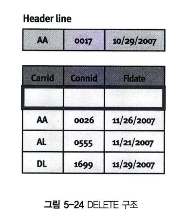
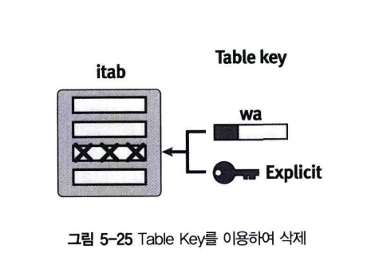
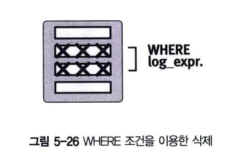
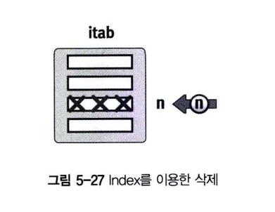

# 인터널 테이블 데이터 삭제
인터널 테이블의 한 라인을 삭제하려면 DELETE 구문을 사용한다. <BR>
해당 라인을 Key와 Index 조건으로 찾아서 삭제할 수 있다.

## 1 Table Key를 이용해서 한 라인 삭제
다음 구문을 사용해서 Key 값 기준으로 인터널 테이블의 라인을 삭제한다. Non-Unique Key로 설정된 Standard Type의 경우 <br>
WITH TABLE KEY 구문은 중복된 Key 데이터 중에서 한 건만 삭제한다.

```abap
DELETE TABLE itab [FROM wa].

DELETE TABLE itab WITH TABLE KEY k1 = f1 ... kn = fn.
```
<br>


## 2 WHERE 조건을 이용해서 여러 라인 삭제
하나 이상의 라인을 삭제하려면 WHERE 구문을 사용한다.
```abap
DELETE itab WHERE cond.
```

WHERE 조건은 논리 연산으로 구성된 여러 칼럼의 조건들이 추가될 수 있다.<BR>


인터널 테이블에서 데이터를 삭제하는 DELETE구문의 WHERE 조건을 해보자.
```ABAP
REPORT Z05_28.

DATA : BEGIN OF gs_line,
        carrid TYPE sflight-carrid,
        connid TYPE sflight-connid,
       END OF gs_line.

DATA gt_itab LIKE TABLE OF gs_line WITH NON-UNIQUE KEY carrid.

SELECT carrid connid fldate
INTO CORRESPONDING FIELDS OF TABLE gt_itab FROM sflight.

DELETE gt_itab WHERE carrid = 'AA' AND connid = '0017'.

LOOP AT gt_itab INTO gs_line.
    WRITE :/ gs_line-carrid, gs_line-connid.
ENDLOOP.    
```

## 3 INDEX를 이용해 삭제
INDEX를 이용해서 해당 라인의 값을 삭제할 수 있다.
```abap
DELETE itab [INDEX idx].
```
 <br>

Index를 이용해 여러 라인을 한 번에 삭제할 수 도 있다. 당연히 Hashed Type의 인터널 테이블에서는 사용할 수 없다. <br>
다음 구문은 Index n1~n2 사이의 Line을 삭제한다. <br>
FROM n1 구문만 사용하면, n1 번째 Index 이후의 모든 데이터를 삭제한다. <br>
이와 반대로 TO n2 구문만 사용하면, 처음부터 n2 번째에 존재하는 데이터가 삭제된다. <br>

```abap
DELETE itab FROM n1 TO n2.
DELETE itab FROM n1.
DELETE itab TO n2.
```

```ABAP
DATA : BEGIN OF gs_line,
    col1 TYPE i,
    col2 TYPE i,
    END OF gs_line.

DATA : gt_itab LIKE TABLE OF gs_line.

DO 3 TIEMS.
    gs_line-col1 = sy-index.
    gs_line-col2 = sy-index * 2.
    APPEND gs_line TO gt_itab.
ENDDO.

DELETE gt_itab INDEX 2.

LOOP AT gt_itab INTO gs_line.
    WRITE :/ gs_line-col1, gs_line-col2.
ENDLOOP.    
```

## ADJACENT DUPLICATE 구문을 이용해 중복 라인 삭제
ADJACENT DUPLICATE 구문을 이용해서 중복된 라인을 삭제할 수 있다. 이 구문을 수행하기 전에 SORT 구문으로 인터널 테이블을 <br>
정렬해야 원하는 결과를 얻을 수 있다.
```abap
DELETE ADJACENT DUPLICATE ENTRIES FROM itab
                    [COMPARING f1 f2 ... |AL FIELDS].
```

COMPARING 구문을 사용하지 않으면, Table Key 값이 중복된 데이터를 삭제한다. <br>
이미 학습했듯이 Key 값을 선언하지 않은 경우는 문자열의 선행 필드들이 Default Key로 구성된다. <br>

```abap
REPORT Z05_30.

DATA : BEGIN OF gs_line,
        carrid TYPE sflight-carrid,
        connid TYPE sflight-connid,
       END OF gs_line.

DATA : gt_itab LIKE TABLE OF gs_line WITH HEADER LINE.

SELECT carrid connid INTO CORRESPONDING FIELDS OF TABLE gt_itab FROM sflight.

DELETE ADJACENT DUPLICATES FROM gt_itab.

LOOP at gt_itab.
    WRITE :/ gt_itab-carrid , gt_itab-connid.
ENDLOOP.    
```