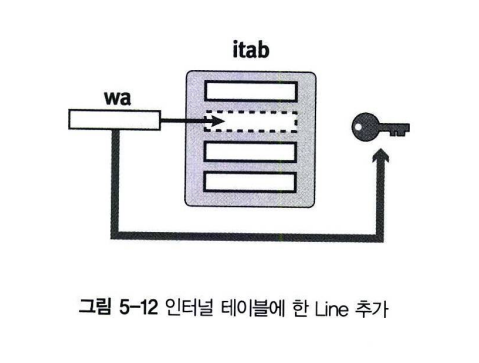
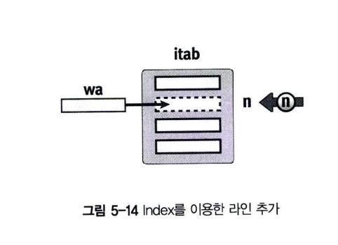
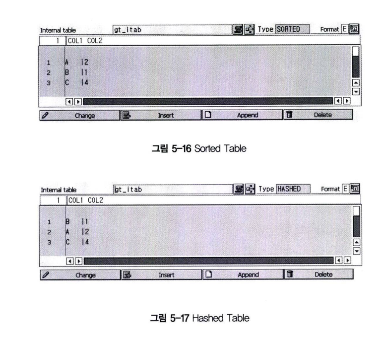
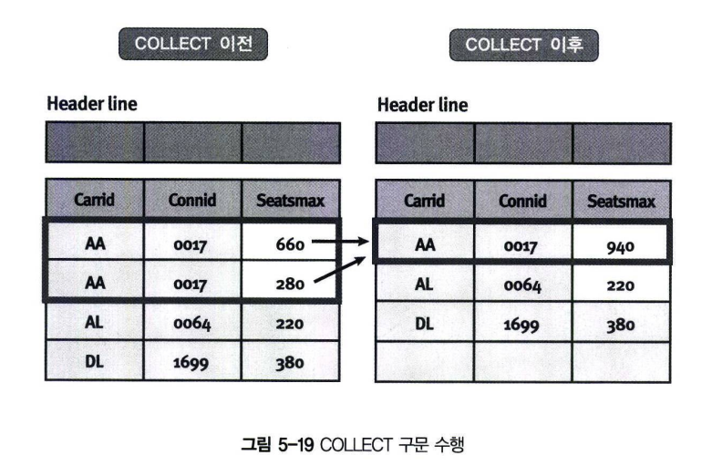

# 인터널 테이블 데이터 추가
## INSERT 구문
### 1.1 Table Key를 이용해 한 라인 추가
한 라인을 삽입하려면 다음 구문을 사용하며, Key 값을 이용해서 인터널 테이블에 라인을 추가한다. <br>
```abap
INSERT line INTO TABLE itab.
```
INSERT가 성공하면, 시스템 변수 SY-SUBRC에 0이 저장된다. <BR>
인터널 테이블이 UNIQUE KEY 값을 가지는 경우라면, INSERT 구문 수행 시 같은 Key 값이 존재하면 SY-SUBRC에 4 값을 반환하고 <br>
덤프 에러는 발생하지 않는다.<br>
 

### 1.2 Table Key를 이용해서 여러 라인 추가
INSERT 구문을 이용해서 여러 라인을 삽입할 수 있다. 단 .Itab1과 Itab2 테이블은 같은 Line Type이어야 한다.
예제 5-19를 이용해 여러 라인을 삽입하는 구문을 실습해보자.
```ABAP
INSERT lines OF itab1 [FROM n1] [TO n2] INTO TABLE itab2.
```

```abap
REPORT Z05_19.

DATA: BEGIN OF gs_line,
    col1 TYPE c,
    col2 TYPE i,
    END OF gs_line.

DATA : gt_itab1 LIKE STANDARD TABLE OF gs_line WITH NON-UNIQUE KEY col1.
       gt_itab2 LIKE SORTED TABLE OF gs_line WITH NON-UNIQUE KEY col1.

gs_line-col1 = 'B'.
gs_line-col2 = 1.
INSERT gs_line INTO TABLE gt_itab1.

gs_line-col1 = 'A'.
gs_line-col2 = 2.
INSERT gs_line INTO TABLE gt_itab1.

gs_line-col1 = 'C'.
gs_line-col2 = 3.

INSERT gs_line INTO TABLE gt_itab1.

INSERT LINES OF gt_itab1 INTO TABLE gt_itab2.

LOOP AT gt_itab2 INTO gs_line.
    WRITE :/ gs_line-col1, gs_line-col2.
ENDLOOP.    
```

Key 칼럼 col1 기준으로 정렬되어 출력되는 것은 인터널 테이블 gt_itab2가 Sorted Type이기 때문에 INSER LINES OF 구문에서 정렬된 값으로 INSERT 되기 때문이다.

### 1.3 Index를 이용해 한 라인 추가
INDEX 구문을 이용하면 INDEX 값 위치에 라인을 삽입할 수 있다. 이때는 Hashed Type의 인터널 테이블에는 사용할 수 없다. <br>
성공하게 되면, SY-SUBRC 변수는 0을 그리고 SY-TABIX 변수는 INDEX 값을 반환한다.
```ABAP
INSERT line INTO itab [Index idx].w
```
 <br>

INDEX 위치를 이용해서 여러 라인도 추가할 수 있다.
```abap
INSERT lines OF itab1 INTO itab2 [Index idx].
```

### 1.4 인터널 테이블 타입에 따른 INSERT 효과

```abap
REPORT Z05_20.

DATA : BEGIN OF gs_line,
    col1 TYPE c,
    col2 TYPE n.
    END OF gs_line.

DATA gt_itab LIKE STANDARD TABLE OF gs_line WITH NON-UNIQUE KEY col1.

gs_line-col1 = 'B'.
gs_line-col2 = 1.
INSERT gs_line INTO TABLE gt_itab.

gs_line-col1 = 'A'.
gs_line-col2 = 2.
INSERT gs_line INTO TABLE gt_itab.

gs_line-col1 = 'A'.
gs_line-col2 = 3.
INSERT gs_line INTO TABLE gt_itab.

gs_line-col1 = 'C'.
gs_line-col2 = 4.
INSERT gs_line INTO TABLE gt_itab.
BREAK-POINT.
```



## 2 Append 구문을 이용한 Table Line 추가
INSERT 구문은 Key와 Index를 이용해서 인터널 테이블에 데이터를 추가할 수 있지만, <br>
APPEND 구문은 Index만 이용할 수 있다. 즉, Hashed Type의 인터널 테이블에게서는 사용할 수 없다.

### 2.1 한 라인 추가
한 라인을 삽입하려면 다음 구문을 사용한다.
```abap
APPEND LINE TO itab.
```

APPEND를 한 후에는 시스템 변수 SY-TABIX에 인터널 테이블에 추가된 라인의 Index 번호를 저장한다.

### 2.2 여러 라인 추가
INSERT 구문과 동일하게 인터널 테이블을 한 번에 다른 인터널 테이블로 추가할 수 있다.
```abap
APPEND lines OF itab1 TO itab2.
```

다음 구문을 활용해서 인터널 테이블 itab1의 인덱스 n1 ~ n2 사이의 값을 itab2에 추가할 수 있다.
```abap
APPEND Lines OF itab1 [FROM n1] [TO n2] TO itab2.
```
APPEND 실습
```abap
REPORT Z05_21.

DATA : BEGIN OF gs_line,
    col1 TYPE c,
    col2 TYPE n,
    END OF gs_line.

DATA gt_itab LIKE STANDARD TABLE OF gs_line WITH NON-UNIQUE KEY col1.

gs_line-col1 = 'B'.
gs_line-col2 = 1.
APPEND gs_line TO gt_itab.

gs_line-col1 = 'A'.
gs_line-col2 = 2.
APPEND gs_line TO gt_itab.

gs_line-col1 = 'A'.
gs_line-col2 = 3.
APPEND gs_line TO gt_itab.

gs_line-col1 = 'C'.
gs_line-col2 = 4.
APPEND gs_line TO gt_itab.

BREAK-POINT.
```

### 2.3 인터널 테이블 타입에 따른 APPEND 효과


### 2.4 APPEND INITIAL LINE
인터널 테이블을 빈 공간에서 미리 생성한 후, 라인을 추가할 수 있다.
```abap
APPEND INITIAL LINE TO itab
~
APPEND wa TO itab.
```

SORTED BY 구문을 사용하면, 칼럼 f를 기준으로 DESCENDING 정렬을 수행해서 추가한다. <BR>
이때는 Standard Type의 인터널 테이블만 효력이 있으며, INITIAL SIZE로 크기를 지정해야 한다.
```ABAP
APPEND wa TO itab SORTED BY f.
```

## 3 COLLECT 구문
COLLECT 구문을 이용해서 인터널 테이블의 숫자 타입 칼럼을 합산하는 기능을 수행한다.
```ABAP
COLLECT wa INTO itab.
```
Key 값을 제외한 칼럼들은 Numeric Type (f,i,p)으로 선언되어야 한다. COLLECT 구문을 수행하면, <br>
같은 Key 값이 있을 때는 숫자 타입 칼럼을 합산하고 없을 때에는 APPEND 기능을 수행한다. <br>
Key 값이 없는 테이블은 CHAR 타입 칼럼들을 기준으로 같은 작업을 수행한다. <br>
아래의 그림은 인터널 테이블에 COLLECT 구문ㅇ르 수행한 이전과 이후의 데이터가 변경된 모습을 보여준다. <br>
인터널 테이블의 CHAR 타입은 carrid와 connid를 기준으로 같은 값이 있으면 숫자 타입의 seatsmax 칼럼을 합산하게 된다.<br>

```abap
REPORT Z05_23.

DATA : BEGIN OF gs_line,
        col1(3) type c,
        col2(2) type n,
        col3    type i,
       END OF gs_line.

DATA gt_itab LIKE STANDARD TABLE OF gs_line WITH NON-UNIQUE KEY col1 col2.

gs_line-col1 = 'AA'.
gs_line-col2 = '17'.
gs_line-col3 = 660.
COLLECT gs_line INTO gt_itab.

gs_line-col1 = 'AL'.
gs_line-col2 = '34'.
gs_line-col3 = 220.
COLLECT gs_line INTO gt_itab.

gs_line-col1 = 'AA'.
gs_line-col2 = '17'.
gs_line-col3 = 280.
COLLECT gs_line INTO gt_itab.

LOOP AT gt_itab INTO gs_line.
    WRITE :/ gs_line-col1, gs_line-col2, gs_line-col3.
ENDLOOP.    
```