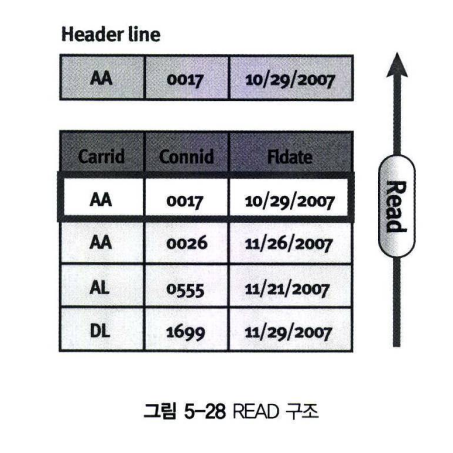
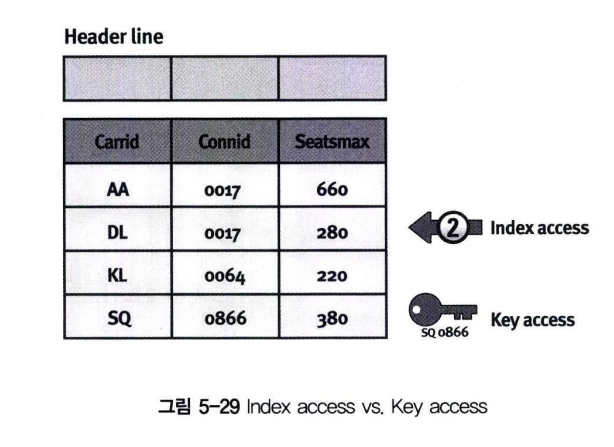

# 인터널 테이블 읽기
인터널 테이블에서 원하는 데이터를 읽으려면 READ 구문을 사용한다. <br>
만일 헤더 라인이 있으면 해당 데이터가 그림 5-28과 같이 헤더 라인으로 복사되고, 그렇지 않으면 Work Area에 복사해야 한다. <br>


## 1 Table Key 이용
Key 값을 이용해서 값을 찾을 수 있다. RESULT는 Read 결과를 저장하게 되는 Work Area이다. <br>
헤더 라인이 존재하는 인터널 테이블은 Into ~ 이하를 생략하고 인터널 테이블 이름 자체를 Work Area로 사용하여도 된다.(=Header Line) <br>
성공하면 SY-SUBRC 변수에 0을 반환하고, 실패하면 4를 반환한다. <BR>
**SY-TABIX 변수는 Line의 Index를 반환한다.**

```abap
READ TABLE itab FROM wa INTO result.
READ TABLE itab WITH TABLE KEY k1 = f1. kn = fn INTO result.
```
두 번째 구문을 이용하면 같은 컬럼을 여러 번 사용할 수 있다 <br>
아래 그림은 인터널 테이블을 READ 할 때 Index와 Key를 이용하는 방법을 설명한다.


```abap
REPORT Z05_31.

DATA : BEGIN OF gs_line,
        carrid TYPE scarr-carrid,
        carrname TYPE scarr-carrnaem,
        END OF gs_line.

DATA gt_itab LIKE TABLE OF gs_line WITH NON-UNIQUE KEY carrid.

SELECT carrid carrname INTO CORRESPONDING FIELDS OF TABLE gt_itab FROM scarr.

gs_line-carrid = 'AA'.
READ TABLE gt_itab FROM gs_line INTO gs_line.
WRITE :/ g_line-carrid, gs_line-carrname.

CLEAR : gs_line.

READ TABLE gt_itab WITH TABLE KEY carrid = 'AB' INTO gs_line.
WRITE :/ gs_line-carrid, gs_line-carrname.
```

## 2 Work Area 할당
READ 구문 수행 결과를 Work Area로 할당하는 구문이다.
```abap
READ TABLE itab WITH KEY k1 ... INTO wa [COMPARING f1 f2 ... | ALL FIELDS]
                                [TRANSPORTING f1 f2 ... | ALL FIELDS | NO FIELDS].
```

### 2.1 READ 구문의 COMPARING 옵션
COMPARING 구문은 READ 구문의 결과값에 비교 조건을 추가한다. 즉, COMPARING 구문 다음 기술된 field 들이 Work Area의 값과 <br>
인터널 테이블에 존재하는 값이 같으면 SY-SUBRC = 0 을 반환하고, 같지 않으면 SY-SUBRC = 2를 반환한다.
```ABAP
REPORT Z05_32.

DATA : BEGIN OF gs_line,
        col1 TYPE C,
        col2 TYPE I,
        END OF gs_line.

DATA gt_itab LIKE SORTED TABLE OF gs_line WITH UNIQUE KEY col1.

gs_line-col1 = 'A'.
gs_line-col2 = 1.
INSERT gs_line INTO TABLE gt_itab.

CLEAR gs_line.
gs_line-col1 = 'B'.
gs_line-col2 = 2.
INSERT gs_line INTO TABLE gt_itab.

CLEAR gs_line.

gs_line-col1 = 'A'.

READ TABLE gt_itab FROM gs_line INTO gs_line COMPARING col2.

WRITE :/ 'SY-SUBRC is : ' , SY-SUBRC.
WRITE :/ 'Result is  : ' , gs_line-col1, gs_line-col2.
```

### 2.2 READ 구문의 TRANSPORTING 옵션
TRANSPORTING은 READ 한 결과를 해당 칼럼만 Target에 저장하는 기능을 수행한다. <br>
예제 5-33을 이용해서 TRANSPORTING 구문을 이해해보자.

```ABAP
REPORT Z05_33.

DATA : BEGIN OF gs_line,
        col1 TYPE c,
        col2(7) TYPE c,
    END OF gs_line.

DATA gt_itab LIKE SORTED TABLE OF gs_line WITH UNIQUE KEY col1.
DATA gs_wa like LINE OF gt_itab.

gs_line-col1 = 'A'.
gs_line-col2 = 'First'.
INSERT gs_line INTO TABLE gt_itab.

CLEAR gs_line.
gs_line-col1 = 'B'.
gs_line-col2 = 'Second'.
INSERT gs_line INTO TABLE gt_itab.

CLEAR gs_line.

gs_line-col1 = 'A'.

READ TABLE gt_itab WITH TABLE KEY col1 = 'A' INTO gs_wa TRANSPORTING col2.

WRITE :/ 'Col1 is :', gs_wa-col1, 'Col2 is : ', gs_wa-col2.
```

예제 5-33은 READ 구문으로 조건에 맞는 데이터를 읽었지만, TRANSPORTING 구문으로 col2 데이터만 Tartget에(gs_wa-col2에만) 값을 복사하고, gs_wa-col1은 초깃값을 0을 가지게 된다.

## 3 INDEX를 이용해서 READ 구문 수행
INDEX를 이용해서 해당 라인의 값을 읽을 수 있다. <BR>
INDEX를 이용하기 때문에 HASHED TYPE의 인터널 테이블에서는 사용할 수 없다. <BR>
성공 시에는 SY-SUBRC 변수에 0을 반환하고 실패 시에는 4를 반환한다. 그리고 SY-TABIX에는 인터널 테이블의 INDEX 순번이 저장된다.
```ABAP
READ TABLE itab INDEX idx INTO result.
```

```abap
REPORT Z05_34.

DATA : BEGIN OF gs_line,
    col1 TYPE c,
    col2(7) TYPE c,
    END OF gs_line.

DATA gt_itab LIKE SORTED TABLE OF gs_line WITH UNIQUE KEY col1.

gs_line-col1 = 'A'.
gs_line-col2 = 'First'.
INSERT gs_line INTO TABLE gt_itab.

CLEAR gs_line.
gs_line-col1 = 'B'.
gs_line-col2 = 'Second'.
INSERT gs_line INTO TABLE gt_itab.

CLEAR gs_line.

READ TABLE gt_itab INTO gs_line INDEX 1.
WRITE :/ 'Col1 is : ', gs_line-col1, 'Col2 is : ', gs_line-col2.
```

## 4 READ BINARY SEARCH
Standard Type의 인터널 테이블을 READ 할 때 BINARY SEARCH를 이용할 수 있다. <BR>
BINARY SEARCH 대상 칼럼을 기준으로 정렬(Sort)한 후 사용하며, READ 속도가 일반 READ 속도보다 훨씬 빠르다. <br>
```ABAP
READ TABLE itab WITH KEY k1 = f1 ... kn = fn INTO result BINARY SEARCH.
```