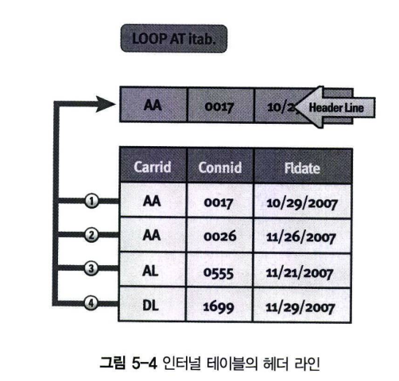
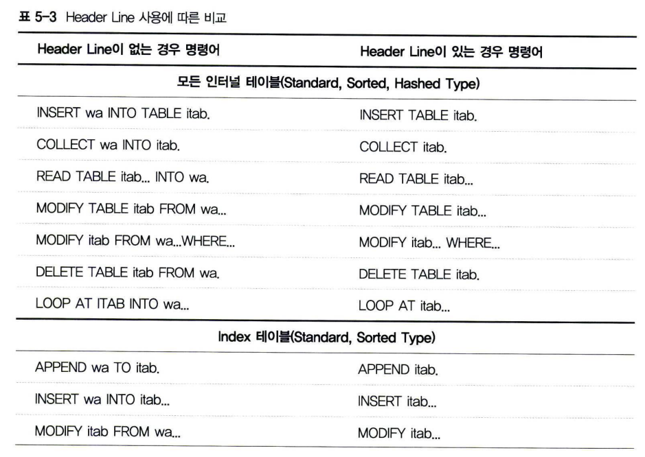

# 인터널 테이블과 헤더 라인


그림 5-3의 모자 아이콘이 보이는 라인이 헤더 라인이다. <br>
다른 말로  Work Area라고도 한다. <br>
인터널 테이블 선언 시 WITH HEADER LINE 구문을 추가하면 생성된다. <BR>
헤더 라인이 있는 인터널 테이블을 사용할 때에는 어떠한 정보가 헤더 라인에 있는지 주의해서 사용해야 한다.

```ABAP
DATA ITAB TYPE TYPE|LIKE OBJ [WITH HEDAER LINE].
```
그림 5-4는 인터널 테이블을 LOOP 돌면서 개별 Line이 헤더 라인으로 옮겨가는 과정을 잘 설명하고 있다.<BR>


다음 구문과 같이 헤더 라인이 있는 인터널 테이블을 정의하면 헤더 라인에 담긴 정보를 바로 사용할 수 있다.
```abap
DATA itab TYPE TABLE OF t_str WITH HEADER LINE.
```

인터널 테이블의 LOOP 구문에서 헤더 라인이 없는 경우와 있는 경우를 비교해보자. <BR>
헤더 라인이 없으면 Work Area(구조체를)를 선언하고 나서 값을 복사한 다음 사용해야 한다. <br>
헤더 라인이 있으면 인터널 테이블의 이름은 ABAP 프로그램 내에서 헤더 라인을 의미하게 된다. <br>


인터널 테이블의 MODIFY 사용 시 헤더 라인의 유무에 따른 구문 비교 <br>


헤더 라인이 있으면 MODIFY 구문은 FROM 이하가 생략되어 있다.
```abap
MODIFY TABLE itab.
```

이 구문을 다시 분석하면 다음과 같이 적용.
```abap
MODIFY TABLE itab FROM 헤더 라인
```
실질적으로 다음 문장이 실행되는 것, FROM 이하 구문은 생략
```abap
MODIFY TABLE itab FROM itab.
```

READ 구문도 같다. READ TABLE ITAB INDEX 2를 하게 되면 인터널 테이블의 2번째 라인이 헤더 라인으로 올라와서 바로 사용이 가능하지만, <BR>
헤더 라인을 선언하지 않으면, READ TABLE itab INDEX 2 INTO work_area 정보를 옮기고 나서 사용할 수 있다. <BR>
인터널 테이블에 헤더 라인의 유무에 따른 READ 명령어 사용법은 다음과 같다.


아래 표 5-3은 헤더 라인 유무에 따라 인터널 테이블과 관련된 명령어들을 정리하고 있다.


위에서 공부한것처럼, 헤더 라인이 있는 명령어들은 헤더 라인이 없는 명령어들의 Work Area 부분이 생략된 것. <br>
헤더 라인과 인터널 테이블 이름이 같기 때문에 간소화하여 표현한 것이다. <br>
헤더 라인이 있는 인터널 테이블에 Entry를 추가하는 다음 2개의 INSERT 구문은 서로 같다.
```abap
INSERT TABLE itab.
INSERT itab INTO TABLE itab.
```

```abap
REPORT Z05_03.

TYPES : BEGIN OF T_STR,
    COL1 TYPE I,
    COL2 TYPE I,
    END OF T_STR.

DATA : GT_ITAB TYPE TABLE OF T_STR WITH HEADER LINE.

DO 3 TIMES.
    GT_ITAB-COL1 = SY-INDEX.
    GT_ITBA-COL2 = SY-INDEX * 2.
    APPEND GT_ITAB.
ENDDO.

LOOP AT GT_ITAB.
    WRITE :/ GT_ITAB-COL1, GT_ITAB-COL2.
ENDLOOP.    
```

예제 5-3은 헤더 라인이 있는 인터널 테이블을 사용할 경우 Work Area 대신 헤더 라인을 이용하는 것을 설명한다. <br>
헤더 라인이 있는 인터널 테이블에서 APPEND 구문은 다음과 같이 헤더 라인 정보를 생략한 것과 같다.<br>
 <br>

즉, 예제 5-3의 APPEND 구문을 다음과 같이 변경해도 에러가 발생하지 않는다.
```abap
DO 3 TIMES.
    GT_ITAB-COL1 = SY-INDEX.
    GT_ITAB-COL2 = SY-INDEX * 2.
    APPEND GT_ITAB TO GT_ITAB.
ENDDO.    
```

예제 5-4는 이와 반대로 Work Area를 선언해서 예제 5-3과 같은 기능을 수행하는 경우이다. <br>
인터널 테이블에 헤더 라인이 존재하지 않으면, Work Area를 선언해서 데이터를 읽거나 변경할 수 있다.

```abap
REPORT Z05_04.

TYPES : BEGIN OF T_STR,
    COL1 TYPE I,
    COL2 TYPE I,
   END OF T_STR.

DATA : GT_ITAB TYPE TABLE OF T_STR,
       GS_STR  LIKE LINE OF GT_ITAB.

DO 3 TIMES.
    GS_STR-COL1 = SY-INDEX.
    GS_STR-COL2 = SY-INDEX * 2.
    APPEND GS_STR TO GT_ITAB.
ENDDO.

LOOP AT GT_ITAB INTO GS_STR.
    WRITE :/ GS_STR-COL1 , GS_STR-COL2.
ENDLOOP.    
```

ABAP 언어에 객체지향 개념이 도입되면서 클래스 내부에서는 헤더라인이 지원되지 않으며, OCCURS 구문을 포함하여 <BR>
헤더 라인이 있는 인터널 테이블을 사용하지 말 것을 권하고 있다. <BR>
하지만 기존 프로그램에서 많이 사용되었고, 헤더 라인의 편리한 기능 때문에 실무에선 여전히 많이 활용되고 있다.