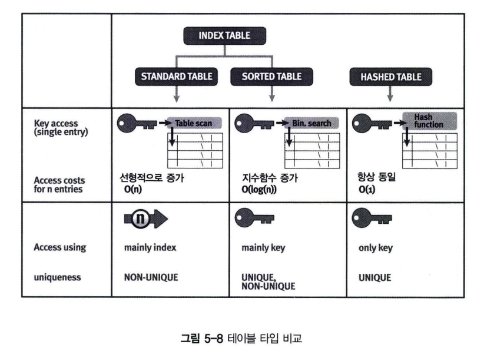
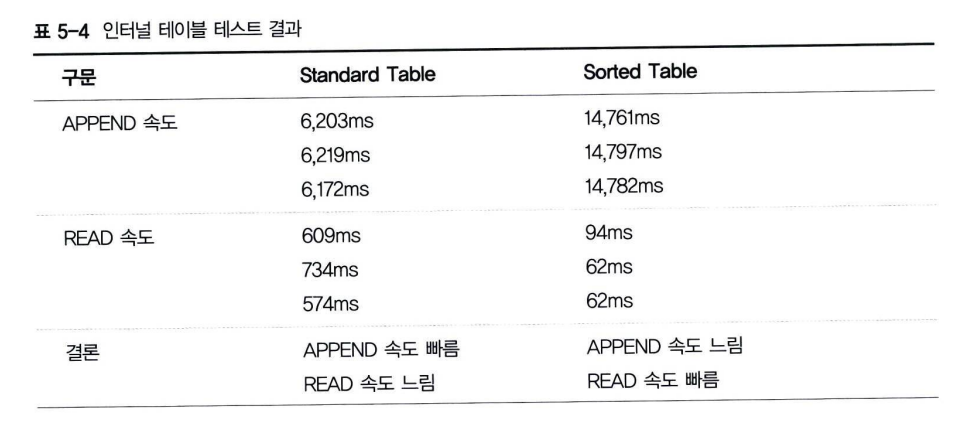
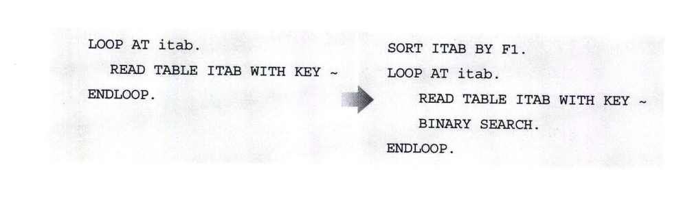

# 인터널 테이블 속도 비교
***ABAP 프로그램에서 인터널 테이블을 잘 활용하는 것은 성능에 큰 영향을 미치는 중요한 변수이다.***

## Standard VS Sorted Table
Standard Table과 Sorted Table은 모두 Index 테이블이다. <br>
프로그램에서 자주 사용하는 (탐색 속도를 개선해주는) BINARY SEARCH 구문의 측면에서 두 가지 테이블을 비교해 보자.<BR>


그림 5-8에서 알 수 있듯이 Standard Table의 Key Access 속도는 인터널 테이블의 Line 수에 따라 선형 종속적으로 증가하게 되고, <br>
Sorted Table은 지수 함수로 증가하게 된다. <br>
즉 테이블의 건수가 증가할수록 Sorted Table의 탐색 속도가 월등히 빠르다는 것을 보여주고 있다.<br>


테스트 결과에서 알 수 있듯이 Sorted Table은 READ속도가 월등히 우수하지만, Line을 추가하면서 정렬하기 때문에 APPEND 구문에서 속도가 많이 느리다. <br>
대용량 데이터를 다룰 때에는 두 가지 타입을 잘 구분해서 사용하여야 한다. <br>
서능 측면에서 큰 차이를 가져올 수 있기 때문이다. 예를 들어, 고객 정보 백만 건을 처리하는 프로그램에서 고객번호, 주민번호, 이름 등의 칼럼으로 탐색(READ)하는 횟수가 많다면 Sorted Table을 사용하는 것이 효율적이라 판단할 수 있다.

## Binary Search(Standard Internal Table)
BINARY SEARCH는 이진 탐색 트리를 이용해서 값을 찾는 방법으로 먼저 데이터를 킷값(칼럼) 기준으로 정렬해야 한다.
```abap
READ TABLE <itab> WITH KEY col1 BINARY SEARCH.
```

Standard Table로 선언하였을 때는 데이터 건수가 많을수록 정렬 시간이 지연되므로 SORT 하는데 들어간 시간이 <br>
BINARY SEARCH로 얻을 수 있는 시간감소량보다 더 많이 소요될 수 있다. 그러므로 무조건 SORT를 해서 BINARY SEARCH 하는 것은 <BR>
바람직하지 않을 수 있다. 테이블 타입, 테이블 건수와 같은 조건에 따라 정반대의 결과를 가져 올 수 있으므로 주의해서 사용해야 한다.

만약, 10,000건의 데이터 인터널 테이블을 LOOP 처리하는 경우라면 LOOP 이전에 SORT를 하고 BINARY SEARCH 해주는 것이 훨씬 더 빠른 성능을 제공해준다. <BR>
튜닝 프로젝트를 하게 되면 BINARY SEARCH를 하라는 지적이 상당히 많을 것이다. <BR>

