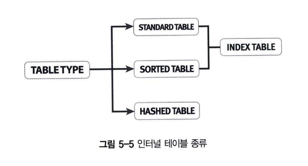
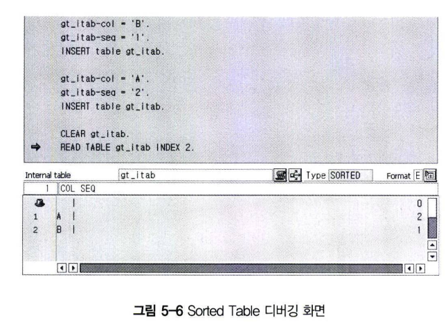
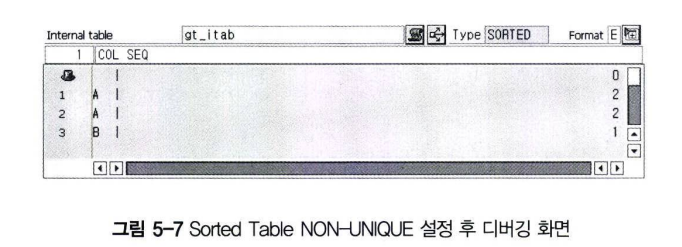

# 인터널 테이블 종류
인터널 테이블 종류는 개별 Entry에 접근하는 방법을 결정하며, 3가지 종류로 구분된다.<br>


## 1 Standard Table
순차적인 Index를 가지는 테이블이며, Tree 구조를 이루고 있다. <br>
Index를 이용해서 테이블 Entry를 찾을 때 바람직한 테이블 구조이다. <br>
READ, MODIFY 그리고 DELETE 구문을 사용할 때도 Index를 사용하게 된다. <br>
인터널 테이블에서의 Index는 단순히 인터널 테이블에서 데이터가 위치하는 라인 순번을 의미한다. <br>
Standard Table의 키는 항상 Non-unique로 선언하여야 한다. <br>
즉, WITH UNIQUE 구문을 사용할 수 없다.

```abap
DATA : itab TYPE STANDARD TABLE OF <t_str>
        WITH NON-UNIQUE KEY <keys> [INITIAL SIZe <n>] [WITH HEADER LINE].
```

Standard 타입의 인터널 테이블을 선언해서, 데이터를 추가하고 출력하는 프로그램을 만들어보자.

```abap
REPORT Z05_05.

** 1. STRUCTURE TYPE 선언
TYPES : BEGIN OF T_LINE,
    FIELD1 TYPE C LENGTH 5,
    FIELD2 TYPE C LENGTH 4,
    FIELD3 TYPE I,
   END OF T_LINE.

** 2. Standard Table 타입 선언
TYPES T_TAB TYPE STANDARD TABLE OF T_LINE WITH NON-UNIQUE DEFAULT KEY.

** 3. INTERNAL TABLE 선언
DATA GT_ITAB TYPE T_TAB WITH HEDAER LINE.

GT_ITAB-FIELD1 = 'ENJOY'.
GT_ITAB-FIELD2 = 'ABAP'.
GT_ITAB-FIELD3 = 1.
APPEND GT_ITAB.

READ TABLE GT_ITAB INDEX 1.

WRITE :/ GT_ITAB-FIELD1, GT_ITAB-FIELD2, GT_ITAB-FIELD3.
```

예제5-5에서 3가지 단계를 이용해서 인터널 테이블을 생성했다. <BR>
2번째 단계에서 TYPE STANDARD TABLE OF 구문으로 Standard 인터널 테이블 타입을 선언한다. <br>
이때 DEFAULT KEY. 구문의 역할은 인터널 테이블의 CHAR 타입으로 선언된 모든 칼럼들을 키 칼럼으로 정의하는 것이다. <BR>
WITH DEFAULT KEY. 구문을 선언하지 않아도 기본으로 포함된 것으로 간주되며, 이러한 KEY를 STANDARD KEY라고 부른다. <BR>
즉, 다음 2개의 문장은 서로 같다.
```ABAP
DATA : GT_ITAB TYPE STANDARD TABLE OF T_LINE WITH DEFAULT KEY.
DATA : GT_ITAB TYPE STANDARD TBALE OF T_LINE.
```

인터널 테이블의 key를 선언할 때는 개발자가 직접 칼럼을 정의할 수 있는데, 이러한 Key를 User Define Key라고 한다. <br>
다음 구문은 인터널 테이블의 field1만 Key 칼럼으로 선언한다.

```abap
DATA : GT_ITAB TYPE STANDARD TABLE OF T_LINE WITH KEY FIELD1.
```

예제 5-5에서 READ TABLE 구문은 인터널 테이블의 개별 Line에 접근하는 문장으로, ABAP Dictionary 테이블에서 데이터를 추출하는 SELECT 문장을 사용하는 것과 유사한 역할을 하게 된다. <br>
READ TABLE ~ INDEX 1 구문은 인터널 테이블의 1번째 Line 데이터를 읽는다.<br>
2번째 Line에 접근할 때는 당연히 다음과 같이 사용하면 된다.

```abap
READ TABLE gt_itab INDEX 2.
```

Standard 테이블은 Index를 이용해서 검색하기 때문에 테이블 라인 수에 비례하여 탐색 속도가 증가한다. <br>
인터널 테이블의 순서(Index)가 아니라, 칼럼 값을 기준으로 데이터를 읽을 때는 다음과 같이 사용한다. <br>
WITH TABLE KEY 구문은 인터널 테이블에서 선언시 정의한 Key 칼럼은 모두 기술해야 한다.
```abap
READ TABLE GT_ITAB WITH TABLE KEY FIELD1 = 'Enjoy' field2 = 'ABAP'.
```

Key 칼럼 이외의 값을 READ 할 경우에는 WITH KEY 구문만 사용하면 된다.
```ABAP
READ TABLE GT_ITAB WITH KEY FIELD3 = 1.
```

정리하자면, Standard 인터널 테이블 타입의 데이터를 READ 하는 방법은 2가지가 있다. <br>
그것은 Index와 Key를 이용하는 방법이다. READ 구문은 뒤에서 더 자세히 학습하도록 한다.

## 2 Sorted Table
Standard Table과 Sorted Table은 Index 테이블이다. 그 중 Sorted Table은 Key 값으로 항상 정렬된 인터널 테이블 타입이다. <br>
즉, 프로그래머가 원하는 Key 값으로 항상 정렬된 결과로 인터널 테이블에 저장해야 하는 경우에 사용한다. <br>
Standard Table과 마찬가지로 Index를 가지고 있으며, Index 또는 Key로 해당 Row를 찾아갈 수 있다. <br>
Sorted Table과 Standard Table의 또 다른 차이점은 Uniqueness이다. <br>
Sorted Table은 Key 값을 선언할 때 WITH UNIQUE를 사용할 수 있지만, Standard Table은 WITH NON-UNIQUE만 사용할 수 있다. <br>
Sorted Table은 내부적으로 BINARY SEARCH를 이용하기 때문에 Table Entry의 수와 탐색 속도는 정적 상관관계를 갖는다. <br>

Sorted Table로 선언할 때는 Unique/Non-unique를 반드시 명시하여야 한다. <br>
Sorted Table은 이미 정렬되어 있기 때문에 Sort 명령어를 사용하면 오류가 발생한다.

```abap
REPORT Z05_06.

** 1. STRUCTURE TYPE 선언
TYPES : BEGIN OF T_LINE,
    COL TYPE C,
    SEQ TYPE I,
        END OF T_LINE.

** 2. STANDARD TABLE 타입 선언
TYPES T_TAB TYPE SORTED TABLE OF T_LINE WITH UNIQUE KEY CO1.

** 3. INTERNAL TABLE 선언
DATA : GT_ITAB TYPE T_TAB WITH HEADER LINE.

GT_ITAB-COL = 'B'.
GT_ITAB-SEQ = '1'.
INSERT TABLE GT_ITAB.

GT_ITAB-COL = 'A'.
GT_ITAB-SEQ = '2'.
INSERT TABLE GT_ITAB.

CLEAR GT_ITAB.
READ TABLE GT_ITAB INDEX 2.

WRITE :/ GT_ITAB-COL1, GT_ITAB-SEQ.
```
예제 5-6은 Sorted Type의 인터널 테이블을 선언하고, 2개의 Entry를 추가하였다. <br>
그림 5-6에서 확인해보면 'B' 값이 먼저 추가된 후에 'A' 값이 추가되었는데, 'A' 값이 'B'값보다 앞에 있다. <br>
이것은 인터널 테이블이 Sorted Type이고, col 칼럼이 Key로 정의되었기 때문에 col 칼럼 기준으로 정렬된 상태로 값이 INSERT 되는 것. <BR>
 <BR>
예제 5-6에서 INSERT 대신에 APPEND 구문을 사용하면 다음과 같이 정렬에 문제가 발생했다는 Dump Error가 발생한다.
```abap
"the sorting sequence - determined by the table key - was destroyed."
```

그리고 예제 5-6에서 WITH NON-UNIQUE KEY 구문으로 Key 값이 중복될 수 있도록 설정하면 그림 5-7과 같이 COL 칼럼에 'A'라는 값이 중복되어도 문제없이 INSERT 된다. <br>


## 3 Hashed Table
Hashed Table은 순차적인 Index를 가지고 있으며, Hash 값으로 계산된 Key 값으로만 탐색할 수 있다. <br>
응답 속도는 인터널 테이블의 Entry 수와 상관없이 항상 같다. <br>
Hash 값은 Hash 알고리즘으로 계산된 것으로 메모리에 저장된 주솟값으로 데이터를 바로 읽을 수 있도록 도와준다. <br>
Hashed Table은 반드시 Unique 하게 선언되어야 한다.
```abap
REPORT Z05_07.

** 1. STRUCTURE TYPE 선언
TYPES : BEGIN OF T_LINE,
    COL TYPE C,
    SEQ TYPE I,
    END OF T_LINE.

** 2. STANDARD TABLE 타입 선언
TYPES T_TAB TYPE HASHED TABLE OF T_LINE WITH UNIQUE KEY COL.

** 3. INTERNAL TABLE 선언
DATA GT_ITAB TYPE T_TAB WITH HEADER LINE.

GT_ITAB-COL = 'B'.
GT_ITAB-SEQ = '1'.
INSERT TABLE GT_ITAB.

GT_ITAB-COL = 'A'.
GT_ITAB-SEQ = '2'.
INSERT TABLE GT_ITAB.

CLEAR GT_ITAB.
READ TABLE GT_ITAB WITH TABLE KEY COL = 'A'.

WRITE :/ GT_ITAB-COL, GT_ITAB-SEQ.
```

Hashed Type의 인터널 테이블은 Index가 없기 때문에 READ TABLE ~ INDEX 구문을 사용할 수 없다. <BR>
즉, 예제 5-7과 같이 READ TABLE ~ WITH TABLE KEY 또는 WITH KEY 구문을 이용해서 인터널 테이블 데이터에 접근할 수 있다.