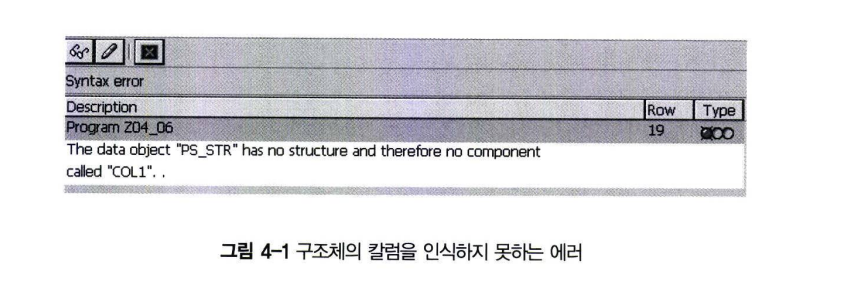

# Subroutine 정의
Subroutine은 FORM으로 시작해서 END FORM으로 종료되는 구문을 의미한다.<br>


```abap
REPORT SUBROUTINE_TEST

PERFROM WRITE_DATA. "EXPECTED -> SUBROUTIN TEST

FORM WRITE_DATA.
    WRITE : 'SUBROUTIN TEST'.
ENDFORM.                " WRITE DATA    
```

## 서브루틴 생성
 <br>
 <br>
 <br>
 <br>
 <br>

# Subroutine 파라미터
파라미터(Parameter)는 Subroutine을 호출하는 구문과 호출받는 구문 사이에 주고받는 값을 의미한다. <br>
Subroutine 내에서 파라미터는 DATA 구문으로 정의하는 일반적인 Local 변수와 같다.<br>
Subroutine을 호출할 때 사용되는 파라미터를 Actual Parameter라 하고 Subroutine에서 사용되는 파라미터를 Formal Parameter라 정의한다.

***PERFORM의 USING, CHANGING 구문을 사용해서 파라미터를 선언하며 Subroutine과 그 순서를 같게 지정해야 한다. <br>***
***파라미터는 ABAP의 모든 기본 Data Type, Field Symbol, Internal Table 등을 사용할 수 있다.***

다음 구문은 Subroutine에 사용되는 다양한 옵션들을 보여 준다.
```abap
FORM subr USING p1 TYPE type
        VALUE (p2) TYPE type
        ...
    CHANGING    p3 TYPE type
        VALUE (P4) TYPE type
```
## 1 파라미터 전달 방법
Subroutine은 Using과 Changing 구문으로 파라미터를 주고받게 되는데, 3가지 유형으로 분류된다.
- Call by Value : 넘겨주는 변수(Actual Parameter)와 받는 변수(Formal Parameter)가 물리적으로 다른 메모리 영역을 가지고 있음.
- Call by Reference : 물리적으로 같은 메모리 영역을 공유하여 넘겨주며 값은 주소.
- Call by Value and Result : 변수의 값을 넘겨주고 받는 구문에서 작업을 성공적으로 수행하였을 경우 변경된 값을 return. 물리적으로는 다른 영역 사용

### 1.1 Call by Value
Call by Value는 USING 키워드 다음에 파라미터를 사용하고, VALUE 구문으로 완성한다.
```ABAP
FORM subr USING ... VALUE(pi) [TYPE <t>|LIKE <f>].
```

VALUE 구문에서 Formal Parameter는 자신의 메모리를 가진다. Subroutine을 호출할 때, Actual Parameter의 값은 Formal Parameter에 복사된다. <br>
하지만 Formal Parameter의 값이 변경되더라도 Actual Parameter에는 영향을 미치지 않는다. <br>

Call by Value 실습

```abap
REPORT SUBROUTINE_CALL_BY_VALUE_TEST.

DATA : GV_VAL TYPE C LENGTH 20 VALUE 'CALL BY VALUE TEST'.

PERFORM CALL_BY_VALUE USING GV_VAL.

FORM CALL_BY_VALUE USING VALUE(P_VAL).
    WRTIE P_VAL.

ENDFORM.    
```
FORM 구문에서 USING과 VALUE 키워드를 같이 사용하면 새로운 메모리에 값을 복사해서 값을 전달받는다.
이때 FORM 구문 내에 사용된 p_val 변수는 지역(Local) 변수이다.

### 1.2 Call by Reference
CHANGING 키워드 다음에 파라미터를 사용하면, Subroutine에 전달된 파라미터 값이 변경된다.

```abap
FORM subr CHANGING ... pi [TYPE <t>|LIKE <f>] ...
```

Subroutine의 Formal Parameter는 자신의 메모리를 가지지 않는다. Subroutine이 호출되는 동안 Actual Parameter의 주소값을 가지고 있을 뿐이다. <br>
즉, Subroutine을 호출한 프로그램의 메모리(동일한 변수 이름)에서 작업하게 된다.

```abap
REPORT CALL_BY_REFERENCE_TEST.

DATA : GV_VAL TYPE C LENGTH 30 VALUE 'CALL BY REFERENCE TEST'.

WRITE / GV_VAL.

PERFORM CALL_BY_REF CHANGING GV_VAL.

WRITE / GV_VAL.

FORM CALL_BY_REF CHANGING P_VAL.

    P_VAL = 'VALUE IS CHANGED'.

ENDFORM.
```

첫 번째 WRITE 구문은 GV_VAL 변수를 선언할 때 지정한 VALUE 값이 출력 되고, 두 번째 WRITE 구문은 FORM 구문에서 변경한 문자열이 출력. <BR>
VALUE 구문을 사용하지 않으면 USING 구문과 CHANGING 구문은 모두 Call by Reference를 이용하게 된다. <br>

CHANGING을 USING으로 변경해도 같은 결과가 출력된다.

즉 FORM, 구문 내에서 VALUE 구문을 사용하지 않으면 USING과 CHANGING 구문의 기능은 같다. <BR>
***단지 가독성 차원에서 '사용', '변경'하다는 것을 명시적으로 표현하기 위해 구분한 것*** <BR>
***USING은 데이터를 전달하고, CHANGING은 데이터를 전달하고 변경한다는 의미를 가진다.*** <BR>

Actual Parameter의 값이 Subroutine 내에서 자동으로 변경되는 것을 피하려면 USING과 VALUE 구문을 함께 사용해야 한다.

### 1.3 Call by Value and Result
CHANGING 키워드 다음에 파라미터를 사용하고, VALUE 구문으로 완성한다.

```ABAP
FORM subr CHANGING.. VALUE(pi) [TYPE <t>|LIKE <f>].
```

USING 구문과 VALUE 구문이 함께 사용되면 Subroutine 내에서 Actual Parameter 값을 변경할 수 없으나 (Call by value) <br>
CHANGING 구문과 VALUE 구문이 함께 사용되면 Subroutine이 정상적으로 종료될 경우 Actual Parameter 값이 변경된다. <br>
즉, CHANGING 구문은 항상 VALUE 구문과 함께 사용하는 것이 바람직하다.<BR>
정수 타입 변수 3개를 선언하고, FORM 구문 내에서 더하기를 수행하고 출력하는 프로그램을 실습해보자.

```ABAP
REPORT CALL_BY_VALUE_AND_RESULT.

DATA : GV_VAL1 TYPE I VALUE2,
       GV_VAL2 TYPE I VALUE3,
       GV_SUM  TYPE I.

PERFORM sum_data USING gv_val1 gv_val2 CHANGING gv_sum.

WRITE :/ 'Result is : ' , GV_SUM.

FORM sum_data USING value(p_val1)
                    value(p_val2)    
                CHANGING value(p_sum).

p_sum = p_val1 + p_val2.

ENDFORM.
```

## 2. 파라미터 타입 정의
FORM 구문 내의 Formal Parameter는 TYPE과 LIKE 구문을 이용해 모든 ABAP 데이터 타입을 사용할 수 있다. <br>
타입을 명시적으로 지정하지 않으면, Generic Type으로 정의 되고, Actual Parameter의 기술적 속성을 상속받게 된다. <br>
이때는 Type Conversion이 가능한 타입을 사용해야 한다.

앞에서 실습했던 에제들은 Formal Parameter 내에서 타입을 지정하지 않았다. 그래서 Actual Parameter의 속성을 그대로 사용할 수 있다. 이번에는 FORM 구문에서 파라미터 타입을 지정하는 실습을 해본다.

```abap
REPORT PARAMETER_TYPE_TEST.

DATA : GV_VAL TYPE C.

PERFORM CALL_BYV_REF CHANGING GV_VAL.

FORM CALL_BYV CHANGING P_VAL TYPE I.
    P_VAL = 'VALUE IS CHANGED'.
ENDFORM.
```


기본 타입 d,f,I,t를 PERFORM 구문에서 사용했다면 FORM 구문의 파라미터도 같은 타입을 사용해야한다.

```ABAP
DATA GV_VAL TYPE d.

PERFORM subr CHANGING gv_val.
```

위 구문과 같이 TYPE d를 파라미터로 FORM 구문에 전달했다면, Formal Parameter는 다음 3가지 방법을 사용해서 타입을 정의할 수 있다.

1. Generic Type 사용 <br> FORM subr CHANGING p_val.
2. Actual Parameter와 같은 타입 사용 <br> FORM subr CHANGING p_val TYPE d.
3. Actual Parameter와 같은 타입의 변수 사용 <br> FORM subr CHANGING p_val LIKE gv_val.
   
## 3 파라미터와 구조체

Formal Parameter는 모든 ABAP Data Type이 허용되기 때문에 구조체도 당연히 사용할 수 있다. <br>
구조체를 파라미터로 사용할 때는 TYPE, LIKE뿐만 아니라 STRUCTURE 구문을 이용해 구조체 타입을 정의할 수 있다.

```abap
FORM subr USING p_str STRUCTURE str... 
FORM subr USING p_str type t_str...
FORM sbur USING p_str LIKE str...
```

```abap
REPORT Z04_06.

DATA : BEING OF gs_str,
            col1 VALUE 'A',
            col2 VALUE 'B',
        END OF gs_str.

PERFORM write_data USING gs_str.

FORM write_data USING ps_str STRUCTURE gs_str.
    WRITE : ps_str-co1, ps_str-col2.
ENDFORM.                                    " WRITE_DATA    
```

Z04_06 프로그램에서 구조체를 파라미터로 전달할 때 타입을 명시적으로 지정하지 않으면 어떻게 될까?

```abap
FORM write_data USING ps_str.
    WRITE : ps_str-col1, ps_str-col2.
ENDFORM.                "WRITE_DATA    
```

구문 점검 버튼을 선택하게 되면, 구조체에 col1 칼럼이 없다는 에러가 발생한다.<br>


이처럼 구조체를 전달할 때 타입을 지정하지 않았으면 구조체 칼럼을 WRITE 하거나 인식하려 할 때 필드 심볼을 이용해야한다.

```abap
FIELD-SYMBOLS <fs>.

FORM write_data USING ps_str.
    ASSIGN COMPONENT 1 OF STRUCTURE ps_str TO <fs>.
    WRITE <fs>.

    ASSIGN COMPONENT 2 OF STRUCTURE ps_str TO <fs>.
    WRITE <fs>.

ENDFORM.
```

## 4 파라미터와 인터널 테이블
### 4.1 USING, CHANGING 구문
인터널 테이블을 Subroutine의 파라미터로 사용할 때도 USING, CHANGING 키워드를 사용할 수 있다.
```ABAP
FORM subr CHANGING ... <itabi> [TYPE <t>|LIKE <f>] ...
```

```abap
REPORT Z04_07.

TYPES : BEGIN OF t_str,
    COL1 TYPE c,
    COL2 TYPE i,
   END OF t_str.

   TYPES : t_itab TYPE TABLE OF t_str.

   DATA : gs_str TYPE t_str,
          gt_itab TYPE t_itab.

    gs_str-col1 = 'A'.
    gs_str-col2 = 1.
    APPEND gs_str TO itab.

    gs_str-col1 = 'B'
    gs_str-col2 = 2.
    APPEND gs_str TO gt_itab.

    PERFORM test_itab USING gt_itab.

    FORM test_itab USING pt_itab TYPE t_itab.

        READ TABLE pt_itab WITH KEY col1 = 'A' INTO gs_str.
        IF sy-subrc = 0.
            WRITE : gs_str-col1 , gs_str-col2.
        ENDIF.
    ENDFORM.                               
```

Z04_07에서 Subroutine의 파라미터 타입을 정의하는 pt_itab TYPE t_itab. 구문에서 인터널 테이블을 사용했는데,<br>
이 구문을 TYPE ANY TABLE 구문으로 다음과 같이 변경해본다.

```ABAP
FORM test_itab  USING   pt_itab TYPE ANY TABLE.
    READ TABLE pt_itab WITH KEY col1 = 'A' INTO gs_str.
ENDFORM.
```

ABAP Editor의 **New Entires** 버튼을 눌러 구문 점검을 하면, READ 라인에서 아래 그림과 같은 에러가 발생한다. <br>
이것은 FORM의 파라미터가 TYPE ANY TABLE로 정의되어서 pt_itab 인터널 테이블의 내부 구조(칼럼)를 알 수 없기 때문이다.<br>
즉, col1이 인터널 테이블에 존재하는지 알 수 없다는 것.<BR>


TYPE ANY TABLE로 파라미터를 정의했다면 다음과 같이 READ 구문을 동적으로 변경해야 한다.