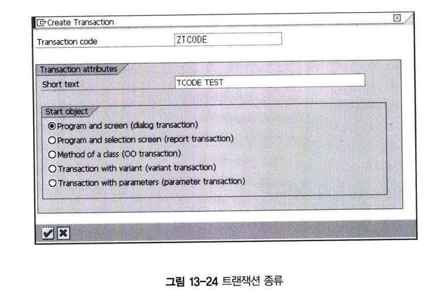

# INCLUDE 프로그램이란?

INCLUDE 프로그램을 자주 사용하지만 정확한 정의를 알고 사용하는 사람은 많지 않다.  
INCLUDE 프로그램은 R/3 Repository에 저장되는 오브젝트로서 다음 2가지 기능을 목적으로 개발되었다.
- Libaray(모듈화)
  - Include 프로그램은 같은 소스 코드를 다른 프로그램에서 사용할 수 있도록 한다.
- Order(순서, 가독성)
  - Include 프로그램은 복잡한 프로그램을 순서대로 정렬해서 뛰어난 가독성을 제공한다.

INCLUDE 프로그램에는 다음과 같은 특성이 있다.
- INCLUDE는 하나의 프로그램이지만 독립적으로 실행될 수 없다.
- INCLUDE는 프로그램은 다른 프로그램 내에 내장되어야(built in) 한다.
- INCLUDE는 프로그램은 또 다른 INCLUDE를 포함할 수 있다.
- INCLUDE는 프로그램은 자기 자신을 호출할 수 없다.
- INCLUDE 프로그램은 파라미터를 가지지 않는다.

## 4 PAI 모듈 구현
PAI 모듈은 사용자가 입력 필드에 값을 입력하고 ENTER 키를 입력하거나, 스크린의 푸쉬 버튼을 클릭하였을 때와 같은 User Dialog에 반응하는 이벤트이다.

## 5 트랜잭션(T-CODE) 생성
### 5.1 트랜잭션 타입의 종류
트랜잭션 코드(T-CODE)는 프로그램을 실행시키는 명령어로서 우리가 개발하게 되는 프로그램을 최종 사용자가 실행할 수 있도록 해준다. 그림 13-24와 같이 T-CODE의 종류는 크게 5가지가 있다.

T-CODE:SE93에서 생성/변경/조회할 수 있으며, TSTC/TSTCT 테이블에 트랜잭션 정보가 저장된다. 
트랜잭션 코드는 최대 20자까지 이름을 지정할 수 있다.

- Dialog 트랜잭션
- Report 트랜잭션
- Object_oriented 트랜잭션
- Variant 트랜잭션
- Parameter 트랜잭션

**1&#41; Dialog 트랜잭션**  
TYPE-M 모듈 풀 프로그램에서 사용되는 트랜잭션 코드로서 스크린과 연결되어 프로그램을 실행하게 된다.

**2&#41; Report 트랜잭션**  
TYPE-1 리포트 프로그램을 시작하기 위한 트랜잭션 코드이다.

**3&#41; Object-Oriented 트랜잭션**  
ABAP 오브젝트인 클래스의 메서드를 트랜잭션 코드를 생성하게 된다.

**4&#41; Variant 트랜잭션**  
트랜잭션 변형(Transaction Variant)을 사용해서 프로그램의 필드를 조정할 수 있다.  
표준 프로그램의 필드를 조회 모드로 변경하는 등의 작업을 할 수 있다.

**5&#41; Parameter 트랜잭션**  
트랜잭션이 수행된 스크린 필드에 초기값을 지정할 수 있게 된다.  
스크린 필드 이름과 값을 파라미터에 입력하고 트랜잭션을 실행하면 스크린의 필드에 초기값이 설정된다.

### 5.2 Dialog 트랜잭션 생성
먼저 TYPE-M 프로그램인 Z13_01의 Dialog 트랜잭션을 생성하자.  
Object Navigator에서 프로그램을 선택하고 오른쪽 버튼을 클릭하면 트랜잭션 생성 메뉴가 나타난다.  
