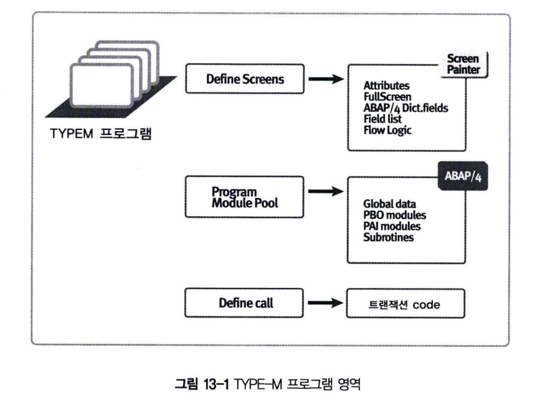

# Module Pool Program Overview
ABAP 프로그램은 Type 1(Executable Program), M(Module Pools), F(Function groups) 등으로 구현될 수 있다.  

Report 프로그램과 모듈 풀 프로그램의 가장 큰 차이점은 무엇일까?  
이에 대한 답을 하자면 리포트 프로그램은 프로그램이 자동으로 생성해주는 1000번 스크린(Selection Screen)을 사용한다는 것이고  
모듈 풀(온라인) 프로그램은 개발자가 직접 생성한 일반 스크린을 사용한다는 것이다.

리포트 프로그램은 데이터베이스 테이블에서 조회한 데이터를 화면에 뿌려주는 데 주목적이 있고,  
모듈 풀 프로그램은 데이터를 조회/수정/삭제/생성하는 등의 데이터 관리를 위한 것에 주목적이 있다  
모듈 풀 프로그램이 데이터를 관리할 수 있는 것은 Business Flow에 의해 파생되는 데이터를 처리할 수 있다는 의미이다.  

그러나 실무에서는 크게 구분하지 않고 사용하고 있다.  
이유는 TYPE 1 프로그램의 SELECT-OPTION과 같은 장점을 활용하기 위해서이다.

일반적으로 모듈 풀 프로그램과 온라인 프로그램의 정의는 구분하지 않고 같은 것으로 여긴다.  
굳이 온라인 프로그램을 정의하자면 Dialog 모드(사용자와 상호 작용할 수 있는 화면이 존재하는 화면)에서 Foreground(다중 프로그래밍)로 실행되는 프로그램을 의미한다.  
이와 반대되는 개념으로 Batch Program이 있으며 이것은 스케쥴 Job 등으로 이용하기 위해 Background에서 실행되는 것을 의미한다.

위 그림에서는 TYPE-M 프로그램을 개발하기 위한 전체 프로세스를 크게 3가지 영역으로 정의하고 있다.
- 스크린 정의
- 스크린에 대한 스크립트 추가
- TYPE-M 프로그램에 대한 트랜잭션 코드 생성