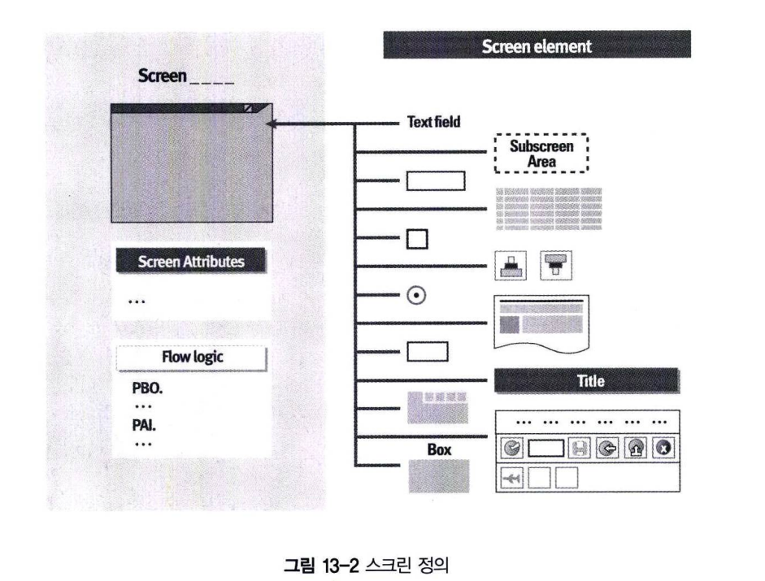
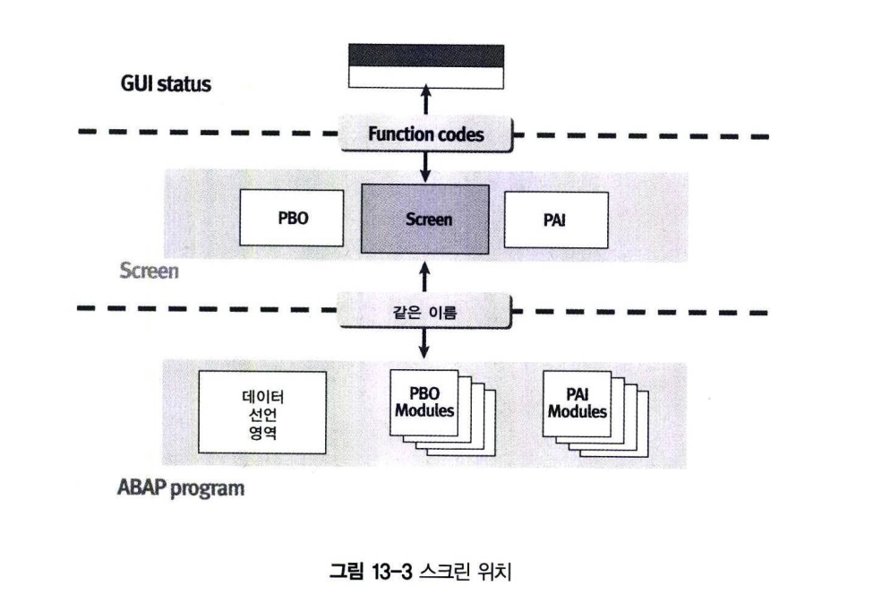
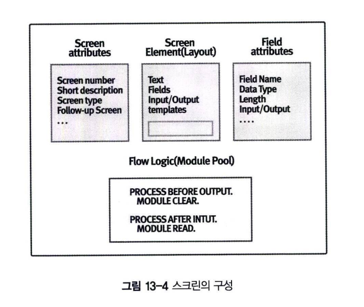
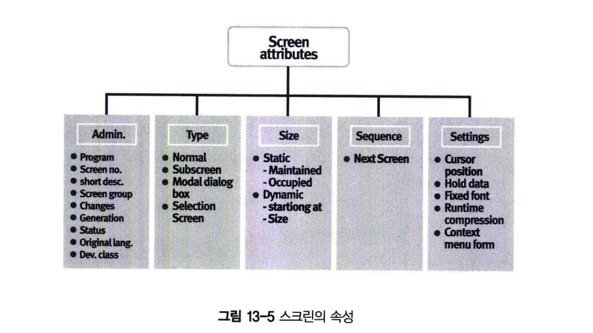
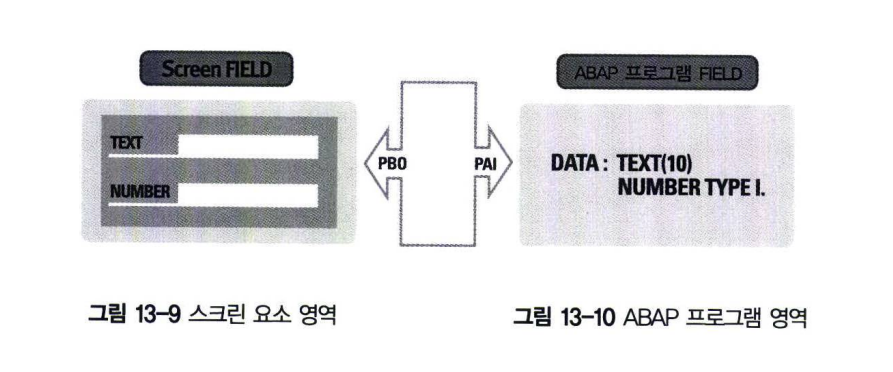
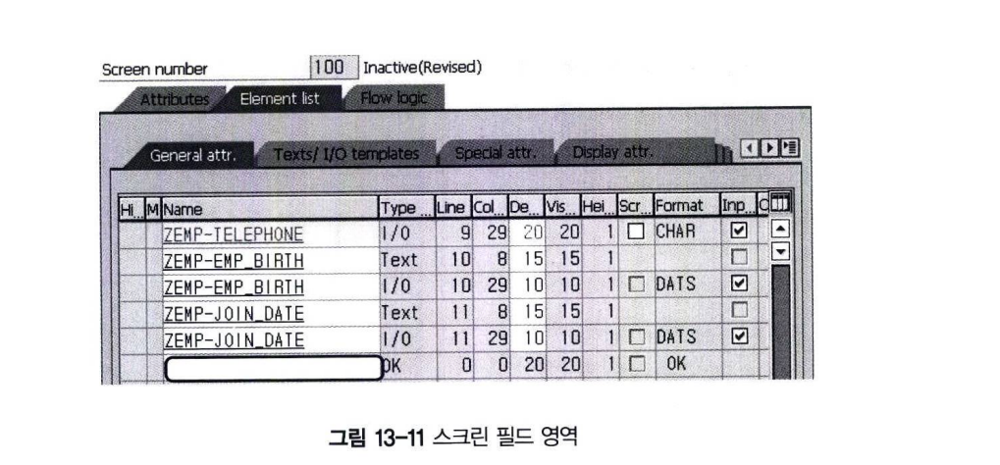
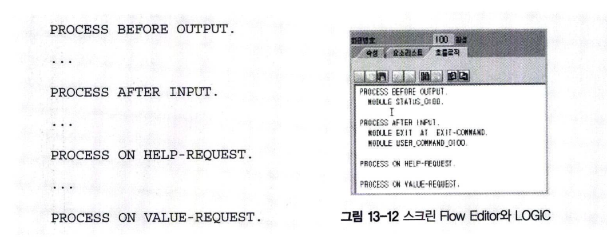
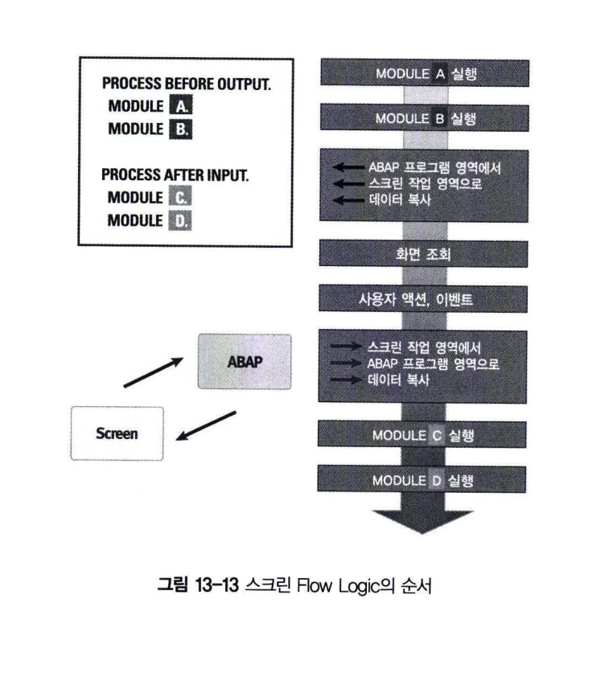
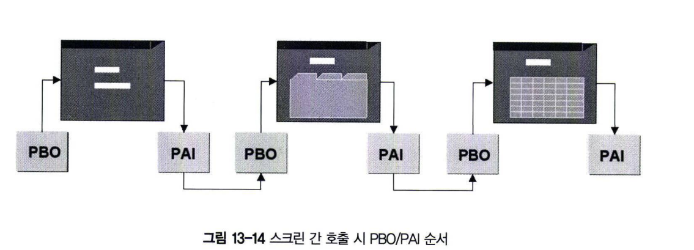
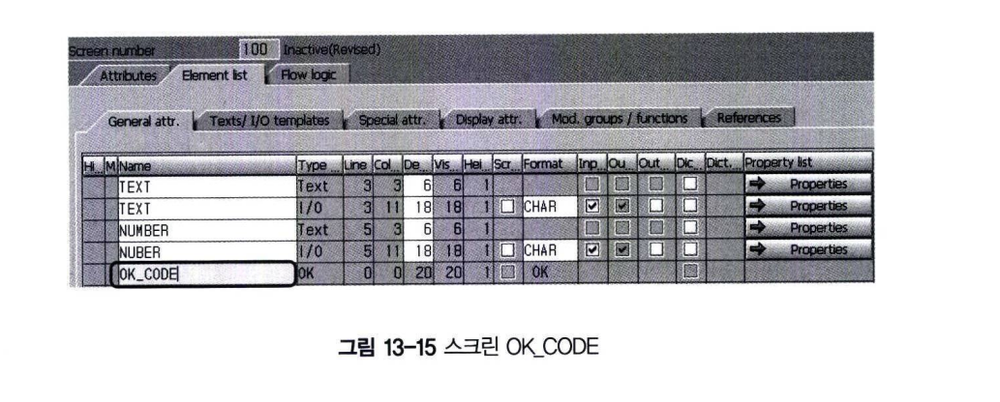

# Screen
스크린은 앞에서 실습하였듯이 SAPGUI에 조회되는 모든 화면을 의미한다. 
스크린은 사용자와 상호 작용을 통해 데이터를 생성하고 조회하는 작업 영역으로 정의된다.

TYPE-M 프로그램에서만 사용하는 것이 아니라 TYPE-1, TYPE-F 프로그램에도 사용될 수 있다. 
그림 13-2와 같이 스크린은 Input/Output 필드와 Flow Logic 등으로 구성된다.

Screen Flow Logic은 PBO(Process Before Output) 와 PAI(Process After Input) 이벤트로 나누어진다.  
PBO 이벤트는 스크린이 화면에 보여지기 전에 실행되는 이벤트이며 PAI 이벤트는 스크린 상에서 User 액션이 발생한 후 실행되는 이벤트이다.  
문맥상의 의미로는 이해가 될지라도 실제 프로그램에서는 어떻게 반영해야 할지 도무지 감이 오지 않는 부분이 PBO와 PAI 부분이다.  
PBO, PAI 와 같은 화면 Flow Logic이 다른 프로그래밍 언어에서는 존재하지 않기 때문에 더 생소하게 느껴질 수 있다. 

위 그림은 GUI STATUS와 ABAP 프로그램 사이에서 스크린의 위치를 보여준다.  
스크린은 동적인 프로그램으로서 그 자신의 데이터 오브젝트들을 가질 수도 있는데 이를 스크린 필드라 한다.  
이 스크린 필드들은 스크린 상에서 Input/Output 필드들과 연결되어 있다.

스크린이 조회된 후, 또는 사용자의 액션이 끝난 후 자동으로 같은 이름을 가진 스크린 필드들과 ABAP 프로그램의 데이터 오브젝트들 사이에 데이터 복사가 일어나게 된다. 이 과정은 PAI 이벤트가 호출되면 프로그램에서 내부적으로 수행된다.

스크린에는 GUI STATUS라는 것이 존재하는데, 이것은 Menu Bar, Standard Toolbar 그리고 Application Toolbar를 포함하고 있다. 
GUI STATUS는 Menu Painter를 사용해서 생성하며 스크린에 ABAP 프로그램 내에서 SET PF-STATUS 구문을 이용해서 동적으로 할당할 수 있다.
  
스크린의 구성 요소는 그림 13-4에서 설명하는 바와 같이 크게 4가지 부분으로 나누어진다.  
먼저 각 항목에 대해서 간단히 정의하고 나서 항목별로 상세하게 알아보자.

**1&#41; 스크린 속성**  
스크린 속성은 스크린 번호, 타입, 이름, 내역, 창 크기, 다음 화면을 정의하고 SAP 시스템에 스크린 오브젝트를 연결하게 된다.

**2&#41; 스크린 요소**  
스크린 요소들은 사용자가 데이터를 조회하고 입력하는 GUI 화면을 디자인하는 데 사용된다.  
텍스트 필드, Input/Output 필드, 체크박스, 라디오 버튼 등과 같은 스크린의 구성 요소를 정의한다.

**3&#41; 스크린 필드**  
스크린 필드의 속성은 메인 스크린 필드의 데이터 타입과 길이 등을 정의하는 부분이다.

**4&#41; 스크린 흐름 로직**  
사용자의 액션에 반응하게 되는 스크린의 PAI와 PBO와 관련되어 절차적으로 수행해야 할 부분을 정의한다.

## 1 스크린 속성
  
그림 13-5와 같이 스크린에는 여러 가지 속성들이 있다. 이러한 속성들은 스크린 페인터에서 설정한다.

스크린은 스크린 필드들로 구성된다. 스크린 필드라는 용어는 Input  필드 또는 Output 필드 등과 같이 스크린에서 생성한 필드와 같은 개념으로 생각해도 되지만 실제로는 차이가 있다.  
스크린 필드는 스크린이 메모리로 로딩되어 활성화되었을 때 스크린 페인터에서 정의한 필드명을 그대로 사용한다  
즉, 이 스크린 필드들은 스크린 상에서 Input/Output 필드들과 연결되어 있다는 말이지 실제로 같다는 것을 의미하지는 않는다.  
스크린이 조회되거나 또는 사용자의 액션이 일어난 후 자동으로 같은 이름을 가진 스크린 필드들과 ABAP 프로그램의 데이터 오브젝트들 간의 데이터 전달이 일어나기 때문이다.

## 2 스크린 구성 요소
스크린은 앞에서 말한 속성뿐만 아니라 Input/Output 필드와 같은 구성 요소들을 가지고 있다.  
스크린의 구성 요소들은 데이터를 보여줄 뿐만 아니라 사용자들과 대화(User Dialog) 할 수 있는 창구 기능을 하게 된다.  
예를 들어 필드에 값을 입력하거나 버튼을 클릭 하는 행위 등이 이에 속한다.

모든 스크린의 구성 요소들은 기본 속성으로 자동 설정된다. 기본 세팅 이외의 사항들은 스크린 페인터를 통해 변경할 수 있다.  
스크린 페인터는 스크린 요소들의 레이아웃 정렬과 같은 일들을 수행하게 된다. 스크린 페인터에서 정적으로 정의된 속성들은 ABAP 프로그램 소스 코드 레벨에서 동적으로 겹쳐 쓸 수 있다. 즉, 스크린 페인터에서 속성을 정의하더라도 프로그램 실행 시점에 ABAP 프로그램으로 정의된 속성으로 변경된다.

## 3 스크린 필드
스크린 필드를 한마디로 정의하면 **스크린의 작업 영역 메모리에 존재하는 필드**이다.  
스크린 구성 요소인 필드는 실행 시점에 어떠한 값을 가지게 될지 모르는 정적인 상태이지만, 스크린 필드는 사용자가 입력한 값을 받아서 메모리에 저장하고 스크린의 필드에 값을 보이게 하는 역할을 한다.  
즉, 스크린 필드라는 개념이 존재하기 때문에 실행 시점의 입력 값들에 대해 프로그래밍 할 수 있다.  
**이것을 dynpros(dynamic program)이라 한다.** 

스크린 필드는 스크린 작업 영역(메모리)에 존재하는 필드로서 PAI 이벤트가 발생하기 전 시점에 ABAP 프로그램에 있는 같은 이름을 가진 필드로 값이 전달된다(복사). 또한, PBO 이벤트가 종료되는 시점에서 다시 ABAP 프로그램에 있는 같은 이름을 가진 필드로부터 값을 복사해 온다. 당연한 말이지만 이렇게 값 전달이 이루어지려면 스크린 필드는 유일한 변수명을 가져야 하며, ABAP 프로그램 영역에도 같은 필드명으로 선언되어야 한다. 이러한 환경에서 PBO/PAI를 통해 스크린 필드와 ABAP 프로그램 간에 데이터가 전달된다.

다음 예제에서는 스크린 페인터를 이용해서 100번 화면을 생성하고, TEXT와 NUMBER라는 두 개의 INPUT 필드와 TEXT 필드를 추가했다.  
그림 13-9의 스크린 구성 요소인 필드는 그림 13-10 ABAP 프로그램 영역에서 속성을 정의하고, 그림 13-9 스크린 필드 영역에서 필드의 속성은 ABAP 프로그램 영역에서 선언한 데이터 타입과 길이를 참고하게 된다(또는 ABAP Dictionary). 
스크린 페인터에서 생성한 스크린 필드들의 이름은 스크린 필드와 같은 이름으로 연결되어 있다.

화면에서 사용자가 버튼을 클릭하는 등의 이벤트를 수행하게 되면 OK_CODE에 값이 저장된다.  
그림 13-11에서는 아직 OK_CODE 이름을 입력하지 않은 상태이다.  
하나의 Module Pool Program에는 여러 개의 스크린이 존재할 수 있으며 각각의 스크린에 OK_CODE를 지정해야한다.

## 4 스크린 Flow Logic
스크린 Flow Logic은 스크린이 절차적으로 실행되어야 할 부분을 나타낸 것이다.  
스크린 Flow Logic은 ABAP Editor와 유사한 Flow Logic 에디터에서 기술할 수 있다.  
스크린 Flow Logic에서 사용하는 문법은 ABAP과 유사하지만 다른 언어이다.  
이것을 스크린 Language라고 부르기도 한다.  
ABAP과 가장 큰 차이점은 명시적인 데이터 선언 부분이 존재하지 않는다는 것인데, 존재하지 않는 것이 아니라 스크린 요소를 구성하면서 정의하게 되는 것이다.  
하지만 프로세싱 블록을 가지고 있다는 점에서는 ABAP과 유사하다.  
스크린 Flow Logic은 그림 13-12와 같이 4가지 이벤트 블록을 가지며 키워드로 이미 정의되어 있다.  
표 13-3은 각각의 이벤트에 대해서 설명하고 있다.  
PROCESS BEFORE OUTPUT, PROCESS AFTER INPUT은 필수 사항이다.

**스크린요소**
- PROCESS BEFORE OUTPUT (PBO)
  - 스크린의 PAI 이벤트가 실행되고 현재 스크린이 조회되기 전에   자동으로 실행된다. PBO 이벤트가실행되고 나서 스크린이 조회된다.   화면이 처음 실행되면, PBO만 수행이 된다.   화면에서 사용자가 이벤트를 발생시키면 PAI가 수행되고 PBO가 실행된다.   PBO는 일반적으로 화면의 초기값을 지정하는 데 자주 사용된다.

- PROCESS AFTER INPUT (PAI)
  - 사용자가 버튼을 클릭하는 것과 같은 액션을 수행하였을 때 발생 하는 이벤트 블록   PAI 이벤트가 실행된 후 다음 스크린의 PBO 이벤트를 호출한다.
- PROCESS ON HELP-REQUEST (POH)
  - 사용자가 F1 키를 눌렀을 때 발생하는 이벤트 블록
- PROCESS ON VALUE-REQUEST (POV)
  - 사용자가 F4 키를 눌렀을 때 발생하는 이벤트 블록

각 프로세싱 블록은 모듈(Module)이라는 기능으로 이루어져 있으며, 이러한 측면에서 TYPE-M 프로그램을 Module Pool Program이라고 한다.  
스크린 Flow Logic에 사용되는 키워드는 아래와 같다.

- CALL
  - Subscreen을 호출한다.
- MODULE
  - 프로세싱 MODULE을 정의하고, Dialog module을 호출한다.
- FIELD
  - 스크린 필드에서 ABAP 필드로 데이터를 복사하는 구문이다.   스크린의 필드들은 PAI 이벤트를 수행하기 전에는 ABAP 프로그램에서 Control 할 수가 없다.   이유는 아직 스크린 필드의 데이터가 ABAP 프로그램의 데이터로 복사되지 않았기 때문이다.   FIELD 구문을 선언하게 되면 PAI를 수행하지 않아도 ABAP 프로그램으로 데이터를 체크할 수 있게 된다.   특정 필드의 값이 변경되어 체크 로직을 추가할 때 많이 사용된다.   MODULE, SELECT 구문과 함께 사용되는 것이 일반적이다.  
- ON
  - FIELD 구문과 함께 사용된다.
- VALUES
  - Field Keyword와 같이 사용된다.
- CHAIN
  - Chain 처리를 시작한다.  여러 개의 필드를 그룹으로 처리한다.
- ENDCHAIN
  - Processing Chain을 종료한다.   여러 개의 필드를 그룹으로 처리한다.
- CALL
  - Subscreen을 호출한다.
- LOOP
  - LOOP 프로세싱을 시작한다.
- ENDLOOP
  - LOOP 프로세싱을 종료한다.
- MODIFY
  - 스크린 Table을 변경한다.
- ON
  - FIELD 구문과 함께 사용
- PROCESS
  - PROCESS 이벤트를 정의한다.   PROCESS BEFORE OUTPUT...

그림 13-13은 스크린 Logic과 PBO,PAI의 모듈이 실행되는 순서를 잘 설명하고 있다.  
사용자가 T-CODE를 입력하여 화면을 조회하면 먼저 PBO 모듈 A, B가 실행된다.  
이때는 ABAP 작업 영역 데이터가 스크린 작업 영역으로 옮겨가 화면이 조회되고, 조회된 화면에서 사용자가 이벤트를 발생시키면  
PAI의 C, D 모듈이 실행된 후 다시 PBO를 수행하여 화면이 조회되는 순서로 이루어져 있다.  
그림 13-14는 하나의 스크린에서 다른 스크린을 호출할 때 PBO와 PAI가 호출되는 순서를 설명한다.  

## 5 USER 액션
### 5.1 Input 필드 데이터 입력
사용자는 스크린 상에서 Input 필드에 값을 넣거나 변경할 수 있다.  
Input 필드에 입력하는 액션은 PAI 이벤트를 발생시키지 않지만, Function Code를 가진 Input 필드(Check Box, Radio Button 또는 Drop Down Box)는 이벤트를 발생시킬 수 있다.

### 5.2 PAI 이벤트 실행
SAPgui 상에서 스크린과 사용자의 상호 작용을 결정하고 Application Server의 실행 환경에서 PAI 이벤트를 호출하는 방법에는 여러 가지가 있다.
- Pushbutton을 선택
- Function Code가 할당된 Check Box 또는 Radio Button을 선택
- Menu, Standard Toolbar, 또는 Application Toolbar에 있는 Function을 선택
- Keyboard에 있는 Function Key를 선택
- Drop Down List에 있는 엔트리 선택

그림 13-15처럼 Element List에서 OK_CODE 필드가 이름을 가지고 있다면(그리고 ABAP 프로그램에서도 같은 이름을 가진 변수가 조냊한다면), 사용자가 Function을 선택하면 그에 할당된 Function Code가 OK_CODE 변수에 복사된다.  
  

만약 OK_CODE가 설정되지 않은 상태에서 PAI 이벤트가 실행되면 Function Code의 값을 채워줄 스크린 필드가 존재하지 않기 때문에 프로그램에서 PAI에 해당하는 작업을 수행하기가 어렵다(OK_CODE라는 이름은 SAP 사에서 권고하는 것이기 때문에 다른 이름을 사용해도 된다.)

'12장 Report Program'에서 버튼을 클릭하거나 메뉴를 선택하면 시스템 변수 SY-UCOMM에 Function Code가 복사된다. 스크린의 Element List에 OK_CODE 필드가 설정되어 있으면 SY-UCOMM의 데이터가 OK_CODE에 자동으로 복사된다.  
앞에서 스크린 필드와 ABAP 프로그램의 필드 간의 데이터 복사가 일어나는 과정을 설명했다.  
이와 마찬가지로 SY-UCOMM의 값이 PAI 이벤트가 발생한 순간에 스크린 필드 OK_CODE에 복사된다.

모듈 풀 프로그램에서 OK_CODE를 SY-UCOMM 대신 사용하는 이유는 두 가지이다.  
첫째, ABAP 프로그램에서 자체적으로 선언된 모든 변수를 관리하고 싶은 이유.  
둘째, 시스템 필드는 시스템에서 사용하는 변수이기 때문에 프로그램에서 변경하는 것은 삼가야 하기 때문이다.  
NEXT SCREEN이 호출 되었을 때 OK_CODE를 초기화하지 않으면 이전의 Function Code를 저장하고 있기 때문에 다른 스크린이 호출되었을 때 PBO에서 원치 않은 액션이 수행될 수 있다.  
또는 사용자가 화면에서 Enter를 입력하면 SY-UCOMM에는 아무런 값이 전달되지 않고 이전의 Function Code를 가지게 된다. 이러한 문제를 방지하기 위해 스크린에서 PAI를 수행한 후에 OK_CODE를 초기화하는 작업이 필요하다.

이러한 개념을 염두에 두고, 한마디로 결론 내리면 스크린마다 OK_CODE 변수를 지정해야 한다는 것

### 5.3 Processing Input/Output 필드
Input/Output 필드는 키보드나 Value List 상에서 값을 입력하는 Field, Radio Button, Checkbox 등을 의미한다.  
모든 스크린 필드들은 스크린 필드와 연결된 이름을 가져야 한다고 앞에서 설명했다.  
여기서 또 하나 중요한 것은 데이터 타입이라고 할 수 있는데 스크린 피드의 데이터 타입이 입력값의 포맷을 결정한다.  
다시 말해서 숫자 필드에 문자형 값을 넣을 수가 없다는 의미이다.  
왜냐하면 스크린은 사용자가 유효하지 않은 값을 입력하고자 할 때 스크린 필드에서 이것을 인식하기 때문이다.  
Radio Button과 Checkbox는 항상 CHAR 1자리의 데이터 타입을 가지고 있으며 선택되면 'X', 해제된 상태라면 빈 값을 가져야 한다.

### 5.4 F1(Field Help)
사용자가 화면에서 F1키를 누르거나 HELP 아이콘을 클릭하면, 현재 커서가 존재하는 필드의 텍스트 도움말이 조회된다.  
ABAP Dictionary 필드의 Data Element Documentation이 생성되어 있으면 스크린에 도움말 문서가 자동으로 첨부된다. 

### 5.5 F4(Input Help)
Input Help는 다음 3가지 방법으로 스크린에 추가할 수 있다.

**1&#41; ABAP Dictionary 를 이용한 Input Help**  
Search Help를 생성해서 Table Field에 할당하고, 스크린 필드는 Table Field의 속성을 상속받아  
Input Help로 사용할 수 있다.

**2&#41; 스크린을 이용한 Input help**  
스크린 페인터에서 개별 필드에 직접 Search Help를 할당하거나, 스크린의 PAI 이벤트에서 입력 값을 제한할 수 있다.

**3&#41; Dialog Mudlue에서의 Input Help**  
사용자가 Screen 필드에서 F4 키를 누를 때 POV(PROCESS ON VALUE-REQUEST) 이벤트에서 Dialog 모듈을 호출함으로써 Input Help를 화면에 보여줄 수 있다.