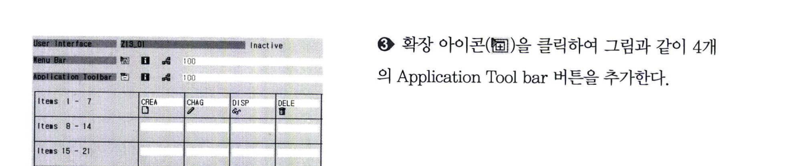

# TYPE-M Program 구현
## 2 GUI STATUS 생성
GUI STATUS는 그림 13-17과 같이 3가지 종류가 존재한다. 모든 스크린은 Menu Bar, Standard Tollbar, Application Toolbar를 가지는 GUI STATUS를 추가해야 한다.  

  

### 2.1 Application Toolbar
먼저 GUI STATUS를 생성해서 이번 절에서 학습하게 될 Application Toolbar를 설정하자.  
  
  
  
  
  

Function Type
- E 
  - 트랜잭션 종료 시 설정하는 Function Type이며, AT EXIT-COMMAND 모듈이 수행된다.
- S
  - 시스템이 사용하는 Function Type
- T
  - 트랜잭션을 호출하는 Function Type이며, Function Code는 SAP에 존재하는 트랜잭션을 입력해야한다.
- SPACE
  - 표준 Application Function Type
- P
  - Local GUI Function Type으로 local GUI logic을 사용하는 Tabstrip에서만 사용된다.
- H
  - PROCESS ON HELP REQUEST 이벤트가 호출된다.

### 2.2 Funtion Key
Function Key는 스크린을 생성하면 기본적으로 제공되는 Standard Toolbar와 개발자가 추가하게 되는 Function Key가 존재한다.  
  

Standard Toolbar는 그림 13-19와 같이 SAP에 존재하는 모든 스크린에 기본적으로 제공되는 Toolbar이다.  
Function Key는 F1, SHIFT + F1와 같이 키보드의 기능키를 이용해 빠르게 접근할 수 있다.
  

그림 13-20과 같이 Function Key는 Reserved Function Key, Recommended Function Key, Frely assigned Function Key로 구별된다.  
Reserved Function Key는 F1(Help), F3(Back), F4(Possible Entry)와 같이 이미 예약되어 있어서 개발자가 정의해서 사용할 수 없다.

나머지 두 개는 문맥 그대로 이해하면 된다.  
사용자가 프로그램을 빠져나가는 코딩을 추가하기 위해서, Standard Toolbar의 기본 3개 버튼을 각각  
'BACK', 'EXIT', 'CANC'로 Function Code를 설정하자.

### 2.3 Menu Bar
Menu Bar는 표준 프로그램에서 기본적으로 제공하지만, 이외 추가로 구성하고 싶은 메뉴를 설정할 수 있다.  
스크린을 테스트 모드로 실행하면 Menu Bar가 생성되었음을 확인할 수 있다.