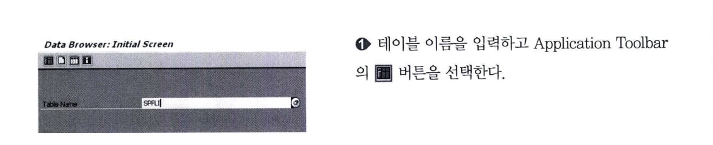
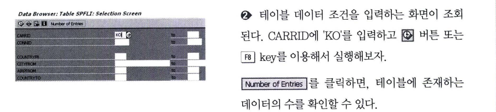
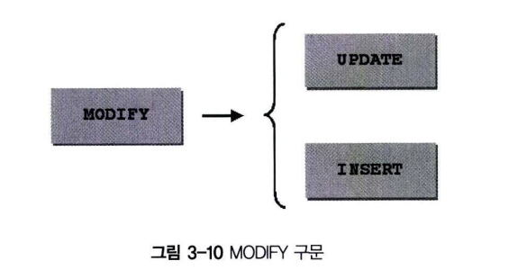

# OPEN SQL : 데이터 변경
OPEN SQL에 사용되는 테이블 데이터 변경 명령문에 대해서 알아본다.

## 1 INSERT 구문
테이블에 하나 또는 여러 개의 데이터를 삽입한다. &#60;target&#62;은 테이블 이름으로, 동적으로 선언이 가능하다.
```abap
INSERT INTO <target> <lines>.
<f2> [ASCENDING|DESCENDING]...
```

Client를 지정할 수 있으며, 이때는 테이블 이름을 정적/동적으로 선언할 수 있다.
```abap
INSERT INTO dbtab [CLIENT SPECIFIED] <lines>.
INSERT INTO <name> [CLIENT SPECIFIED] <lines>.
```

**1&#41; Single line** <br>
테이블에 하나의 line을 삽입하기 위한 문장이다. &#60;wa&#62;는 테이블과 같은 구조로 선언되어야 한다.

```abap
INSERT INTO <target> VALUES <wa>.
INSERT <target> FROM <wa>.
```

INSERT &#60;dbtab&#62; 구문을 사용하려면 TABLES : &#60;dbtab&#62; 선언이 되어야 한다.
```abap
INSERT <dbtab>.
```

```ABAP
REPORT Z03_15.

DATA : GS_SCARR TYPE SCARR.

GS_SCARR-CARRID = 'KO'.
GS_SCARR-CARRNAME = 'AIR KOREA'.
GS_SCARR-URL = 'HTTP://WWW.AIRKOREA.CO.KR/'.

INSERT INTO SCARR VALUES GS_SCARR.
```

**2&#41; Several lines** <br>
인터널 테이블의 모든 값을 한 번에 테이블에 삽입한다. 같은 KEY 값을 INSERT 하게 되면, dump error가 발생하는데 이를 방지하기 위해, ACCEPTING DUPLICATE KEYS 구문을 사용한다. <BR>
INSERT 구문이 실패하면 SY-SUBRC = 4 를 리턴한다.

```ABAP
INSERT <target> FROM TABLE <itab>
                    [ACCEPTING DUPLICATE KEYS].
```

**테이블 데이터 확인하기**

테이블의 데이터를 확인하는 방법은 크게 2가지가 존재한다.

- **T-CODE : SE11 (ABAP Dictionary) : 테이블과 같은 오브젝트를 조회/수정/생성하는 용도로 사용됨**
- **T-CODE : SE16 (Data Browser) : 데이터를 조회하는 용도로 사용된다.**

T-CODE : SE11에서 데이터 조회 버튼을 클릭하면 T-CODE : SE16이 호출된다. <BR>
즉, 데이터를 확인할 때에는 자신에게 익숙한 트랜잭션을 사용하도록 하자.





## 2 UPDATE 구문
테이블의 하나 또는 여러 line을 변경한다. &#60;target&#62;은 테이블 이름으로, 동적으로 선언할 수 있다.
```abap
UPDATE INTO <target> <lines>.
```

Client를 지정할 수 있으며, 이때는 테이블 명을 정적/동적으로 선언할 수 있다.
```abap
UPDATE <dbtab> [CLIENT SPECIFIED] <lines>.
```

**1&#41; Single line**
Work Area &#60;wa&#62;는 table과 같은 구조로 선언되어야 한다.
```abap
UPDATE <target> FROM <wa>.
```

UPDATE &#60;dbtab&#62; 구문을 쓰려면 TABLES:&#60;dbtab&#62;이 선언되어야 한다.
```abap
UPDATE <dbtab>.
```

**2&#41; Several lines**
인터널 테이블의 여러 데이터를 한 번에 테이블에 반영한다.
```abap
UPDATE <target> FROM TABLE <itab>
```

SET 필드 1 필드 2 와 같이 필드를 여러 개 선언할 수 있다. SELECT 구문과 동일하게 WHERE 조건을 사용할 수 있다. <BR>
WORK AREA를 사용하는 것보다 UPDATE SET 구문을 이용해서 개별 칼럼 값을 변경하는 것이 성능이 우수하다.
```ABAP
UPDATE <target> SET <set 1><set 2> WHERE <cond>.
```

```abap
REPORT Z03_17.

DATA : GS_SPFLI TYPE SPFLI

MOVE 'KO'               TO      GS_SPFLI-CARRID.
MOVE '0001'             TO      GS_SPFLI-CONNID.
MOVE 'Busan'            TO      GS_SPFLI-CITYFROM.

UPDATE SPFLI FROM GS_SPFLI.

UPDATE SPFLI
    SET CITYTO = ' Shanghai'
    WHERE carrid = 'KO'
    AND CONNID = '0001'.

IF SY-SUBRC = 0.
    WRITE 'Update is Succesful'.
ENDIF.        
```

## DELETE 구문
테이블에 하나 또는 여러 line의 데이터를 삭제한다. &#60;target&#62;은 테이블 이름으로 동적으로 선언할 수 있다.

```abap
DELETE <target> <lines>.
```

Client를 지정할 수 있으며, 이때는 테이블 명을 정적/동적으로 선언할 수 있다.
```abap
DELETE [FROM] (<name>) [CLIENT SPECIFIED] <lines>.
DELETE <dbtab> [CLIENT SPECIFIED] <lines>.
```

**1&#41; Single line** <br>
&#60;wa&#62;는 table과 동일한 구조로 선언되어야 한다.
```abap
DELETE <target> FROM <wa>.
```

DELETE&#60;dbtab&#62; 구문을 쓰려면 TABLES:&#60;dbtab&#62; 선언이 되어야 한다.
```ABAP
DELDETE <dbtab>.
```

**2&#41; Several lines** <br>
인터널 테이블의 WHERE 조건에 해당하는 모든 값을 한 번에 삭제한다.
```abap
DELETE FROM <target> WHERE <cond>.
```

```abap
REPORT Z03_18.

DATA gs_spfli TYPE SPFLI.

MOVE 'KO'       TO      GS_SPFLI-CARRID.
MOVE '0001'     TO      GS_SPFLI-CONNID.

DELETE  SPFLI       FROM        GS_SPFLI.
](image.png)
DELETE FROM SPFLI
    WHERE CARRID = 'KO'.

IF SY-SUBRC = 0.
    WRITE : 'DELETE SUCCESS'.
ENDIF.        
```

## MODIFY (Inserting or Changing Lines) 구문


MODIFY는 UPDATE 구문과 INSERT 구문을 합한 기능을 수행. <BR>
키값을 가지는 데이터가 테이블에 존재하면 UPDATE하고, 존재하지 않을 때에는 INSERT를 수행. <BR>
테이블에 하나 또는 여러 line을 UPDATE 또는 INSERT 할 수 있다. <br>
&#60;target&#62;은 테이블 명으로, 동적으로 선언할 수도 있다.

```abap
MODIFY <target> <lines>.
```

Client를 지정할 수 있으며, 이때는 테이블 명을 정적/동적으로 선언할 수 있다.
```abap
MODIFY <dbtab> [CLIENT SPECIFIED] <lines>.
MODIFY <name> [CLIENT SPECIFIED] <lines>.
```

**1&#41; Sigle line**
Work Area &#60;wa&#62;는 table 과 같은 구조로 선언되어야 한다.
```abap
MODIFY <target> FROM  <wa>.
```

MODIFY &#60;dbtab&#62; 구문을 쓰려면 TABLES : &#60;dbtab&#62; 선언이 되어야 한다.
```abap
MODIFY <dbtab>.
```

**2&#41; Several lines**
인터널 테이블의 모든 값을 한 번에 변경 또는 추가한다.
```abap
MODIFY <target> FROM TABLE <itab>
```

```abap
REPORT Z03_19.

DATA :  GT_SPFLI         TYPE TABLE OF SPFLI,
        GS_SPFLI         TYPE SPFLI.

gs_spfli-carrid = 'KO'.
gs_spfli-connid = '0001'. 
gs_spfli-cityfrom = 'Korea'.
MODIFY spfli FROM gs_spfli.

gs_spfli-carrid = 'KO 1.
gs_spfli-connid = '0001'.
gs_spfli-cityfrom = 'Busan'.
APPEND gs_spfli TO gt_spfli.

gs_spfli-carrid = 'KO'.
gs_spfli-connid = '0003' .
gs_spfli-cityfrom = 'Seoul'.
APPEND gs_spfli TO gt_spfli.

MODIFY spfli FROM TABLE gt_spfli.
```