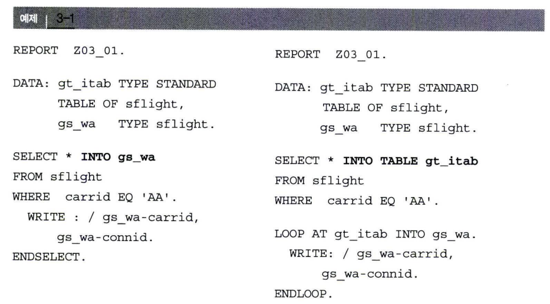
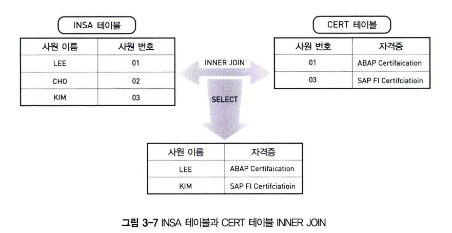
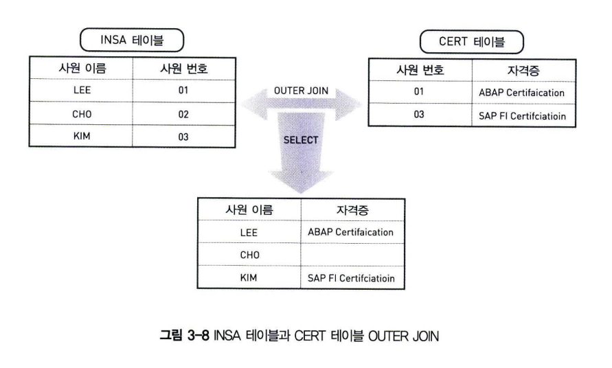
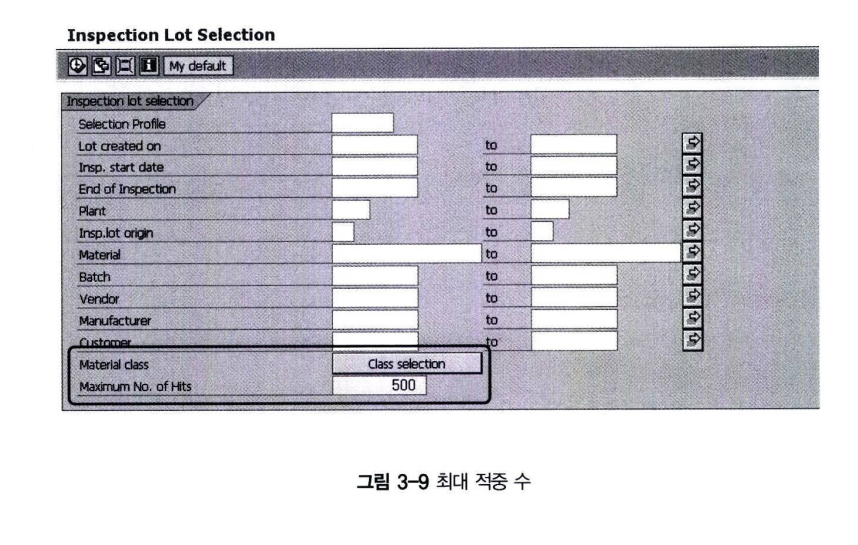
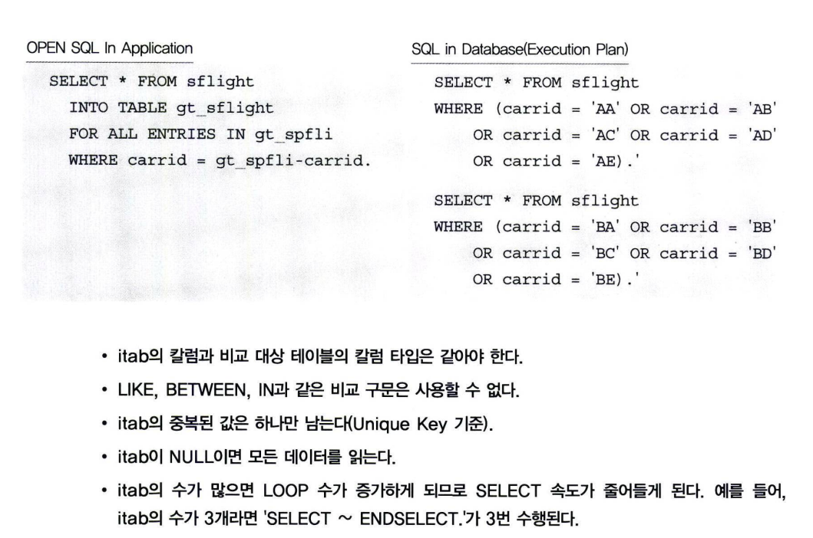

# OPEN SQL: 데이터 읽기
테이블에서 데이터를 읽어 오는 구문은 아래와 같다. <br>
각 구문의 기능에 대한 정의를 보자

- SELECT &#60;result&#62;
  - SELECT 구문은 조회하고자 하는 테이블 필드명을 나열할 수 있으며, 한 건 또는 여러 라인을 조회할 수 있다.

- INTO &#60;target&#62;
  - SELECT에서 읽어온 데이터를 변수에 저장하며, 이 변수를 ABAP 프로그램에서 사용한다.

- FROM &#60;source&#62;
  - FROM 구문은 SELECT 할 테이블을 지정해준다. 위치는 INTO 이전/이후 모두 둘 수 있다.

- WHERE&#60;cond&#62;
  - 조회하고자 하는 데이터의 조건을 추가할 수 있다.

- GROUP BY &#60;fields&#62;
  - 여러 라인의 결과를 그룹으로 지정해서 하나의 결과를 얻을 수 있다. 예를 들면, 그룹별 합계를 구할 경우 GROUP BY를 사용한다.

- HAVING &#60;cond&#62;
  - HAVING은 GROUP의 조건을 설정하는 WHERE 구문이다.

- ORDER BY &#60;fields&#62;
  - 조회된 데이터를 정렬(sort)한다.

## 1 SELECT 구문
SELECT 구문은 데이터베이스 테이블에서 필요한 데이터를 읽어 온다.

SELECT 구문은 두 가지 부분으로 나누어진다. &#60;lines&#62;는 하나 또는 여러 라인을 선택할 때 사용되며 <br>
하나의 라인일 때는 SINGLE 구문을 사용한다. &#60;columns&#62;는 테이블 칼럼을 기술한다.

```abap
SELECT <lines> <columns> ...
```
### Single Line
데이터베이스에서 하나의 라인 값을 읽어오고자 할 경우 SINGLE을 사용한다. <br>
SINGLE 구문을 사용하려면 데이터를 한 건만 가져오기 때문에 원하는 데이터의 조건을 정확하게 알고 있어야 한다. <br>
즉, WHERE 조건에 유일한 키값이 추가되어야 하는데 만약에 WHERE 구문이 잘못되어 여러 개의 라인을 읽어오게 되면 임의의 라인을 반환한다. <br>
테이블의 모든 칼럼을 읽을 때는 '*'를 사용한다.

```abap
SELECT SINGLE <cols> ... WHERE
```

### Several Lines
여러 라인을 조회할 때는 SELECT 결과가 내부 테이블에 저장된다. 이것을 ABAP에서는 인터널 테이블(Internal Table)이라 부른다. <br>
인터널 테이블은 ABAP 메모리에 생서되는 데이터를 저장할 수 있는 가상의 테이블이다.<br>
DISTINCT를 사용하게 되면, 중복된 값을 제거한다.

```ABAP
SELECT [DISTINCT] <cols> ... WHERE
```

INTO 구문의 결과가 저장되는 곳이 인터널 테이블이 아니라 필드 또는 Wokr Area(구조체) 일때에는 마지막에 ENDSELECT를 사용해야 한다. <br>
이 구문은 하나의 값을 읽어서 구조에 삽입하고, 조건에 해당하는 값을 모두 읽어 올 때까지 LOOP를 수행한다.
```abap
SELECT [DISTINCT] <cols> ... WHERE ...
...
ENDSELECT.
```

예제 3-1의 왼쪽은 구조체를 이용해서 SELECT ~ ENDSELECT 구문을 사용했고, 오른쪽은 인터널 테이블에 값을 한 번에 저장하기 때문에 <BR>
ENDSELECT 구문이 존재하지 않는다. 왼쪽 프로그램은 SELECT ~ ENDSELECT 구문이 반복 수행될 때 마다 Application Server와 <br>
Database 간의 인터페이스가 수행되므로, 한 번에 데이터를 인터널 테이블에 저장하는 오른쪽 프로그램보다 비효율적이라고 판단할 수 있다.



### AS(Alias)
AS 구문을 사용해서, 칼럼 명에 별명을 지정할 수 있다.
```abap
SELECT <cols> [AS <alias>] ...
```

### 동적인 SELECT 구문
SELECT 구문의 칼럼을 동적으로 선언할 수 있다. 예제 3-2에서 동적 구문을 저장하는 구조체 GS_LINE은 최대 72자까지 가능하며,<BR>
CHAR 타입이어야 한다. GS_LINE 구조체가 null이면 '*'와 같은 구문이 된다.

```ABAP
SELECT <lines> (<itab>)...
```
```abap
REPORT Z03_02.

DATA : GT_ITAB TYPE STANDARD TABLE OF sflight,
       GS_WA LIKE LINE OF GT_ITAB.

DATA : GS_LINE(72) TYPE C,

GT_LIST LIKE TABLE OF GS_LINE(72).
GS_LINE = 'CARRID CONNID'.

SELECT DISTINCT (GS_LINE) INTO TABLE GT_ITAB
FROM SFLIGHT.
IF SY-SUBRC EQ 0.
    LOOP AT GT_ITAB INTO GS_WA.
        WRITE :/ GS_WA-CARRID, GS_WA-CONNID.
    ENDLOOP.
ENDIF.            
```

gt_itab은 SELECT 구문의 결과값을 넣어줄 인터널 테이블이다. gs_line은 72자리 CHAR 자리 변수이다. <br>
gs_line 변수에 필드명을 적어주고, SFLIGHT 테이블의 carrid connid 칼럼 값을 조회해서 화면에 출력한다. <br>
72자 이상이 필요한 경우에는 72자 인터널 테이블을 선언해서 다음과 같이 사용하면 된다.

```abap
REPORT Z03_03.
*----중간 생략----

DATA GS_LINE(72) TYPE C.
DATA GT_LIST LIKE TABLE OF GS_LINE(72).

GS_LINE = 'CARRID CONNID'.
APPEND GS_LINE TO GT_LIST.

SELECT DISTINCT (GT_LIST)
*----중간 생략----
```

## 2 INTO 구문
SELECT 구문에서 조회한 결과값을 변수 (Tartget Area)에 저장하는 기능을 수행한다.

### 1 구조체(Work Area)
여러 칼럼의 한 라인만 조회하고자 할 경우에는 Work Area(변수, 구조체)에 값을 할당한다. <br>
애스터리스크 기호를 사용하면 전체 칼럼의 값을 읽어오고, **CORRESPONDING FIELDS OF 구문을 사용하면 한 번에 Work Area의 동일 필드명에 값을 할당한다.** <br>
애스터리스크 기호를 사용하면, 개별 필드를 SELECT 하는 것보다 비효율적이다. <br>
특히 SAP 주요 테이블은 많은 필드가 존재하기 때문에, 이 경우에는 SELECT* 구문은 성능에 아주 큰 영향을 미칠 수 있다. <br>
간단하게 설명해서 이것은 테이블의 한 라인 전체 데이터를 DB에서 읽어오는 것이 아니라, 일정한 크기만큼 잘라서 SELECT 결과를 반환하기 때문 <BR>
그러므로 SELECT* 구문의 사용을 삼가는 것이 바람직하다.
```ABAP
SELECT ... INTO [CORRESPONDING FIELDS OF] <wa>.
```

### 2 Internal TAble
여러 라인을 조회할 경우에는 인터널 테이블을 사용한다. APPENDING은 인터널 테이블에 추가로 INSERT하고, INTO는 인터널 테이블의 데이터를 삭제한다음 INSERT한다.

```abap
SELECT ...INTO|APPENDING [CORRESPONDING FIELDS OF] TABLE <itab> [PACKAGE SIZE <n>] ...
```

PACKAGE SIZE는 인터널 테이블에 몇 개의 라인을 추가할 것인지를 설정한다. PACKAGE SIZE 5 라 설정하면 5개의 값을 여러 번 읽어와서, <BR>
인터널 테이블에 추가하게 된다. 이 경우에는 ENDSELECT 구문을 반드시 사용해야 한다.

```ABAP
SELECT INTO CORRESPONDING FIELDS OF TABLE ITAB
    PACKAGE SIZE 5
    FROM SPLI.
ENDSELECT.
```

```ABAP
REPORT Z03_04.
DATA : GS_WA TYPE SFLIGHT,
       GT_ITAB TYPE TABLE OF SFLIGHT.

SELECT CARRID CONNID FROM SPFLI
                    INTO CORRESPONDING FIEDLS OF TABLE GT_ITAB

PACKAGE SIZE 5.
    LOOP AT GT_ITAB INTO GS_WA.
        WRITE :/ GS_WA-CARRID, GS_WA-CONNID.
    ENDLOOP.
ENDSELECT.            
```

PACKAGE SIZE 5를 사용했기 때문에 SELECT 구문은 5개의 값을 읽어와 LOOP를 수행한 후에 다시 SELECT 구문을 실행한다. <BR>
인터널 테이블 GT_ITAB은 SFLIGHT 테이블 구조를 참고하고 있고, FROM 구문에서는 SPFLI 테이블 구조를 참고하여 SELECT하고 있다. <BR>
이 2개의 테이블은 다른 구조로 되어 있기 때문에 CORRESPONDING FIELDS OF 옵션을 사용해야 같은 필드명을 가진 인터널 테이블에 값이 전달된다.

### 3 Single Field
테이블의 개별 칼럼을 조회하거나 Aggregate 함수를 사용할 때는 다음 구문과 같이 사용한다. <br>
INTO 구문 다음에 두 개 이상의 Target이 필요한 경우에는 괄호와 변수명을 붙여써야 한다. <br>
공백이 존재하면 Syntax Error가 발생한다.

```abap
SELECT ... INTO (f1, f2, ...)...
```

SELECT 구문에서 2개의 필드가 필요한 경우 다음과 같이 사용한다.
```ABAP
SELECT CARRID CONNID INTO (GT_CARRID, GV_CONNID) FROM SFLIGHT.
```

## 3 FROM 구문
FROM 구문은 데이터를 SELECT 할 대상 테이블(또는 뷰)을 지정한다. FROM 구문 다음 에는 하나의 테이블을 지정하거나 <BR>
여러 개의 테이블을 JOIN 할 수 있다. Alias를 사용해서 테이블 명에 별명을 붙일 수 있으며, 테이블 이름을 동적으로 선언할 수 있다. <br>
FROM 구문은 Table을 정의하는 부분과 데이터베이스 접근을 컨트롤하는 부분(Option)으로 나누어 진다.
```abap
SELECT ... FROM table option ...
```

FROM 구문에서 사용할 수 있는 옵션은 다음과 같다.
- CLIENT SPECIFIED
  - 자동 client 설정을 해제한다.

- BYPASSING BUFFER
  - SAP Local Buffer에서 값을 읽지 않는다. 테이블이 BUFFERING이 설정되어 있더라도 바로 데이터베이스 테이블에서 SELECT를 수행한다.

- UP TO n ROWS
  - SELECT의 row갯수를 제한한다. 조회 조건에 날짜를 입력하지 않는 것과 같은 사용자 실수로 대량의 데이터를 요청할 때 <BR> 데이터 베이스 성능 저하를 예방할 수 있다.

### 3.1 정적인 TABLE 선택
하나의 테이블을 정적으로 선언할 때 사용한다. Alias를 사용할 수 있으며 이 경우에는 테이블 명을 SELECT 구문에서 사용할 수 없다.
```ABAP
SELECT ... FROM <dbtab> [AS <alias>] <options>
```

### 3.2 동적인 TABLE 선택
테이블 이름을 동적으로 선언하여 사용할 수 있다. 이때 테이블 이름은 반드시 대문자로 지정해야하며, ABAP Dictionary에 존재하는 이름이어야 한다.
```ABAP
SELECT ... FROM (dbtab).
```

사용자에게 출력을 원하는 테이블 이름을 직접 입력받아서 데이터를 출력하는 경우 다음과 같이 사용한다.

```ABAP
REPORT Z03_05.

PARAMETERS p_tname TYPE char10.

DATA gs_wa TYPE SFLIGHT.

SELECT SINGLE * INTO gs_wa FROM (p_tname)
                WHERE CARRID = 'AA'.
```

위 예제 프로그램을 실행하면 사용자가 값을 입력하는 화면(SELECTION-SCREEN)이 조회된다. <BR>
이 화면은 PARAMETERS 명령어를 이용하면 자동으로 생성된다. <BR>
필드에 테이블 이름 SFLIGHT를 입력하고 실행 버튼을 선택해보면 FROM (p_tname) 구문에서 p_tname 변수에 사용자가 입력한 SFLIGHT 테이블 이름을 동적으로 지정하게 된다.

### 3.3 JOIN 구문
관계형 데이터베이스에서 여러 개의 테이블 값을 동시에 읽어 올 경우 JOIN을 사용하게 된다. <BR>
일반적으로 Primary Key 와 Foreing Key를 사용하여 JOIN 하는 경우가 대부분이지만 때로는 논리적인 값들의 연관으로 JOIN 하는 경우도 있다. <br>
두 테이블 간의 연결 조건은 ON 구문을 사용한다. <br>
**JOIN에 사용되는 필드가 인덱스에 존재할 때 빠른 성능이 보장된다.**

```abap
SELECT ... FROM <tab> [INNER] JOIN <dbtab> [AS <alias>] ON <cond> <options>...
```

ABAP 프로그램에서는 테이블 간의 JOIN을 하기보다는 인터널 테이블에 데이터를 저장하고 나서 LOOP 구문을 이용하여, 추가 정보를 SELECT 하고 인터널 테이블 내용을 MODIFY 하는 경우가 많다.

```ABAP
SELECT field1 INTO gt_itab FROM table1.
LOOP AT gt_itab.
    SELECT field2 into gt_itab-field2 FROM table2
                WHERE field1 = gt_itab-field1.
    MODIFY gt_itab.
ENDLOOP.                    
```

이것은 데이터베이스 입장에서 보면 아주 좋지 않은 습관인데, 프로그램을 느리게 만드는 주요 원인 중 하나는 하드디스크에 저장된 데이터에 빈번하게 접근하는 것이다. <br>
이 경우는 LOOP을 돌면서 데이터베이스에 반복적으로 접근하게 된다. <br>
물론 ABAP 언어에는 다른 언어에 존재하지 않는 인터널 테이블이라는 것이 존재하고, OPEN SQL의 제한된 기능 때문에 어쩔 수 없이 LOOP 처리를 해야 하는 경우가 발생할 수 밖에 없다. <br>
그러나 JOIN이 가능한 경우라면, 될 수 있으면 JOIN을 이용하는 것이 바람직하다.

```abap
SELECT a~field1 b~field2 INTO gt_itab
FROM table1 as a , table 2 as b ON a~field1 = b~field1.
```

다음 구문과 같이 WHERE 조건과 ON 조건이 기술되어 있으면, WHERE 조건이 먼저 수행되고, 이 데이터를 기준으로 다시 ON 조건에서 두 테이블을 JOIN 하게 된다.

```abap
SELECT a~field2 b~field3 INTO (gt_itab-field1, gt_itab-field2) FROM table 1 as a , table2 as b on a~field1 = b~field1
                    WHERE a~field2 = 'SEOUL'.
```

예제 3-6은 INNER JOIN을 설명하고 있다. 항공기 정보를 저장하고 있는 SFLIGHT 테이블에는 항공사 이름이 존재하지 않지만 <BR>
SCARR 테이블에는 항공사 ID에 해당하는 이름이 저장되어 있다. 이 2개의 테이블을 JOIN으로 연결하면 항공사 이름을 가져올 수 있다.<br>
JOIN 구문을 사용할 때 INNER 구문을 명시적으로 언급하지 않아도 기본적으로 INNER JOIN이 수행된다.

```abap
REPORT Z03_06.

TYPES : BEGIN OF t_str,
            CARRID TYPE SFLIGHT-CARRID,
            CARRNAME TYPE SCARR-CARRNAME,
        END OF t_str.

DATA : gs_str TYPE t_str.

SELECT SINGLE a~carrid b~carrname
            INTO CORRESPONDING FIELDS OF gs_str from sflight AS a INNER JOIN scarr AS b
                    ON a~carrid EQ b~carrid
                    WHERE a~carrid = 'AA'.

WRITE : gs_str-carrid, gs_str-carrname.                    
```

**예제 3-6의 JOIN구문에서 AS 구문은 테이블의 Alias 이름을 지정하며, sflight AS a 구문에서는 테이블 sflight는 SELECT 구문** **내에서 a 라는 별명으로 사용된다.** <br>
**Alias를 사용하지 않으면 a~carrid 구문은 sflight~carrid와 같이 테이블 이름 전체를 사용해야 한다.**

### 3.4 INNER JOIN과 OUTER JOIN
JOIN의 종류에는 크게 INNER JOIN과 OUTER JOIN 두 가지가 있으며, OUTER JOIN은 다음 구문과 같이 사용한다.

```ABAP
SELECT ... FROM <tab> LEFT [OUTER] JOIN <dbtab>
                                        [AS <Alias>]
                                        ON <cond>
<options>                                        
```

아래 그림처럼 인사 정보 테이블 2개가 있다고 가정하면, INSA 테이블은 사원 기본 정보를 저장하고 있고 <br>
CERT 테이블은 사원이 취득한 자격증 정보를 저장하고 있다.

사원 LEE 와 KIM 은 자격증을 가지고 있지만, 사원 CHO는 자격증이 없다. 사원 번호 필드를 기준으로 INNER JOIN을 수행하게 되면, <br>
사원 CHO는 자격증이 없어서 결과에서 제외된다.


기본적으로 모든 사원 정보는 조회하고, 자격증이 있는 경우에는 추가로 보여주고자 할 경우에는 OUTER JOIN을 사용해야 한다. <BR>
ABAP OPEN SQL에는 LEFT OUTER JOIN만 사용할 수 있다. <BR>
이것은 JOIN 연결의 왼쪽에 있는 데이터를 기준으로 SELECT 결과가 도출된다.


예제 3-7은 OUTER JOIN을 설명하고 있다. SCARR 테이블에 모든 항공사 정보의 이름이 없다는 가정하에서는 항공사의 항공기 정보 누락을 방지하기 위해 SFLIGHT 테이블과 SCARR 테이블을 LEFT OUTER JOIN을 수행해야 한다.

```ABAP
REPORT Z03_07.

TYPES : BEGIN OF t_str,
            carrid TYPE sflight-carrid,
            carrname TYPE scarr-carrname,
        END OF t_str.

DATA : gs_str TYPE t_str.

SELECT SINGLE a~carrid b~carrname
    INTO CORRESPONDING FIELDS OF gs_str
    FROM sflight AS a
    LEFT OUTER JOIN scarr AS b
    ON a~carrid EQ b~carrid
    WHERE a~carrid = 'AA'.

WRITE : gs_str-carrid, gs_str-carrname.        
```

### 3.5 Line 수 제한
다음 구문을 이용해서 테이블에서 읽어오는 라인 수를 제한하자.
```abap
SELECT ... FROM <tab> UP TO <n> ROWS ...
```

이 구문은 그림 3-9와 같이 리포트 프로그램의 조회 조건인 SELECTION SCREEN에서 최대 적중 수를 제한하는 목적으로 많이 사용한다.<BR>
사용자가 조회 조건 값을 입력하지 않고 실행할 경우, 테이블의 모든 데이터를 읽기 때문에 서버에 부하를 줄 수 있기 때문이다. <BR>
이럴 경우 최대 적중 수 조건을 기본으로 추가하여 Line 수를 제한하게 된다. <br>


## WHERE 구문
WHERE 조건은 SELECT 적중 수를 줄여 주고 사용자가 원하는 데이터를 정확하게 선택할 수 있도록 하는 조건이다. <BR>
당연한 말이지만, WHERE 조건에 사용되는 필드가 인덱스에서 사용될 때 빠른 성능을 보장한다. <BR>
UPDATE, DELETE와 같은 명령어에도 사용된다.
```ABAP
SELECT ... WHERE <s> <operator> <f> ...
```

### 1 interval 조건
조건에 범위 값을 사용해야 할 때에 사용된다.
```abap
SELECT ... WHERE <s> [NOT] BETWEEN <f1> AND <f2>
```
예를 들어, COL1 칼럼이 1~10 까지인경우 WHERE COL1 BEWEEN 1 AND 10 과 같이 사용한다.

### 2 String 비교
문자열을 비교할 때는 LIKE 구문을 사용한다. ABC로 시작하는 조건을 추가하면 다음과 같이 사용한다.

```abap
COL2 = 'ABCDEFGHIGJ'.

SELECT ~ WHERE COL2 LIKE 'ABC%'.
```

ABC로 시작하는 4자리 문자를 구할 경우, 예를 들어 ABCD, ABCE, ABCF, ABCG와 같이 한자리만 비교할 경우에는 '_'문자를 사용한다.
```ABAP
WHERE COL2 LIKE 'ABC_'
```

### 3 LIST VALUE
IN 구문을 사용해서, 여러 조건에 속한 경우의 값을 가져온다. 예를 들면 '서울', '수원'에 거주하는 사람을 구할 경우 <BR>
'WHERE 거주지 IN ('서울', '수원')과 같이 사용한다.

```ABAP
SELECT ... WHERE <S> [NOT] IN (<f1>, ... , <fn>)...
```

### 4 SELECTION TABLE
IN 구문을 사용해서 Selection Table, Range 변수에 존재하는 값들을 조회할 수 있다. <br>
Selection Table, Range 변수는 인터널 테이블과 유사하게 여러 Row를 저장할 수 있는 변수이다.

```abap
SELECT ... WHERE <s> [NOT] IN <seltab> ...
```

### 5 Dynamic 조건
SELECT 구문의 조건을 설정하는 WHERE 구문을 동적으로 구성할 수 있다. 다음 구문의 itab은 최대 72자리의 <BR>
Internal Table로 선언되어야 한다.

```abap
SELECT ... WHERE (<itab>)...
```
```abap
REPORT Z03_08.

DATA gs_where TYPE c LENGTH 72.
DATA gv_carrname TYPE scarr-carrname.
DATA gv_carrid TYPE scarr-carrid VALUE 'AC'.

CONCATENATE 'CARRID = ''' gv_carrid '''' INTO gs_where.

SELECT SINGLE carrname
INTO gv_carrname
FROM scarr
WHERE (gs_where).
WRITE / gv_carrname.
```

### 6 FOR ALL ENTRIES 구문
```ABAP
SELECT ... FOR ALL ENTRIES IN <itab> WHERE <cond>
```

FOR ALL ENTY 구문은 인터널 테이블과 데이터베이스의 테이블을 JOIN 하는 개념과 유사하며 , 이것도 LOOP를 돌면서 SQL을 수행한다.<BR>
데이터베이스에 반복적으로 접근하기 때문에 데이터베이스 테이블간의 JOIN 보다는 비효율적일 수 있지만 ABAP 언어에서 많은 경우에 유용하게 활용된다. 예를 들어 다음 왼쪽의 SQL 구문은 오른쪽 구문처럼 FOR ALL ENTRY 구문에 사용된 인터널 테이블의 데이터가 5개씩 그룹으로 나뉘어 SQL이 반복 수행된다. 이 5개의 제한은 SAP 파라미터를 이용해서 변경이 가능하다.


항공시 스케줄 정보를 저장하고 있는 spfli 테이블의 모든 데이터를 가져와서, FOR ALL ENTRIES 구문을 이용해서 일자별 항공기 운항 정보 테이블에서 관련 데이터를 SELECT 하는 프로그램을 만들어보자.

```abap
REPORT Z03_10.

DATA gt_spfli TYPE TABLE OF spfli.
DATA gt_sflight TYPE TABLE OF sflight.
DATA gs_sflight TYPE sflight.

SELECT * FROM spfli
INTO TABLE gt_spfli.

SELECT * FROM sflight
        INTO TABLE gt_sflight
        FOR ALL ENTRIES IN gt_spfli
        WHERE carrid = gt_spfli-carrid
        AND connid = gt_spfli-connid.

LOOP AT gt_sflight INTO gs_sflight.
    WRITE :/ gs_sflight-carrid, gs_sflight-connid.
ENDLOOP.        
```

## 5 Grouping 구문
Aggregate 함수를 사용하려면 SELECT 구문에 GROUP BY를 기술해야 한다. GROUP BY 구문은 테이블의 특정 칼럼에 같은 값들이 존재 할 때 이 값들의 정보를 요약해서 한 줄의 정보로 조회되게 한다.
```ABAP
SELECT <f1> <f2> <agg> ...
        GROUP BY <f1> <f2>....
```

GROUP BY에 기술된 칼럼은 SELECT 구문에서 반드시 같은 칼럼으로 기술되어야 한다. <BR>
SELECT 구문에서 칼럼과 Aggregate 함수를 사용할 수 있다. Aggregate 함수는 다음과 같다.<br>


GROUP BY 구문도 동적으로 지정할 수 있다.
```abap
GROUP BY (itab) ...
```

```abap
REPORT Z03_11.

DATA : gv_carrid            TYPE sflight-carrid,
       gv_connid            TYPE sflight-connid,
       gv_apymentsum        TYPE i.

SELECT  carrid connid AVG ( paymentsum )       
    INTO (gv_carrid, gv_connid, gv_paymentsum)
FROM sflight GROUP BY carrid connid.
    WRITE :/ gv_carrid, gv_connid, gv_paymentsum.
ENDSELECT.        
```

🚨TIP🚨<br>
OPEN SQL에서 SUM을 이용하여 INTO CORRESPONDING FIELDS OF TABLE 구문을 사용하면, 원하는 결과를 가져오지 못한다. <br>
이때는 AS 구문을 사용해서 Alias를 지정해야 한다.

```abap
SELECT CARRID SUM( PRICE ) AS PRICE
FROM SFLIGHT
    INTO CORRESPONDIG FIELDS OF TABLE GT_GLT
WHERE CARRID = 'AA'.    
```

## 6 GROUPING 조건 : HAVING
HAVING 구문은 GROUP BY로 조회한 SELECT 구문에 그룹의 조건을 추가한다. <BR>
WHERE 조건에서처럼 동적(Dynamic) 선언이 가능하다.

```abap
SELECT <f1> <f2>        <agg>...
...
    GROUP BY <f1> <f2>
    HAVING <cond>.
```

평균 점유 좌석이 100,000건 이상인 경우 select 구문은 다음과 같이 구성하면 된다.
```ABAP
SELECT CARRID CONNID AVG( PAYMENTSUM )
    INTO (GV_CARRID, GV_CONNID, GV_PAYMENTSUM) FROM SFLIGHT GROUP BY CARRID CONNID
    HAVING AVG( PAYMENTSUM ) > 100000.
```

## 7 SORT 구문
SELECT 결과로 조회된 데이터가 ORDER BY에 기술된 칼럼 기준으로 정렬된다. <BR>
ORDER BY를 사용하지 않으면 임의로 정렬된 결과가 조회된다.

- ORDER BY PRIMARY KEY
  - 테이블의 KEY에 의해 정렬된다.
  - SELECT * 구문인 경우에만 사용할 수 있다.
  - JOIN 구문 및 VIEW에는 사용할 수 없다.

```ABAP
SELECT <lines> *
...
ORDER BY PRIMARY KEY.
```

ORDER BY 에는 모든 칼럼을 사용할 수 있다. ASCENDING, DESCENDING 구문으로 오름차순, 내림차순 정렬을 사용할 수 있다.
```ABAP
SELECT ...
...
ORDER BY <f1> [ASCENDING|DESCENDING]
```

ORDER BY 구문도 동적 선언이 가능하다. itab 타입은 char이며, 72자를 넘기지 못한다.
```abap
SELECT ...
...
ORDER BY (itab)
```

```abap
REPORT Z03_12.

DATA : GV_CARRID        TYPE SFLIGHT-CARRID,
       GV_CONNID        TYPE SFLIGHT-CONNID,
       GV_PAYMENTSUM    TYPE I.

SELECT CARRID CONNID AVG( PAYMENTSUM ) AS PAYMENTSUM
        INTO (GV_CARRID, GV_CONNID, GV_PAYMENTSUM)
        FROM SFLIGHT
        GROUP BY CARRID CONNID
        ORDER BY PAYMENTSUM.
        WRITE :/ GV_CARRID, GV_CONNID, GV_PAYMENTSUM.
ENDSELECT.        
```
ORDER BY 구문에서는 AVG(PAYMENTSUM)와 같은 Aggregate 함수를 사용할 수 없어서 SELECT 구문에서 as 명령어를 이용하여 'PAYMENTSUM' 이라는 Alias를 설정하였다.

## 8 Subquery
Subquery는 SELECT 구문의 WHERE 조건에 또 다른 SELECT 구문을 추가해서 값을 제한하는 목적으로 사용된다.

### 8.1 Scalar Subquery
Subquery를 이용해서 특별한 조건을 WHERE 구문에 추가할 수 있다. Subquery의 SELECT 구문에는 칼럼 하나만 선언할 수 있다.

🚨TIP🚨 <br>
**Scalar Subquery의 정의** <br>
SELECT 절 안에 기술된 SELECT 절로 정의된다. 즉, 하나의 행으로부터 하나의 칼럼 값(또는 Aggregate 함수)만을 반환하는 <br>
Subquery로서 JOIN 구문과 유사한 역할을 수행한다.

**Scalar Subquery의 이해** <br>
1&#41; Scalar subquery는 반드시 한 칼럼만을 반환해야 한다. <br>
2&#41; Scalar subquery는 Nested Loop 방식으로 처리된다. <br>
3&#41; Scalar subquery는 실행되는 횟수는 row 수이다. <br>
4&#41; 반복되는 코드나 마스터 유형의 테이블을 조회하는 경우 사용하면 효율적이다. <br>

```abap
REPORT Z03_13.

DATA : GV_CARRID            TYPE SFLIGHT-CONNID,
       GV_CONNID            TYPE SFLIGHT-CONNID,
       GV_PAYMENTSUM        TYPE SFLIGHT-PAYMENTSUM.

SELECT SINGLE CARRID CONNID PAYMENTSUM
        INTO (GV_CARRID, GV_CONNID, GV_PAYMENTSUM)
        FROM SFLIGHT AS A
        WHERE CARRID IN ( SELECT CARRID
                            FROM SPFLI
                            WHERE CARRID = A~CARRID
                            AND   CONNID = A~CONNID)
        AND A~CARRID = 'AA'.

WRITE : GV_CARRID, GV_CONNID, GV_PAYMENTSUM.        
```

### 8.2 Non-scalar Subquery
Subquery의 결과가 존재하면 TRUE를 반환하며, 존재하지 않으면 FALSE를 반환한다. EXISTS 구문을 이용해서 구현한다.

```ABAP
REPORT Z03_14.

DATA :  GV_CARRID       TYPE    SFLIGHT-CARRID,
        GV_CONNID       TYPE    SFLIGHT-CONNID,
        GV_PAYMENTSUM   TYPE    SFLIGHT-PAYMENTSUM.

SELECT SINGLE CARRID CONNID PAYMENTSUM
    INTO (GV_CARRID, GV_CONNID, GV_PAYMENTSUM)        
    FROM SFLIGHT AS A
    WHERE EXISTS ( SELECT * FROM SPFLI
                            WHERE CARRID = A~CARRID
                            AND CONNID = A~CONNID )
    AND A~CARRID = 'AA'.

WRITE : GV_CARRID, GV_CONNID, GV_PAYMENTSUM.
```