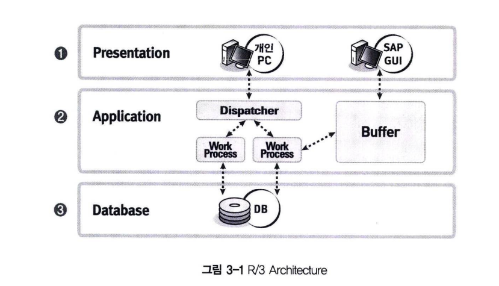

# OPEN SQL & NATIVE SQL
## 1 R/3 Architecture

SAP R/3는 기본적으로 세 개의 Layer로 구분  
Application 서버와 Database 서버는 물리적은 개별 서버로 구성.

- **Presentation Layer**
Presentation Layer는 쉽게 말해 개인 컴퓨터를 의미  
SAP GUI (Graphical User Interface)를 구성하는 소프트웨어 컴포넌트들의 정보를 가지고 있다.  
이 Layer는 R/3 시스템과 사용자 간의 인터페이스를 제공한다.  
SAP GUI는 개인 컴퓨터에 설치되는 터미널 화면이고, 사용자는 이 GUI를 통해서 데이터를 입력하거나 조회할 수 있다.

- **Application Layer**
  - SAP의 모든 프로그램은 Application Server에서 구동된다.  
    SAP GUI는 단지 터미널의 역할만 한다.  
    운영 서버의 Application Layer 는 하나 또는 여러 개의 Application Server와 하나의 Message Server로 구성된다.  
    Message Server는 Application Server와 통신하며 부하가 적은 서버에 사용자가 로그온되도록 한다.  
    여러 개의 Application Server를 구동하는 것은 시스템의 부하를 분산하기 위한 목적.  
    SAP에는 Application Server 레벨에서 Local Buffer가 존재하며, ABAP Dictionary 테이블 레벨에서 버퍼 설정을 하게 되면  
    데이터베이스까지 접근하지 않고, Local Buffer에서 데이터를 읽어온다.  
    이것은 SAP의 성능을 향상시키는데 기여하며, OPEN SQL을 사용할 때만 가능하다.  

    Dispatcher는 Work Process를 적절히 분배하는 역할을 담당하게 된다.  
    사용 가능한 Work Process보다 더 많은 사용자가 Application Server에 접속해서 동시에 여러 프로그램을 실행할 수 있다.  
    이 경우 작업 중인 정보와 대기 중인 정보는 Shared memory에 저장되어 관리된다.

- **Database Layer**
  -   SAP의 모든 데이터를 데이터베이스 테이블에 저장하고 있는 계층.  
데이터베이스는 마스터 데이터, 트랜잭션 데이터 그리고 R/3 시스템의 모든 데이터를 저장하고 있다.  
예를 들면, 데이터베이스는 R/3 시스템의 실행 환경을 정의하는 시스템 변수, 모든 프로그램의 소스 코드, 트랜잭션 데이터 등을 저장하고 있다.  
    ABAP 프로그램은 코드, 스크린, 함수, 테이블 등 다양한 항목들로 구성되어 있다.  
    이러한 것들은 R/3 Repository라 불리는 특별한 공간에 저장되어 있으며, 우리는 ABAP Workbench에서 Repository 오브젝트들을  
    관리(생성/변경/조회)하게 된다. 

        자바, ASP, JSP와 같은 대부분의 프로그램 언어는 Application 계층과 Database 계층이 분리되어 있다.  
        Application 계층에서는 사용자와 화면을 통해 상호작용(Dialog)을 하는 GUI를 구성하고,  
        데이터베이스 레벨의 데이터를 조회하고 유지보수하는 역할을 주로 담당하게 된다.

        Database 레벨에서는 DBMS를 통해 테이블/뷰/구조 등과 같은 데이터베이스 오브젝트를 생성하고, 데이터를 관리할 수 있다.  
        이러한 환경의 개발자는 애플리케이션읜 GUI 화면을 통해 데이터를 수정하거나, 데이터베이스에 직접 접속하여 SQL을 수행할 수 있다.

        SAP는 일반 개발자에게 데이터베이스에 직접 접속하여 데이터를 수정하는 행위를 금지하고 있으며,  
        심지어는 데이터베이스에 접속하여 데이터를 조회하는 권한도 부여하지 않는다.  
        이것은 Data Integrity(무결성). Data Consistency(일관성), Data Security(안전성), Data Transparency(투명성)를 보장하게 된다. (물론, 데이터베이스의 서버 정보, ID와 패스워드가 공개되면 물리적으로 접근하는 것을 차단하지는 못한다.)

        ABAP 프로그램에 사용되는 오브젝트들(Table, View, Structure, Types)을 ABAP Dictionary라고 부르고  
        이러한 오브젝트들의 정보를 MetaData, DAta Definition 또는 Schema라고 정의하며 데이터 구조를 정의하고 관리하는 역할을  
        ABAP Dictionary가 하게 된다.

## 2 SQL의 정의
SQL이란 Structured Query Language의 약자이다. SQL은 관계형 데이터베이스에 사용되는 표준화된 언어이다.  
**ABAP 프로그램의 OPEN SQL에서는 DML 언어만 사용이 가능하다.**

- Data Manipulation Language(DML)
  - **데이터 처리언어** : 데이터베이스(테이블)에 저장된 데이터를 검색, 삾입, 삭제, 갱신 재구성하기 위해 사용되는 언어.

- Data Definition Language(DDL)
  - **데이터 정의 언어** : 응용 프로그램과 데이터베이스 관리 시스템 간에 데이터 요구를 표현 할 수 있는 인터페이스를 기술하기 위한 언어로서 데이터베이스를 생성할 목적으로 사용하는 언어이다.

- Data Control Language(DCL)
  - **데이터 제어 언어** : 무결성, 보안 및 권한 제어, 회복 등을 하기 위한 언어로서 데이터를 보호하고 관리하는 목적으로 사용
