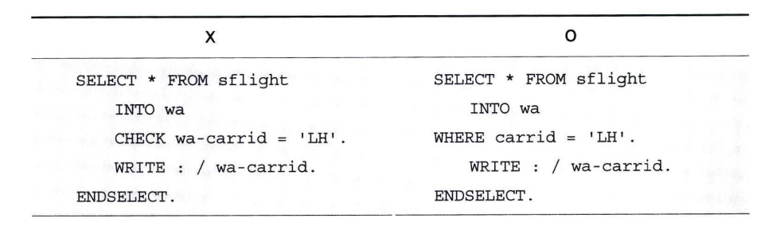
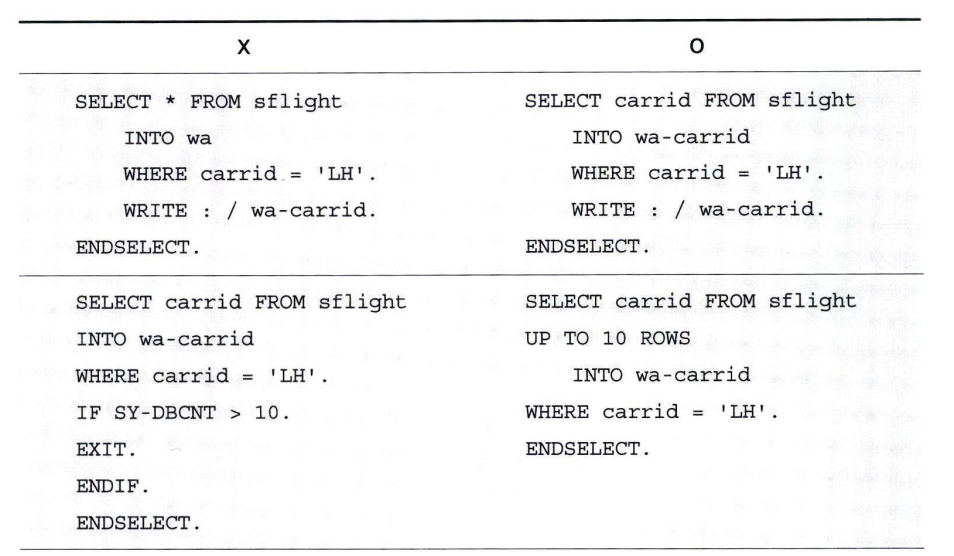
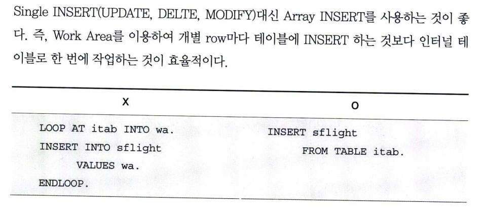
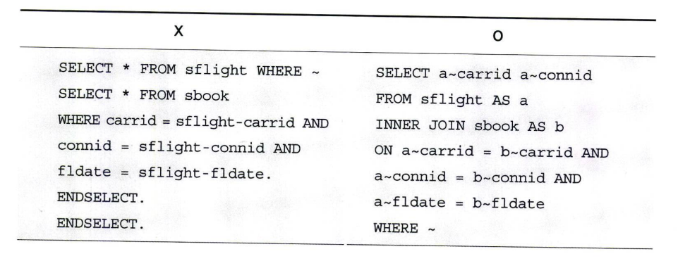
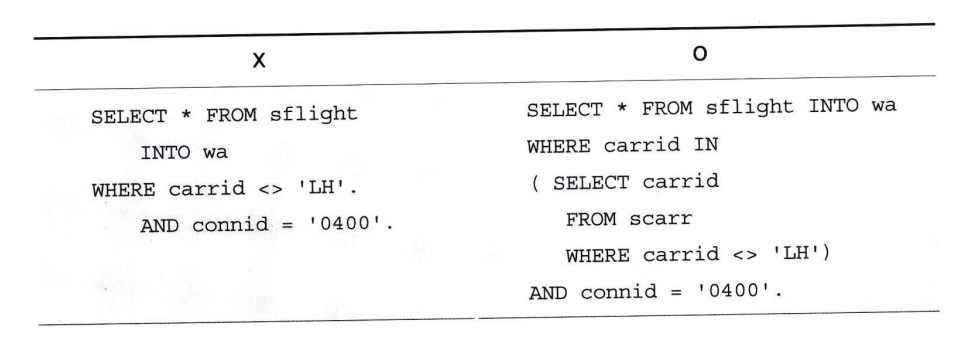
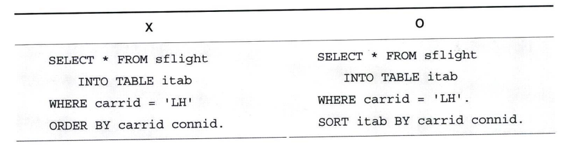
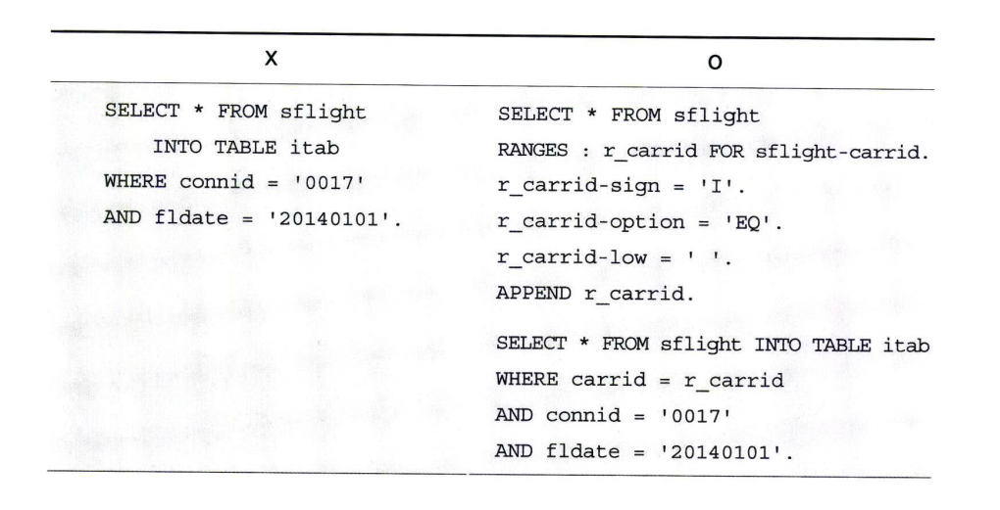
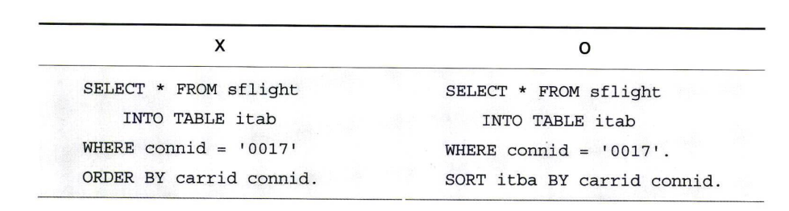

# 효율적인 SQL 구문 작성

**1&#41; 적중 리스트 최소화**
SQL 결과 적중 리스트를 최소화하도록 WHERE 구문을 구성해야한다.

**2&#41; 전송되는 데이터양의 최소화**
SQL 구문은 DB에 서버에서   
AP 서버로 데이터양을 최소화해서 전송하도록 구성해야 한다.

**3&#41; LOOP에 소요되는 비용 최소화**  
① Array 기능을 활용하자  
Single INSERT(UPDATE, DELETE, MODIFY) 대신 Array INSERT를 사용하는 것이 좋다.  
즉 Work Area를 이용해서 개별 row 마다 테이블에 INSERT 하는 것보다 인터널 테이블로 한 번에 작업하는 것이 효율적이다.

② Nested SELECt 구문을 피하자  
Nested SELECT를 피하고 INNER JOIN, FOR ALL ENTRY 그리고 Subquery를 사용하자.

**4&#41; 검색 비용의 최소화**  
INDEX를 활용하는 SQL 문을 구성하자. INDEX는 NOT 기호에는 작동하지 않는다.  
가능하면 OR 구문은 피하고 AND 구문과 EQ 구문으로 SQL을 구성하자.

**5&#41; 데이터베이스의 부담 제거**  
테이블이면서 트랜잭션이 자주 일어나지 않는 마스터 성격의 테이블이라면 버퍼링 설정을 활용하자.  
ORDER BY 구문은 적절한 인덱스가 수행되는데 방해될 수 있으므로 SORT 구문으로 변경하자.

**6&#41; 인덱스에 사용된 필드 모두 기술**  
SQL 문의 성능에 갖아 큰 영향을 미치는 것은 인덱스이다. WHERE 조건과 테이블 JOIN 조건인 ON 구문에도 인덱스로 구성된 필드를  
사용하는 것이 당연히 효율적이다.  
인덱스에 사용된 모든 필드는 될 수 있으면 모두 기술하자.  
SFLIGHT 테이블에서 3개의 필드 (CARRID, CONNID, FLDATE)로 구성된 인덱스 하나만 존재한다고 가정하자.  
그리고 WHERE 조건에 사용될 CARRID 값을 모를 경우에는 RANGE 변수를 이용해서 빈 값을 INSERT 한 후에 SELECT 해야 적절하게 인덱스를 활용할 수 있다.  

그리고 r_carrid 변수에 값이 없는 경우에도 NATIVE SQL로 번역될 때 해당 필드는 WHERE 조건에서 제외되기 때문에 다음과 같이 빈 값 하나를 추가해야 한다.  
이것은 SELECT-OPTIONS이 WHERE 조건에 사용될 떄도 같다.

**7&#41; 정렬은 가급적 Application Server에서 실행**  
SQL 문에서 ORDER BY 구문을 추가해서 데이터베이스에서 정렬을 수행하는 것보다는,  
Application Server에서 인터널 테이블을 SORT 하는 것이 효율적이다.
