# BDC 프로그램
SAP를 설치하고 난 후 기존의 시스템 또는 외부 시스템에서 오랫동안 축적된 데이터를 SAP에 맞는 데이터 형태로 가져와야 한다. <BR>
물론 외부 시스템과 연동해서 SAP를 사용하게 된다면 지속적으로 이러한 작업이 필요하다. <BR>
이럴 때는 데이터 전송 프로그램을 생성해야하며 이때 Data Transfer Workbench를 사용할 수 있다.

Data Transfer Workbench는 데이터 전송을 위한 일련의 작업들을 총괄해주는 Tool이라 할 수 있다.<br>
레거시 시스템에서 데이터를 추출해내고 SAP 포맷에 맞는 형태로 데이터를 생성한 후 SAP로 데이터를 전송하게 된다. <br>
전송 방법에는 BAPI, Batch Input, Direct Input 등의 기술을 사용한다. <br>
우리는 이 중 Batch Input 방법이 무엇인지 알아보고, Batch Input을 사용하는데 필요한 BDC 프로그램을 어떠헥 작성하는지 살펴보도록 한다.

일반적으로 Batch Input 프로그램을 BDC 프로그램이라고 한다. <br>
BDC는 ABAP 프로그램이라기보다는 Tool에 가깝다. 그러나 실무에는 아주 많이 사용되고 중요한 부분이기 때문에 개념 위주로 설명한다. <br>
여기서 잠깐 짚고 넘어가야 할 문제가 있다. T-CODE : SE11에서 테이블 데이터를 직접 변경할 수 있는데, <BR>
왜 BDC와 같은 프로그램을 이용해서 데이터를 입력하느냐는 의문이 생길 수 있다. SAP에 사용되는 데이터는 RDBS를 기본으로 하기 때문에 데이터 특성을 고려해서 여러 테이블에 분산되어 저장하고 있다.<br>
하나의 테이블에 존재하는 데이터를 변경하는 것이 관계가 있는 다른 테이블에 어떠한 영향을 주는지 판단하는 것은 몹시 어려운 문제이다.

만약 SAP가 아닌 레거시 시스템을 이용한다면, RDBS를 사용하더라도 이야기는 달라진다. <br>
왜냐하면, 개발자가 직접 전체 ERD를 설계하고 프로그램을 개발하기 때문에 어떠한 데이터가 어느 테이블에 저장되는지 정확히 알 수 있다. <br>
그러나 SAP 사에서는 ERD를 제공하지 않기 때문에 프로그램에 포함된 복잡한 로직과 관련 테이블들을 파악하는 것은 불가능에 가까운 일이다. <br>
T-CODE:SE11에서 외부 키 관계를 조회 할 수 있지만, 외부 키가 설정되지 않은 테이블 정보는 조회되지 않는다.

이러한 배경하에서 BDC를 이용해서 실제 우리가 사용하는 트랜잭션과 같은 화면(프로세스)을 진행하면서 데이터를 생성하거나 변경하게 된다. <br>
이외에도 트랜잭션을 수행해서 데이터를 변경하면 로그 정보가 저장되어 임의로 비즈니스 정보를 조작할 수 없다는 장점도 있다.

BDC 프로그램은 Batch Input 세션을 생성해서 실행하는 방법과 프로그램 내에서 CALL TRANSACTION 구문으로 트랜잭션을 호출하는 방법으로 나누어진다. <BR>
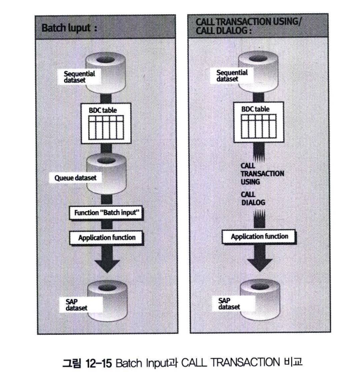 <BR>

그림 12-15의 왼쪽에서 설명하는 Batch Input 방법을 이용하면, ABAP 프로그램은 외부 데이터(파일과 같은 형태)를 읽어서 <br>
BDC 테이블로 구성한다. <BR>
'Batch Input 세션'에 데이터를 저장한 후 큐에 전달한다. 그리고 세션이 생성되면, System, Services, Batch Input 또는 <br>
Background 작업으로 세션 레코드는 SAP 트랜잭션을 이용해 시스템에 전송된다.

그림 12-15의 오른쪽은 ABAP 프로그램에서 CALL TRANSACTION 구문을 이용해서 SAP 트랜잭션을 실행하는 방법이다. <BR>
외부 데이터가 이후 프로세스에서 진행되기 위해 세션에 저장되지 않고, 모든 Batch Input 프로세스가 프로그램 내에서 실시간으로 수행된다.

두 가지 방버에 대해서 좀 더 자세하게 살펴본다.

## 1 Batch Input 이용
Batch Input은 주로 대량의 데이터를 전송할 때 사용되므로 실시간 데이터 전송에는 적합하지 않다. <br>
이 경우에는 CALL TRANSACTION을 이용하는 것이 바람직하다. <BR>
전형적으로 신규로 설치된 SAP R/3에 레거시 시스템 데이터를 이전할 때 사용하고 일 단위, 짧게는 시간 단위로 외부 시스템 데이터를 가져올 때 사용된다.

## 2 CALL TRANSACTION 이용
사용자가 트랜잭션을 실행해서 화면에 값을 입력하는 프로세스를 프로그램으로 구현해서 액셀과 같은 파일 형태로 데이터를 표준 프로그램에 입력하는 방법이다. 실무에서 많이 사용되며, Batch Input Session을 생성하지 않고 ABAP 프로그램 내에서 CALL TRANSACTION 구문을 이용해서 데이터를 입력하게 된다.
```ABAP
CALL TRANSACTION <tcode>
    USING <bdc_tab>
OPTIONS FROM <ctu_params>
    MODE <mode>
    UPDATE <update>
MESSAGES INTO MESSTAB.    
```
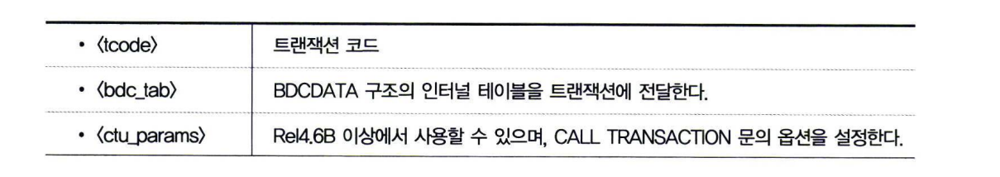 <BR>

**CTU_PARAMS 속성**
- DISMODE
  - MODE 옵션과 동일
- UPMODE
  - UPDATE 옵션과 동일
- CATTMODE
  - CATT 모드 설정 <BR> '' CATT 사용 안함 <BR> 'N' single-screen control이 없는 CATT <BR> 'A' single-screen control이 있는 CATT
- DEFSIZE
  - 기본 윈도우 사이즈 설정
- RACOMMIT
  - COMMIT WORK에서 트랜잭션 종료하지 않음.
- NOBINPT
  - Batch Input Mode 사용 안함 <br> SY-BINPT = space로 설정해서 트랜잭션이 온라인 프로그램과 같은 형식으로 실행되도록 함. <br> 프로그램이 Batch Input(T-CODE : SE53)으로 실행되면 SY-BINPT = 'X'가 설정된다. <br> * 일부 트랜잭션은 Batch Input 모드와 온라인 화면이 다를 수가 있다. 이럴 때는 SY-INPUT = 'X'를 설정해서 트랜잭션을 호출하도록 한다.
- NOBIEND
  - DISMODE가 'E' 상태일 때만 설정할 수 있으며, 시스템 에러가 발생하면 Background에서 수행중인 BDC가 Foreground로 전환되고 <br> 스크린이 조회된다.

CTU_PARAMS의 옵션인 DISMODE와 CALL TRANSACTION의 &#60;mode&#62;는 같은 기능을 수행하며, 중복으로 사용이 불가능하다. <br>
UPMODE 속성도 같다.

MODE 옵션
- A
  - 화면을 조회하면서 트랜잭션 수행
- E
  - 에러가 발생할 때만 화면 조회
- N
  - 화면을 표시하지 않는다.
- S
  - Synchronous Update
- A
  - Asynchronous Update
- L
  - Local Update
    - Local Update는 VBLOG 테이블에 저장하지 않고 ABAP Memory 영역에 데이터를 저장한다.
    - 호출한 프로그램과 호출된 프로그램은 같은 Work Process에서 수행된다.

Return code : BDC 수행 후 시스템 변수 SY-SBURC에 성공 여부를 반환한다.

RETURN CODE 의미
- 0
  - Success
- <=1000
  - Dialog Program Error
- &#62; 1000
  - Batch Input Error

MESSTAB: BDC 수행 시 트랜잭션에서 수행된 메시지들이 저장되는 BDCMSGCOLL 타입의 인터널 테이블이다.<BR>
MESSTAB의 시스템 변수 의미
- SY-MSGID
  - Message ID
- SY-MSGTY
  - Message type(E, I, W, S, A, X)
- SY-MSGNO
  - Message number
- SY-MSGV(N)
  - Message variable N

## 3 레코딩 및 BDC 프로그램 생성
Batch Input을 수행하려면 Batch Input 프로그램이 있어야 한다. 이 프로그램을 만들려면 전송한 데이터가 어떤 트랜잭션을 수행해야 하는지 결정하는 레코딩 작업이 선행되어야 한다. <br>
레코딩 작업의 주목적은 BDC 프로그램 작성을 위한 것이라고 볼 수 있다.

BDC 프로그램을 만들기 위해 트랜잭션 레코딩에 대해 간단히 살펴보자

**1&#41; 용도** <br>
- Batch Input 또는 Call Transaction을 실행하는 데이터 프로그램 생성
- Batch Input 세션 생성
- 테스트 데이터 생성
- Function Module 생성

**2&#41; 특징** <br>
F1, F4(PROCESS ON HELP-REQUEST, PROCESS ON VALUE-REQUEST)는 레코딩되지 않는다. <BR>
그리고 Error나 Warning 메시지도 레코딩되지 않는다. 이는 현 화면에서 성공적으로 다음 프로세스를 진행할 수 있도록 하기 위해서다.

그림 12-16은 사용자가 수행하는 트랜잭션을 레코딩 하는 과정을 설명하고 있다. 화면의 필드는 필드 네임(Field Name), 화면에 입력된 값은 필드 값(Field Value)으로 표현된다. <br>
BDC_OKCODE는 화면에서 수행된 명령(OK_CODE)이며, BDC_CURSOR는 화면을 빠져 나가기 전의 커서 위치를 설명한다. <BR>
그리고 RP50G-PERNR은 사원 번호가 입력되는 화면은 Input Field이며, 필드 값 '1000'이 입력되었음을 설명하고 있다. <br>
BDC 프로그램을 생성하면 필드 값 '1000' 대신에 파일에서 읽어온 변수로 변경해서 처리하게 된다.
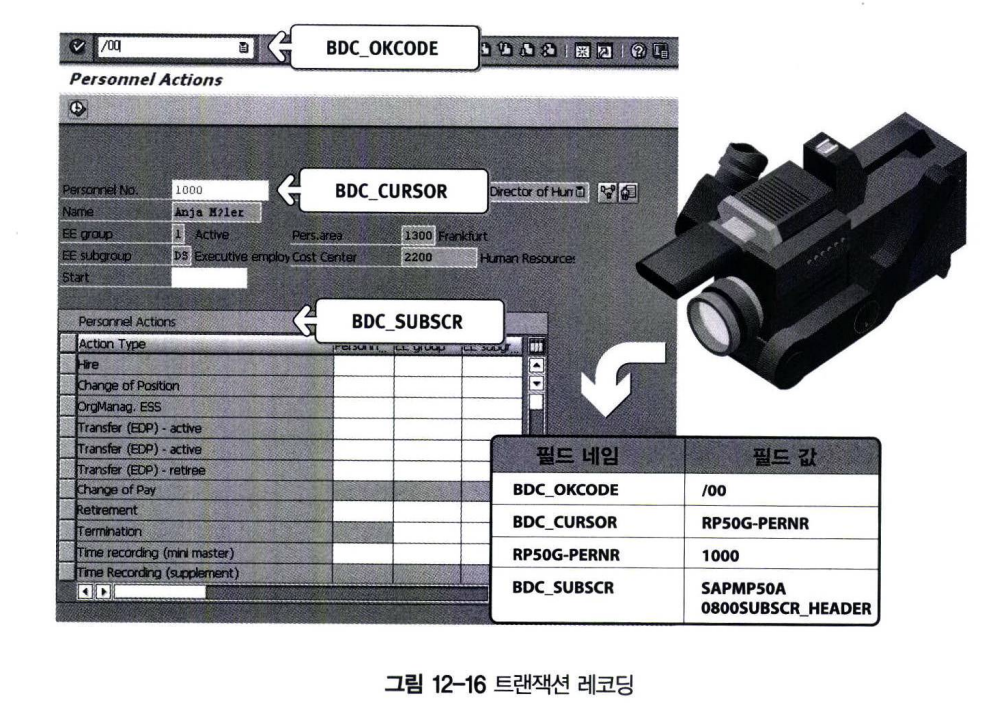

### 3.1 Transaction Recorder 수행
자재 마스터를 변경하는 레코딩을 직접 Transaction Recorder에서 수행해보도록 한다. <br>
BDC 프로그램은 사이트별 또는 개발자의 속성에 따라 다양한 형태로 개발된다. <BR>
BDC 프로그램의 소스에 대해서는 상세하게 설명하지 않고 넘어가며, 이번 절을 통해 BDC의 개념을 이해한 후에, <BR>
각 사이트의 표준 포맷 프로그램을 참고하는 것이 바람직한 방법이다.
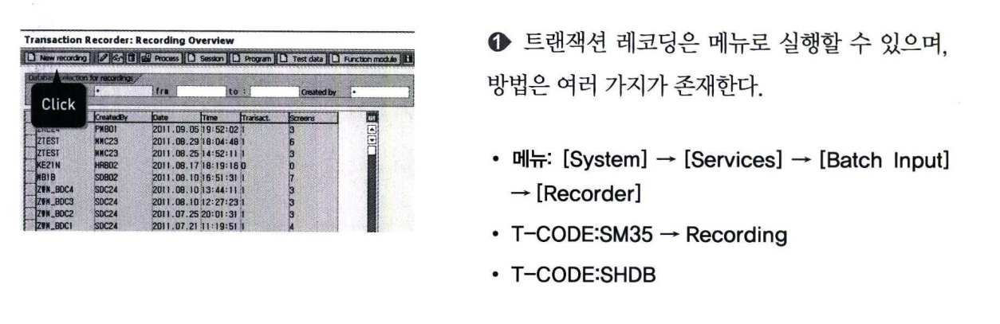 <BR>
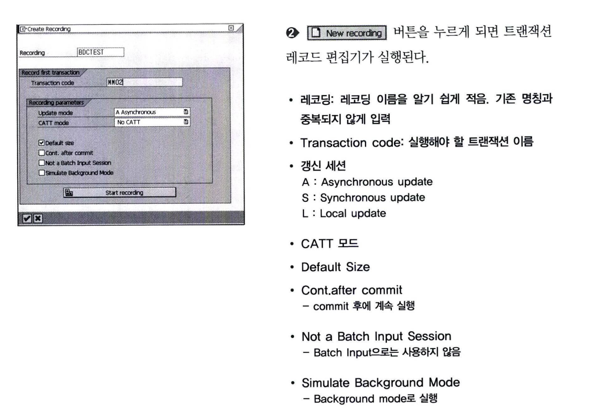 <BR>
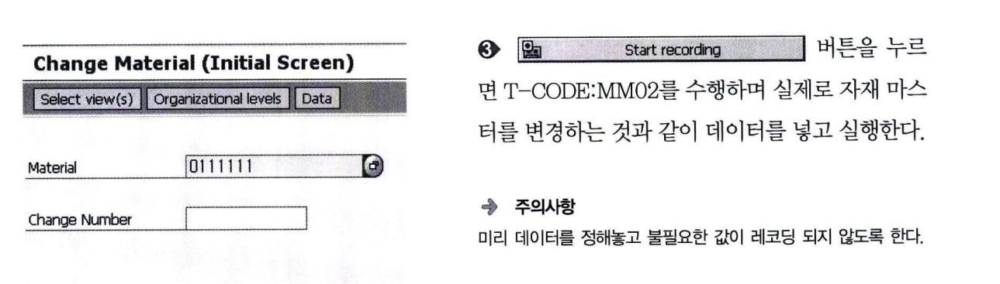 <BR>
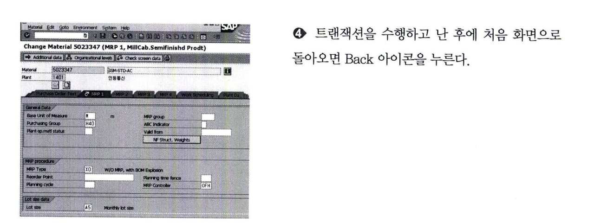 <BR>
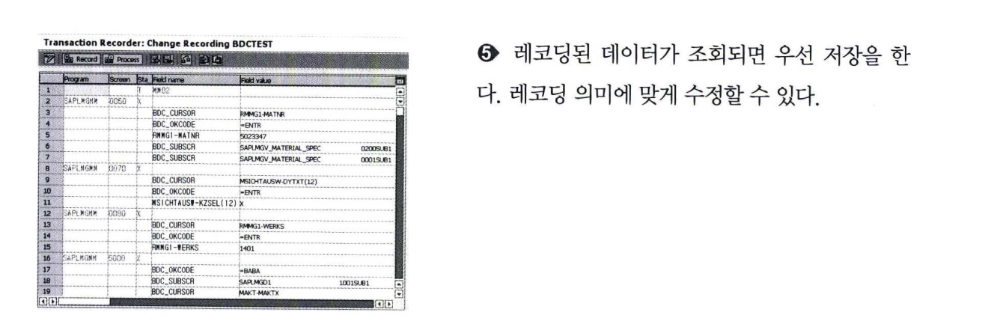

### 3.2 Transaction Recording을 이용해서 BDC Program 생성
앞서 생성한 레코딩의 프로그램 생성 기능을 이용해서 BDC 프로그램을 만들어본다.
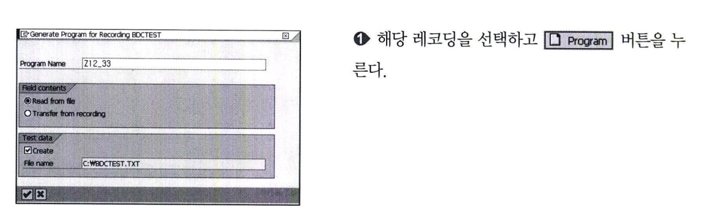 <br>
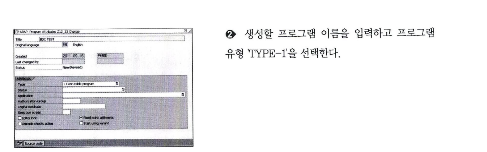 <br>
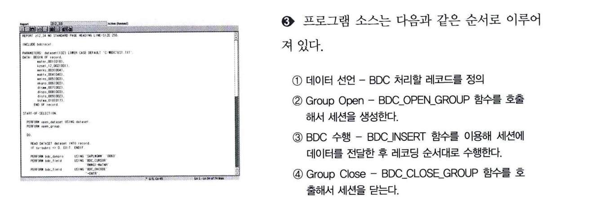 <br>
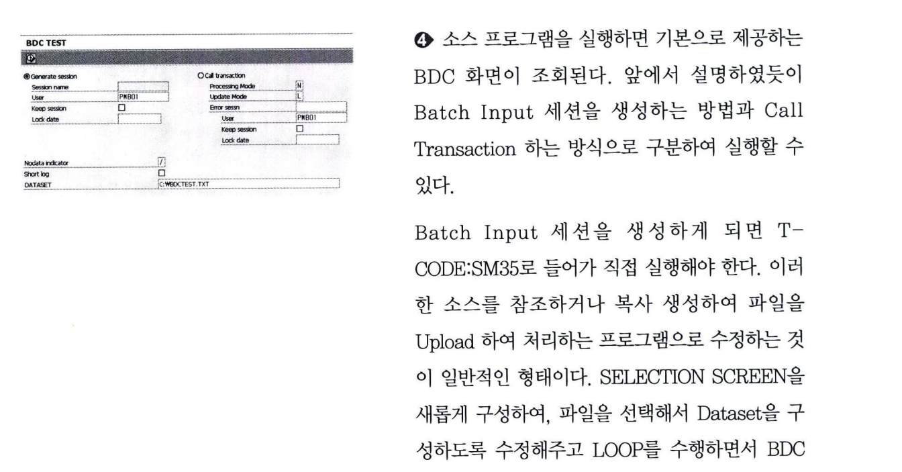