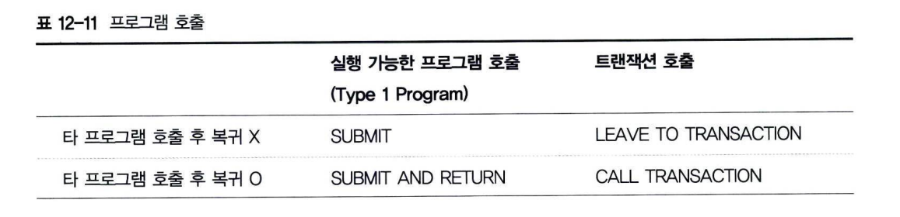
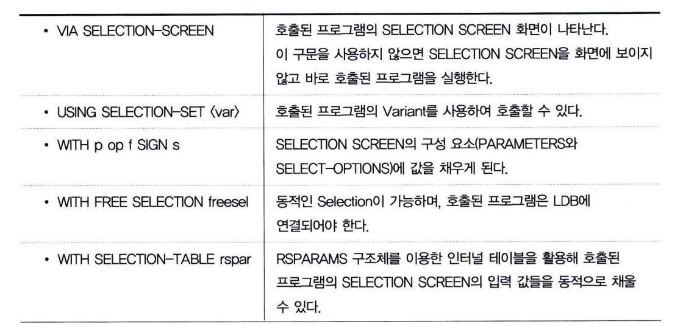
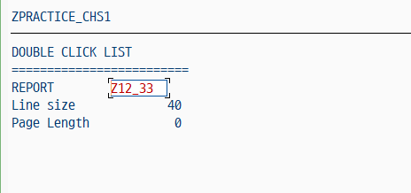

# Calling Program
프로젝트 수행 시 하나의 프로그램을 여러 명의 개발자가 동시에 개발해야 하는 경우가 발생할 수 있다. <br>
즉 프로그램이 매우 복잡한 기능을 수행해야 하는 경우, 기능별로 프로그램을 나누어서 개발하는 것도 좋은 방법이다. <br>
이렇게 구성된 패키지 프로그램은 메인 프로그램에서 사용자의 요구에 따라 각각의 프로그램을 호출하여 사용한다.<br>
 <br>

모든 ABAP 프로그램에서 표 12-11의 프로그램 호출 구문을 사용할 수 있다. SUBMIT 구문과 CALL TRANSACTION 구문의 가장 큰 차이점은 <BR> 프로그램과 트랜잭션을 호출한다는 점이다.

예를 들어, 실행 가능한 프로그램의 조회 LIST에서 사용자가 한 라인을 더블클릭한 경우 선택된 라인의 데이터를 다른 트랜잭션을 호출해서 보여줄 수 있다. <BR>

TYPE-1 프로그램이 다른 프로그램에 의해 호출될 때는 LOAD-OF-PROGRAM 이벤트 라는 것이 자동으로 수행된다. <BR>
클래스의 CONSTRUCTOR 메서드와 유사한 기능을 수행하며 리포트 프로그램에서 처음 수행되는 INITIALIZATION 이벤트 이전에 수행된다.<BR>
이것은 실행 가능한 프로그램은 소스에 SUBMIT 구문을 암묵적으로 포함하고 있다는 것을 의미한다. <BR>
T-CODE : SE38에서 TYPE-1 프로그램을 실행하게 되면, SUBMIT 구문이 호출되어 프로그램이 실행되는 것이다.

SUBMIT AND RETURN과 CALL TRANSACTION 구문을 이용해서 다른 프로그램을 호출한 후에 프로그램을 빠져나오면 <BR>
호출한 프로그램에서 해당 구문의 바로 다음 라인이 수행된다. <BR>
예를 들어, 자재 코드 리스트에 자재 코드의 상세 내역을 조회하고자 다른 프로그램을 호출한 후 빠져나오면 이전 리스트로 돌아와야 한다. <BR>
이러한 작업을 문제없이 수행하려면 SUBMIT과 AND RETURN을 함께 추가하면 된다.<BR>
다음과 같은 예제가 프로그램에 포함되어 있다면,
```ABAP
SUBMIT 'program' AND RETURN.
IMPORT g_carrid FROM MEMORY ID 'T_CID'.
            ...
```
프로그램을 호출한 후, 원래 프로그램으로 복귀할 때 IMPORT 구문부터 수행된다. <br>
CALL TRANSACTION 구문도 마찬가지이다.

## 1 리포트 프로그램 호출
TYPE-1 프로그램은 다음 구문과 같이 SUBMIT 구문으로 호출할 수 있다.
```ABAP
SUBMIT <rep>|(<field>) [AND RETURN] [<options>].
```
프로그램을 호출할 때 소스 코드 레벨에서 직접 프로그램 이름을 입력해서 정적으로 지정할 수 있고, <BR>
'(프로그램 이름)'과 같이 괄호를 사용해 동적으로 호출할 수도 있다. <BR>
시스템이 SUBMIT 구문을 수행해서 적절한 프로그램을 찾지 못하면 Runtime 에러가 발생한다. <br>
그리고 AND RETURN 구문을 사용하지 않으면 호출한 프로그램의 모든 데이터와 리스트는 삭제된다. <BR>
AND RETURN 구문을 사용하면 시스템은 데이터를 스택에 저장하고 있다가 원래의 프로그램으로 되돌아오게 된다.

### 1.1 리포트 프로그램 호출과 SELECTION SCREEN
TYPE-1 프로그램을 실행하게 되면 일반적으로 PARAMETERS와 SELECT-OPTION을 포함하는 표준 SELECTION SCREEN이 화면에 조회된다. <BR>
SUBMIT 구문을 이용해서 SELECTION SCREEN 입력 필드에 값을 채우는 다양한 옵션을 수행할 수 있다.
```ABAP
SUBMIT ... [VIA SELECTION-SCREEN]
            [USING SELECTION-SET var]
            [WITH p op f SIGN s]
            [WITH FREE SELECTIONS freesel]
            [WITH SELECTION-TABLE rspar].
```


### 1.2 호출된 프로그램 리스트 설정
호출된 프로그램은 REPORT 구문이 존재하지 않기 때문에 LIST의 라인 수와 같은 포맷을 설정할 수 없다. <BR>
이때는 SUBMIT 구문을 이용해서 호출된 프로그램의 LIST 구조를 변경할 수 있다.
```ABAP
SUBMIT ... [LINE-SIZE <width>] [LINE-COUNT <length>].
```
```abap
REPORT Z12_32.

DATA : GV_NAME(8) VALUE 'Z12_33',
       GV_WID TYPE I VALUE 40,
       GV_LEN TYPE I VALUE 0.

DATA : GT_SELTAB TYPE TABLE OF RSPARAMS WITH HEADER LINE.

START-OF-SELECTION.
    WRITE : 'DOUBLE CLICK LIST',
    / '========================='.

END-OF-SELECTION.
    WRITE : / 'REPORT       ',    gv_name INPUT on,
            / 'Line size    ',    gv_wid ,
            / 'Page Length  ',    gv_len .

AT LINE-SELECTION.
    SUBMIT (gv_name) WITH SELECTION-TABLE gt_seltab LINE-SIZE gv_wid LINE-COUNT gv_len AND RETURN.
```


## 2 트랜잭션 호출
프로그램이 트랜잭션을 가지고 있다면, 트랜잭션을 실행해서 타 프로그램을 호출할 수 있다.
```ABAP
LEAVE TO TRANSACTION tcod [AND SKIP FIRST SCREEN].
```
이 구문은 호출한 프로그램을 종료하고 새로운 프로그램을 수행한다. <BR>
호출된 프로그램을 종료하게 되면 처음 실행된 메뉴 화면으로 돌아간다. LEAVE 구문은 COMMAND 창에서 <BR> /N + T-CODE를 입력한 것과 같은 효과가 있다.
```ABAP
CALL TRANSACTION tcod [AND SKIP FIRST SCREEN].
```
이 구문은 호출한 프로그램의 데이터를 저장하고 트랜잭션을 호출한다. <BR>
LEAVE PROGRAM 구문을 만나 호출된 프로그램을 빠져나오면 호출한 프로그램으로 되돌아간다. <BR>
AND SKIP FIRST SCREEN 옵션은 메모리 파라미터를 이용해서 SELECTION SCREEN을 건너뛰고 바로 <BR>
Output List가 조회되도록 한다.