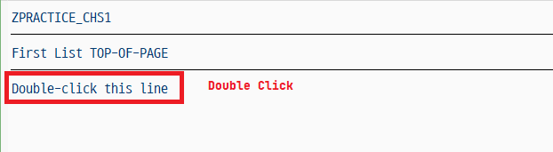
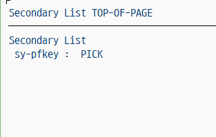
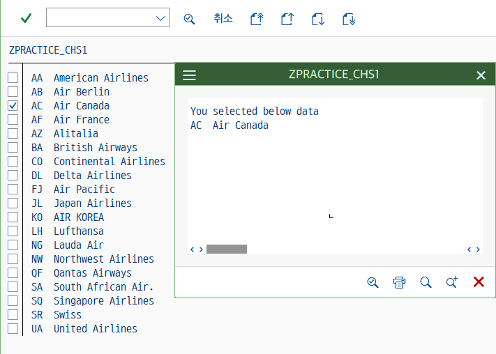
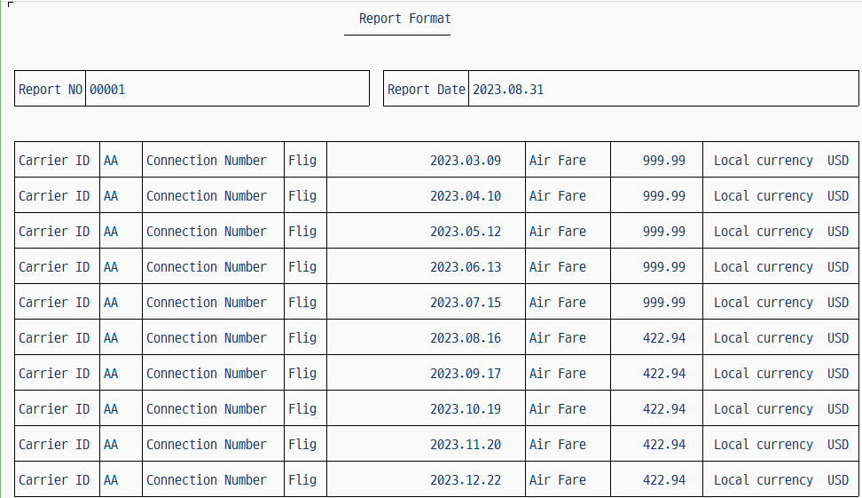
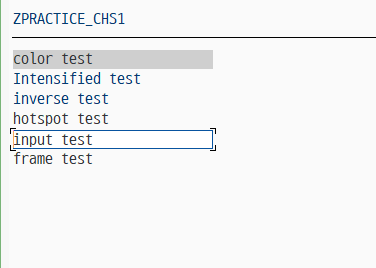
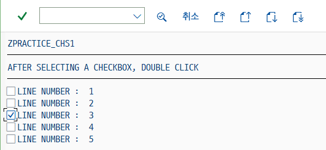
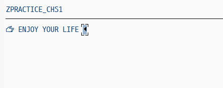
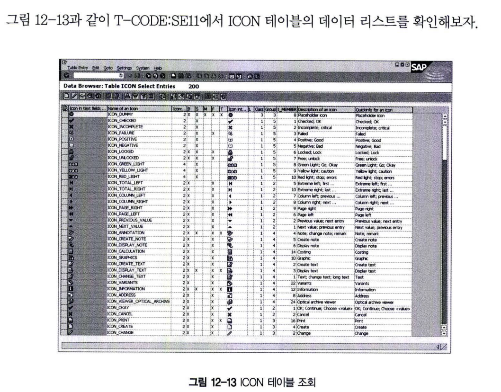
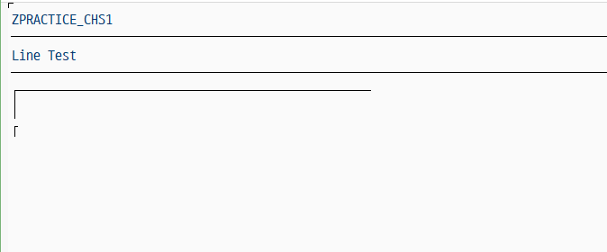
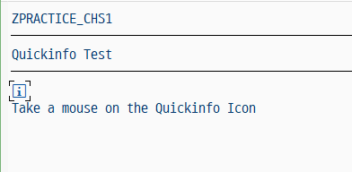

# GUI Status 생성(SET PF-STATUS)
표준 리포트 프로그램에서 제공하는 메뉴를 삭제하거나 기능을 추가하고자 하면 SET PF-STATUS 구문을 사용한다. <BR>
GUI STATUS 는 ABAP 프로그램 영역과 독립적으로 존재하며, 메뉴 페인터(T-CODE:SE41)에서 생성해서 화면에 동적으로 추가할 수 있다.<BR>
'EXCLUDING' 옵션을 사용하면 메뉴 중 일부를 비활성화 시킬 수 있다. <BR>
모듈 풀 프로그램에서 메뉴를 생성해서 스크린에 추가하는 것이 일반적이며, TYPE-1 리포트 프로그램에서 Function Key를 사용하는 것으로도 충분하다 (EXCLUDING 문장한 한 개의 Menu만 비활성화시킨다. 여러 개의 메뉴를 비활성화시키려면 EXCLUDING 구문 다음에 인터널 테이블을 사용한다.)<br>

시스템 변수 SY-PFKEY는 현재 화면의 status 값을 가지고 있다.
```abap
SET PF-STATUS <menu> EXCLUDING <fnk>.
```

## 6 TOP-OF-PAGE DURING LINE-SELECTION
Secondary LIst에서 Header를 Control 할 때 사용하는 이벤트 <br>
시스템 변수 SY-LSIND에 현재 List Index를 가지고 있다. <br>
SY-LSIND 변수는 Secondary List가 보일 때 마다 Index는 1씩 증가한다. <br>
Basic list는 Index가 0이다. <br>
만일 SY-LSIND = SY-LSIND - 1 이라는 문장을 사용하면 다음 List를 현재 화면에 겹쳐 쓰겠다는 표시가 된다. <br>
Secondary List에서 Back 버튼이나 Exit (ICON X) 버튼을 누르면 Index는 1씩 감소하게 된다.
```abap
TOP-OF-PAGE DURING LINE-SELECTION.
```
```ABAP
REPORT Z12_20.

TOP-OF-PAGE.
    WRITE 'First List TOP-OF-PAGE'.
    ULINE.

TOP-OF-PAGE DURING LINE-SELECTION.
    WRITE 'Secondary List TOP-OF-PAGE'.
    ULINE.

AT LINE-SELECTION.
    PERFORM write_list.

START-OF-SELECTION.
    WRITE : 'Double-click this line'.

FORM write_list.
    WRITE : 'Secondary List', / ' sy-pfkey : ', sy-pfkey.
ENDFORM.    
```
 <br>


## HIDE AREA
HIDE로 선언된 변수는 LIST에서 선택(더블클릭)하게 되면 HIDE WORK AREA로 데이터가 저장된다. <BR>
Output List에 출력되지 않는 WRITE 문으로, WRITE 문장 바로 뒤에서 사용한다.
```ABAP
WRITE <필드명>.
HIDE <필드명>.
```
```ABAP
REPORT Z12_21.

DATA : LT_SCARR TYPE STANDARD TABLE OF SCARR WITH HEADER LINE.
DATA : LS_SCARR TYPE SCARR,
       LV_CHK   TYPE C,
       LV_FLDNAME(30),
       LV_FLDVAL(50).

START-OF-SELECTION.
    SELECT * INTO TABLE LT_SCARR FROM SCARR.

END-OF-SELECTION.
    LOOP AT LT_SCARR.
        WRITE :/ LV_CHK AS CHECKBOX,
        SY-VLINE, LT_SCARR-CARRID, LT_SCARR-CARRNAME.
        HIDE : LT_SCARR-CARRID, LT_SCARR-CARRNAME.
    ENDLOOP.

AT LINE-SELECTION.
    CHECK SY-LSIND = 1.
    WINDOW STARTING AT 5 5 ENDING AT 55 10.
    WRITE :/ 'You selected below data'.
    WRITE :/ lt_scarr-carrid, lt_scarr-carrname.                       
```


위의 코드에서 LIST의 한 라인을 더블클릭하게 되면, HIDE 구문으로 선언된 필드 HIDE : lt_scarr-carrid, lt_scarr-carrname.에 <br>
라인의 필드 값이 할당된다. HIDE 구문과 유사한 기능을 수행하는 구문으로 READ LINE, GET CURSOR, DESRIBE LIST가 있다. <BR>
WINDOW STATRING AT 5 5 ENDING AT 55 10 구문은 새로운 윈도우 창을 열고 선택된 라인의 값을 화면에 WRITE 하는 예제이다.

## 7 WRITE 구문
WRITE 구문은 OUTPUT 리스트에 데이터를 쓰는 기능을 주로 하게 되며, 값을 할당하는(MOVE) 기능도 수행한다. <BR>
리스트용으로 사용될 때에는 데이터를 LIST BUFFER에 저장한다. <BR>
OUTPUT 리스트에 사용될 수 있는 항목은 다음과 같다.
- **DATA 구문으로 선언된필드**
- **TABLES 구문으로 선언된 구조체의 항목**
- **FIELD-SYMBOL로 선언된 필드 심볼**
- **언어에 종속적이지 않은 TEXT 문장**

```ABAP
WRITE AT pl. (position and length specification)
         option. (formatting option)
         ofmt. (output format by field)
         AS CHECKBOX. (output as checkbox)
         AS SYMBOL. (output as symbol)
         AS ICON. (output as ICON)
```
### 7.1 AT pl
필드의 위치와 길이를 지정해 준다. 슬래시 기호는 new line을 의미하며 숫자 앞에 선언되어져야한다.
```abap
REPORT Z12_22 NO STANDARD PAGE HEADING LINE-SIZE 120 LINE-COUNT 78.

DATA : GT_DATA TYPE TABLE OF SFLIGHT WITH HEADER LINE.

TOP-OF-PAGE.
    WRITE :/50 'Report Format' CENTERED.
    WRITE :/48 '---------------' CENTERED.

    SKIP.

START-OF-SELECTION.
    WRITE :/(51) SY-ULINE, 53(68) SY-ULINE,
           /     SY-VLINE NO-GAP, 51 SY-VLINE NO-GAP, 53 SY-VLINE NO-GAP, 120 SY-VLINE NO-GAP.

    WRITE : 2(9) 'Report NO' NO-GAP CENTERED, SY-VLINE NO-GAP.
    WRITE : 12(5) '00001' NO-GAP, 51 SY-VLINE NO-GAP.

    WRITE : 54(11) 'Report Date' NO-GAP CENTERED, SY-VLINE NO-GAP.
    WRITE : 66(10) SY-DATUM NO-GAP CENTERED, 120 SY-VLINE NO-GAP.
    WRITE :/(51) SY-ULINE, 53(68) SY-ULINE.
    SKIP.

    WRITE :/(120) SY-ULINE.

    SELECT * INTO CORRESPONDING FIELDS OF TABLE GT_DATA FROM SFLIGHT UP TO 10 ROWS.

    LOOP AT GT_DATA.

        WRITE :/ SY-VLINE NO-GAP, 2(10) 'Carrier ID', SY-VLINE NO-GAP.
        WRITE : 14(4) GT_DATA-CARRID, SY-VLINE NO-GAP.
        WRITE : 20(18) 'Connection Number', SY-VLINE NO-GAP.
        WRITE : 40(4) 'Flight date',        SY-VLINE NO-GAP.
        WRITE : 60(12) GT_DATA-FLDATE, SY-VLINE NO-GAP.
        WRITE : 74(10) 'Air Fare', SY-VLINE NO-GAP.
        WRITE : 86(11) GT_DATA-PRICE, SY-VLINE NO-GAP.
        WRITE : 100(15) 'Local currency', SY-VLINE NO-GAP.
        WRITE : 116(3) GT_DATA-CURRENCY, SY-VLINE NO-GAP.
        WRITE :/(120) SY-ULINE.

    ENDLOOP.        
```


### 7.2 WRITE OPTION
LIST OUTPUT 포맷을 설정하는 옵션은 아래를 참고한다. <BR>
- NO-ZERO
  - 0을 출력하지 않음 <BR> TYPE C인 경우 SPACE
- NO-SIGN
  - 부호를 조회하지 않음
- DD/MM/YY <BR> MM/DD/YY <BR> DD/MM/YYYY <BR> MM/DD/YYYY <BR> DDMMYY
  - TYPE D <BR> 날짜포맷을 변경함 <BR> (YY = year, MM = month, DD = day).
- CURRENCY w
  - w에 정의된 통화 형식으로 금액 필드 값을 나타낸다. <br> w에 정의된 통화 key가 얼마나 많은 소수점 자리를 가졌는지를 파악해서<br> 이를 금액필드에 적용하는 것이다. <br> 통화 종류별 소수 자릿수는 테이블 tcurx에 정의 되어 있다.
- DECIMALS d
  - 소수점 자리를 조절한다(TYPE I, P, F에서 사용된다).
- ROUND r
  - r 수만큼 10진수는 10의 r승 이동한다.
- UNIT u
  - u에 정의된 단위에 따라 출력 값의 포맷을 결정한다. 이떄 출력 변수 f는 수량으로 취급되며, u에 정의된 단위로 출력 <BR> 시의 소수점 자리를 결정한다. <BR> Unit 'STD'는 소수점 3자리를 가지고 있다.
- EXPONENT e 
  - e만큼 지수를 설정해서 보여준다. (TYPE f).
- USING EDIT MASK mask | USING NO EDIT MASK
  - 사용자가 정의한 포맷으로 화면에 보여준다.
- UNDER g
  - g헤더라인을 선언하고 아래에 각 필드의 값을 보일 경우 사용한다.
- NO-GAP
  - 필드 사이의 공백을 없애준다.
- LEFT-JUSTIFIED
  - 왼쪽으로 정렬
- CENTERED
  - 중앙 정렬
- RIGHT-JUSTIFIED
  - 오른쪽 정렬

### 7.3 WRITE OUTPUT 포맷
LIST의 필드별 OUTPUT 포맷을 설정한다. 각 옵션은 중복 사용이 가능하다.
```abap
DATA : l_color TYPE char25 VALUE 'color test'.
DATA : l_intens TYPE char25 VALUE 'Intensified test'.
DATA : l_inverse TYPE char25 VALUE 'inverse test'.
DATA : l_hotspot TYPE char25 VALUE 'hotspot test'.
DATA : l_input TYPE char25 VALUE 'input test'.
DATA : l_frame TYPE char25 VALUE 'frame test'.

FORMAT COLOR COL_HEADING ON.
WRITE :/ l_color.
FORMAT COLOR OFF.

FORMAT INTENSIFIED ON.

WRITE :/ l_intens.
FORMAT INTENSIFIED OFF.

FORMAT INVERSE ON.
WRITE :/ l_inverse.
FORMAT INVERSE OFF.

FORMAT HOTSPOT ON.
WRITE :/ l_hotspot.
FORMAT HOTSPOT OFF.

FORMAT INPUT ON.
WRITE :/ l_input.
FORMAT INPUT OFF.

FORMAT FRAMES ON.
WRITE :/ l_frame.
FORMAT FRAMES OFF.

FORMAT RESET.
```


### 7.4 WRITE AS CHECKBOX
리스트의 필드를 체크박스로 보여준다. GUI STATUS 'CHECK'를 생성후에 해보도록하자
```ABAP
DATA : gv_box(1) TYPE c,
       gv_lines  TYPE i,
       gv_num(1) TYPE c.

DO 5 TIMES.
  gv_num = sy-index.
  WRITE :/ gv_box AS CHECKBOX, 'LINE NUMBER : ', gv_num.
  HIDE : gv_box, gv_num.
ENDDO.

gv_lines = sy-linno.

TOP-OF-PAGE.
  WRITE 'AFTER SELECTING A CHECKBOX, DOUBLE CLICK'.
  ULINE.

AT LINE-SELECTION.
  DO gv_lines TIMES.
    READ LINE sy-index FIELD VALUE gv_box.
    IF gv_box = 'X'.
      MODIFY LINE sy-index
        FIELD VALUE gv_box
        FIELD FORMAT gv_box INPUT OFF
                     gv_num COLOR 7 INVERSE ON.
    ENDIF.
  ENDDO.
```


### 7.5 WRITE AS SYMBOL
LIST의 필드를 심볼로 보여준다.
```ABAP
INCLUDE <SYMBOL>.

WRITE : SYM_RIGHT_HAND AS SYMBOL, 'ENJOY YOUR LIFE', SYM_LEFT_TRIANGLE AS SYMBOL.
```


### 7.6 WRITE AS ICON


### 7.7 WRITE AS LINE
```ABAP
INCLUDE <line>.

TOP-OF-PAGE.
    WRITE : 'Line Test'.
    ULINE.

START-OF-SELECTION.
    ULINE /1(50).
    WRITE: / SY-VLINE NO-GAP.
    WRITE :/ LINE_TOP_LEFT_CORNER AS LINE.    
```


### 7.8 WRITE AS QUICKINFO
Quickinfo로 선언된 필드 위에 마우스 커서거 놓이면 정보가 보이게 된다. <br>
INCLUDE &#60;LIST&#62; 는 INCLUDE &#60;SYMBOL&#62;, &#60;ICON&#62;, &#60;LINES&#62;, &#60;COLOR&#62;를 포함한다.
```ABAP
INCLUDE <list>.
DATA : GV_INFO(20) VALUE 'THIS IS QUICK INFO.'.

TOP-OF-PAGE.
    WRITE : 'Quickinfo Test'.
    Uline.

START-OF-SELECTION.
WRITE :/ icon_information AS ICON QUICKINFO gv_info.
    WRITE :/ 'Take a mouse on the Quickinfo Icon'.
```
