# 프로그램 구조(List Process 이벤트)
이번 절에서는 조회 화면서에서 조회 조건 입력 값을 입력한 후에 사용자가 실행 버튼을 클릭하거나 F8 키를 눌렀을 때 <br>
데이터를 화면에 뿌려주는 List Process 이벤트에 대해서 학습한다.
```abap
TOP-OF-PAGE
END-OF-PAGE.
AT LINE-SELECTION.
AT PF<NN>
AT USER-COMMAND.
```
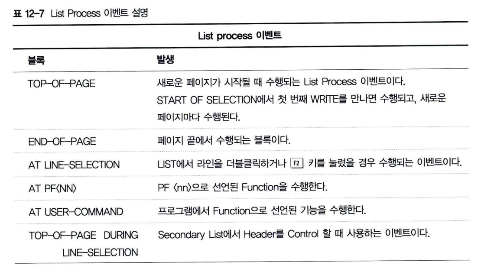 <BR>

## 1 TOP-OF-PAGE
새로운 PAGE에 첫 번째 데이터가 출력되기 전에 수행된다. 그리고 NO STANDARD PAGE HEADING 옵션으로 <BR>
생성된 프로그램에서 직접 HEADER를 입력할 때 사용한다. <BR>
추가적인 옵션이 없을 때에는 기초적인 LIST 생성 시에만 사용된다. <BR>
NEW-PAGE 구문에서는 EVENT를 수행하지 않는다. <BR>
현재 PAGE에서 고정된 HEADER로 지정되기 때문에 스크롤을 해도 움직이지 않는다.<BR>
```ABAP
TOP-OF-PAGE
```

DURING LINE-SELECTION 옵션은 AT LINE-SELECTION, AT USER-COMMAND 등으로 새로운 화면이 호출됐을때, <BR>
Secondary List의 TOP-OF-PAGE를 화면에 출력한다.
```ABAP
TOP-OF-PAGE DURING LINE-SELECTION.
```
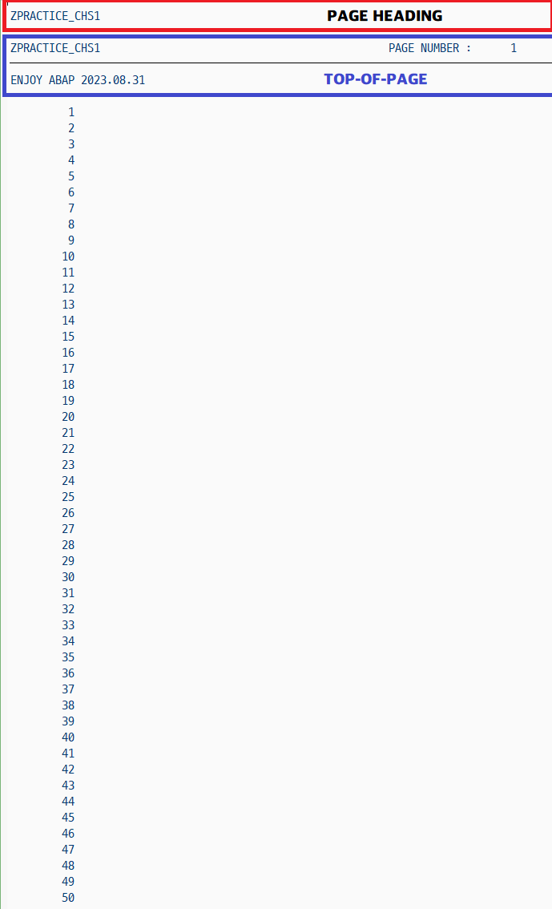 <BR>

## 2 END-OF-PAGE
END-OF-PAGE는 현재 페이지의 남은 공간이 부족할 때 수행되는 이벤트. <BR>
즉, 페이지의 Footer를 지정하게 된다. <br>
명시적으로 Line-count를 지정하면 페이지가 Line-count 수를 넘어가면 수행된다. <br>
**LINE-COUNT 10(2)의 숫자 10은 한 페이지의 총 라인 수를 의미하고** <BR>
**(2)는 Page Footer에 뿌려줄 라인 수를 의미한다.**<br>
LINE-COUNT 옵션을 사용하지 않은 경우, default LINE-SIZE(너비)는 83 칼럼이며, <br>
Default LINE-COUNT(높이)는 60,000 Line이다. <br>
LINE-SIZE, LINE-COUNT는 반드시 숫자를 사용해야 하며, 데이터 오브젝트를 사용할 수 없다. <BR>
프로그램 내에 NEW-PAGE 이벤트를 추가했다면 END-OF-PAGE는 수행되지 않는다.
```ABAP
END-OF-PAGE
```
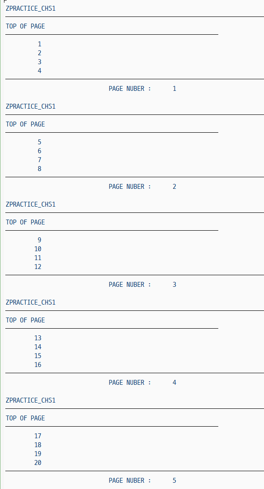

## AT LINE-SELECTION
Report의 한 Line을 더블클릭하거나 F2 키를 눌렀을 때 발생하는 이벤트 <br>
이때 발생하는 SY-UCOMM 시스템 변수에는 'PICK'이 할당된다. <BR>
FORMAT HOTSPOT 구문을 사용하며 해당 라인은(클릭 = 더블클릭)의 효과를 가져오게 된다. <BR>
색상 및 INVERSE를 지정할 수 있다. <BR>
ON 구문으로 시작했으면 ,반드시 OFF구문으로 끝내야한다.
```ABAP
START-OF-SELECTION.
    WRITE 'FIRST LIST'.

    FORMAT HOTSPOT ON COLOR 7.
    WRITE : / 'CLICK THIS LINE'.
    FORMAT HOTSPOT OFF COLOR OFF.

AT LINE-SELECTION.
    WRITE: 'SECONDARY LIST'.
    WRITE :/ 'SY-UCOMM = ', SY-UCOMM.    
```
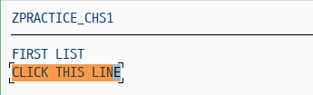 <BR>
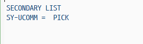

```ABAP
DATA : GS_SCARR     TYPE    SCARR,
       GT_SCARR     TYPE    TABLE OF SCARR,
       GV_FNAME(20) TYPE    C,
       GV_VALUE(20) TYPE    C,
       GV_CARRID    LIKE    SCARR-CARRID,
       GV_CARRNAME  LIKE    SCARR-CARRNAME.

AT LINE-SELECTION.
    GET CURSOR  FIELD   GV_FNAME    VALUE   GV_VALUE.

    CASE    GV_FNAME.
        WHEN    'GS_SCARR-CARRID'.
        SPLIT SY-LISEL AT ' '   INTO GV_CARRID  GV_CARRNAME.
        WRITE : GV_CARRID, GV_CARRNAME.

        WHEN OTHERS.
    ENDCASE.

START-OF-SELECTION.
    SELECT * INTO CORRESPONDING FIELDS OF TABLE GT_SCARR FROM SCARR.

LOOP AT GT-SCARR INTO GS_SCARR.
    WRITE :/ GS_SCARR-CARRID,
             GS_SCARR-CARRNAME.
ENDLOOP.                 
```
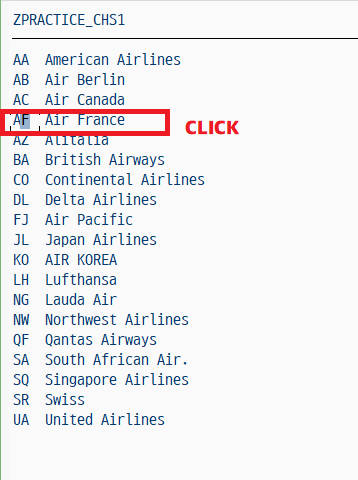 <BR>
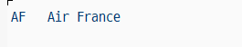 <BR>

GET CURSOR 구문은 현재 커서의 필드명, 라인, 값을 가져 오는 명령어이다.<BR>
AF Air France라인을 더블클릭하게 되면 AT LINE-SELECTION 부분이 실행되고, GET CURSOR 구문에서 필드명과 값을 할당받는다. <BR>
SY-LISEL 시스템 변수는 LIST에서 선택한 라인의 값 전부를 가지고 있다. <br>
SPLIT 구문을 이용해서 시스템 변수 SY-LISEL을 공백 ' '으로 구분해서 각 G_CARRID, G_CONNID 변수에 값을 할당한다.
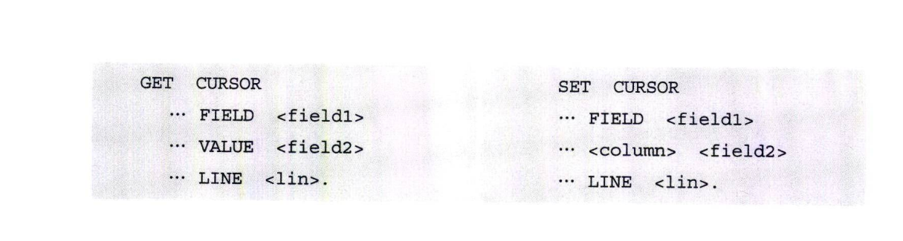 <BR>
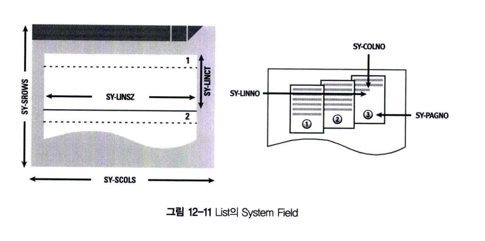 <BR>

### SYSTEM-FIELD
- SY-TITLE
  - Program의 Title(Text Element 부분에서 입력)
- SY-LINCT
  - Report Statement에서 지정한 한 Page의 Line 수
- SY-LINSZ
  - Report Statement에서 지정한 Line의 길이
- SY-SROWS
  - Current Window의 Line 수
- SY-SCOLS
  - Current Window의 Column 수
- SY-PAGNO
  - Page Number(Current Page)
- SY-LILLI
  - 선택된 Line이 몇 번째 Line인지를 알 수 있다.
- SY-LINNO
  - 각 Page의 Line Number
- SY-COLNO
  - Current Column의 Number
- SY-LISEL
  - 선택한 Line의 모든 값
- SY-CPAGE
  - Current Page의 Page Number
- SY-LSIND
  - LIST의 순번, Secondary List

## 4 AT PF<NN>
PF &#60;nn&#62;으로 선언된 Function을 수행한다. Function Key nn 번을 눌렀을 때 발생하는 이벤트이다. <br>
&#60;nn&#62;은 1 ~ 24번까지의 숫자이다.
```abap
REPORT Z12_18.

START-OF-SELECTION.
    WRITE 'Function Key Test PF5, PF6, PF7'.

AT PF5.
    PERFORM wlist.

AT PF6.
    PERFORM wlist.

AT PF7.
    PERFORM wlist.

FORM wlist.
    write :
    / 'You selected below Function Key',
    / 'SY-UCOMM = ', SY-UCOMM.
ENDFORM.    
```
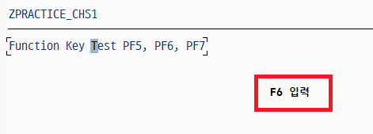<BR>
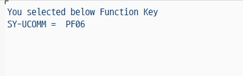

## 5 AT USER-COMMAND
프로그램에서 Function으로 선언된 기능을 수행한다. <br>
메뉴 바의 기능을 선택하거나 버튼을 눌렀을 때 발생하는 이벤트이다. <br>
```abap
AT USER-COMMAND.
```
```ABAP
REPORT Z12_19.

START-OF-SELECTION.
    SET PF-STATUS 'TEST'.
    WRITE : 'Click the button'.

AT USER-COMMAND.
    CASE SY-UCOMM.
        WHEN 'FC1'.
            LEAVE PROGRAM.
    ENDCASE.            
```