# 프로그램 구조(선언)
Report 프로그램은 다음과 같이 크게 3가지 구조로 분류할 수 있다. <br>
① 데이터 선언부와 조회 선택 화면(SELECTION SCREEN)<br>
② 실행 시점까지의 Event<br>
③ 데이터를 뿌려주는 List Event

## 1 프로그램 선언문
프로그램을 선언하는 구문에는 REPORT &#60;프로그램 이름&#62;의 기본 구조에 추가 옵션들이 존재한다. <BR>
1&#41; 프로그램 LIST Heading 지정 <br>
프로그램을 실행한 리스트 화면에 프로그램 이름을 기본 Heading으로 사용할지 결정하게 된다. <br>
다음 구문을 기술하면 기본 Heading을 삭제하게 된다.
```abap
REPORT Z12_02 NO STANDARD PAGE HEADING.

WRITE 'List Heading Test'.
```
사용자가 원하는 Heading을 넣으려면 List Process 이벤트의 TOP-OF-PAGE에서 스크립트를 추가하면 된다. <BR>
아래 그림은 프로그램 이름은 기본 Heading으로 사용한 경우와 그렇지 않은 경우를 비교하여 보여주고 있다. <br>
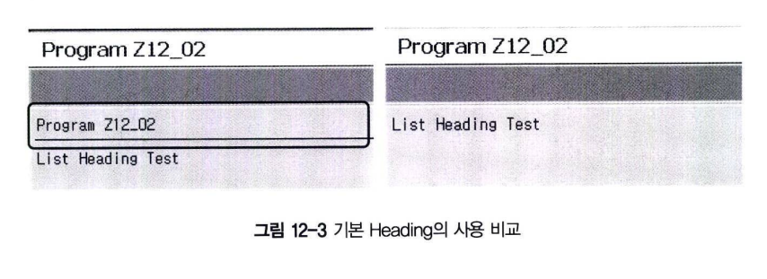

2&#41; Line-Size <br>
Output List의 넓이를 지정한다. 넓이를 0으로 설정하거나, LINE-SIZE 구문을 삭제하면 표준 길이를 사용하게 된다.
```abap
REPORT Z12_03 LINE-SIZE 30.

WRITE 'Line Size Test'.
```
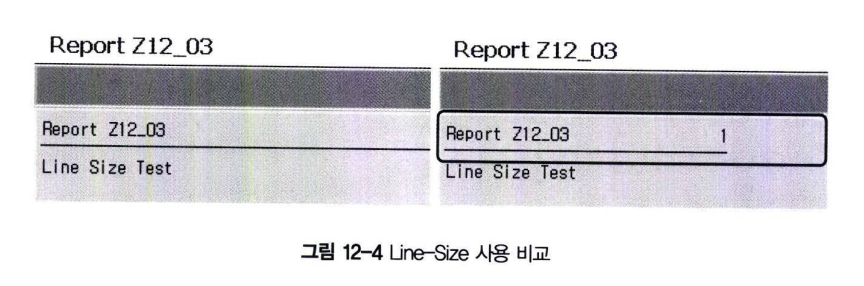

3&#41; Message ID <br>
ABAP 프로그램에서 사용할 MESSAGE ID를 선언한다.
```ABAP
REPORT Z12_04 MESSAGE-ID <message-id>.
```

## 2 DATA 선언
프로그램에서 사용하게 될 테이블과 데이터를 선언하게 된다.<br>
복잡한 프로그램에서는 INCLUDE(프로그램 이름) TOP 구문에 포함된다.
```ABAP
REPORT pgm_id " 프로그램 ID
INCLUDE pgm_idTOP.
```

INCLUDE 프로그램은 모듈 풀 프로그램에서 주로 사용하게되며, R/3 Repository에 저장되는 오브젝트로서 독립적으로 실행될 수 없는 프로그램이다. <br>

&#39;SELECT * FROM SFLIGHT WHERE ~~&#39; 구문 만으로 SFLIGHT는 하나의 구조체 변수로 활용할 수 있다.
```ABAP
TABLES : sflight.
DATA : lv_carrid TYPE sflight-carrid.
```

## SELECTION SCREEN
프로그램의 조회 조건을 입력할 수 있는 SELECTION SCREEN을 생성하는 부분이다. <BR>
리포트 프로그램이 실행되면, SELECTION SCREEN이 자동으로 생성된다. <BR>
SELECTION SCREEN은 사용자와 상호 작용을 하기 위한 INPUT 필드와 같이 선택 조건을 입력할 수 있는 화면을 제공한다. <BR>
리포트 프로그램에서 SELECTION SCREEN은 'INCLUDE 프로그램명SEL(또는TOP)'에 포함하는 것이 좋다. <BR>
SELECTION SCREEN은 개발자가 정의하지 않아도, 자동으로 스크린을 생성하고 Flow logic을 구현하도록 도와준다.
```abap
SELECT-OPTIONS : sel_carr FOR sflight-carrid.
PARAMETERS : p_carr LIKE sflight-carrid.
SEELCTION-SCREEN BEGIN OF BLOCK bl1 WITH FRAME TITLE TEXT-010
SELECTION-SCREEN END OF BLOCK bl1.
```

### 3.1 PARAMETERS
PARAMETERS는 사용자가 값을 입력하도록 Input 필드를 정의한다. 다음 구문을 사용하여 변수를 선언한다. <br>
Data Type F는 SELECTION SCREEN에서 지원되지 않으므로 파라미터로 선언될 수 없다.
```abap
PARAMETERS <p>[(<length>)] <type> [<decimals>].
```

PARAMETERS 변수와 같이 TYPE을 정의하지 않으면 기본 CHAR 1자리 TYPE이 정의된다. <BR>
PARAMETERS에 입력된 값은 데이터를 조회하는 SELECT 구문의 조건 등에 사용된다. <BR>
파라미터는 1개의 값만 입력받을 수 있으며, 체크박스로 보이는 것과 같은 옵션을 추가할 수 있다. <BR>
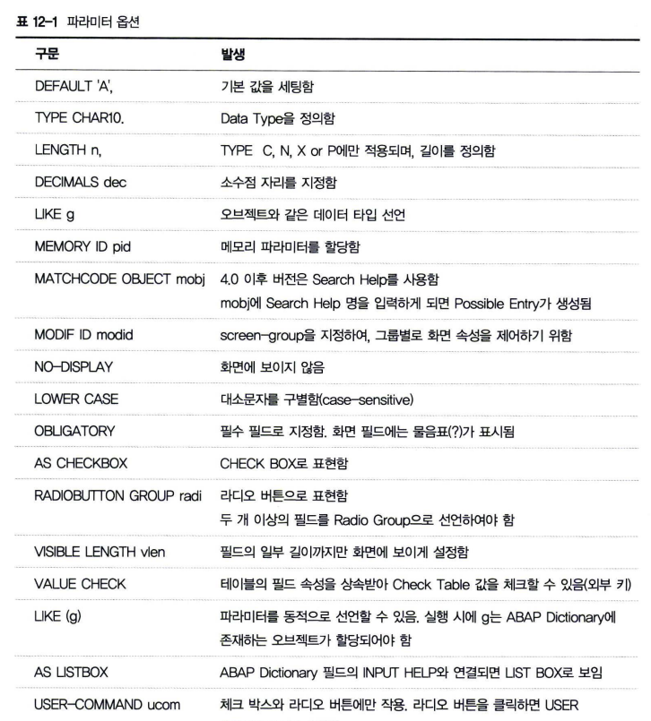 <BR>
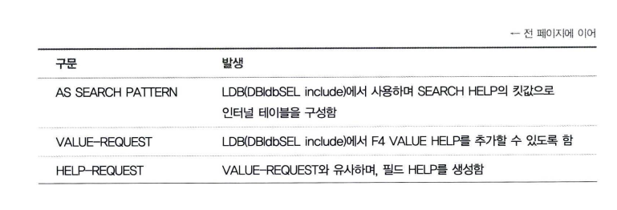 <br>
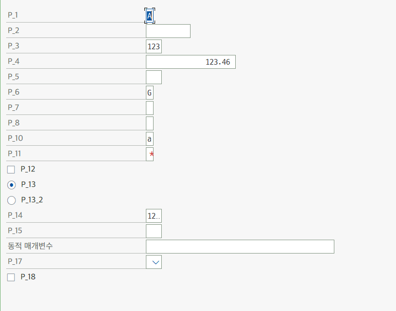

### 3.2 SELECT-OPTIONS
PARAMETERS가 하나의 값만 입력받을 수 있는 INPUT 필드인 반면에 SELECT-OPTIONS은 2개의 INPUT 필드를 통해 다양한 조건 값(Selection Criteria)을 입력받을 수 있다. <br>
RANGE 변수와 같은 구조(인터널 테이블)를 가지고 있다. <br>
SELECT-OPTIONS는 FOR 구문과 항상 병행하여야 하며, 이때 FOR 구문 다음에 올 수 있는 값은 TABLES로 선언된 테이블 필드명이나 <BR>
DATA로 선언된 변수이어야 한다.
```ABAP
SELECT-OPTIONS <seltab> FOR <f>.
```
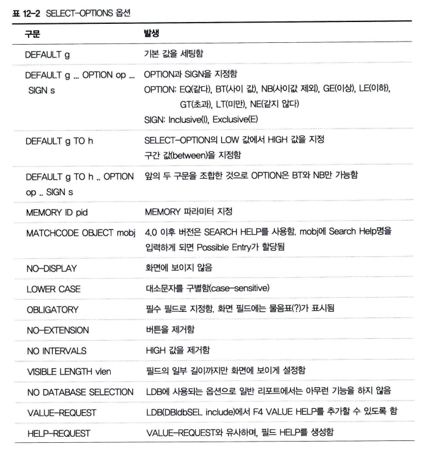
```ABAP
REPORT : Z12_05

TABLES : sflight.
DATA : gs_scarr TYPE scarr.
DATA : gv_val TYPE char20.
SELECT-OPTIONS : s_1  FOR   sflight-carrid      DEFAULT 'AC',
s_2  FOR   gs_scarr-carrid     DEFAULT 'AA*' OPTION EQ SIGN I,
s_3  FOR   gv_val              DEFAULT '1111'  TO  '9999',
s_4  FOR   gv_val              DEFAULT 'AAAA'  TO  'ZZZZ' OPTION BT SIGN E,
s_5  FOR   sflight-carrid      MEMORY ID scl,
s_6  FOR   gv_val              MATCHCODE OBJECT zcarrid,
s_7  FOR   sflight-carrid      MODIF ID car,
s_8  FOR   sflight-carrid      NO-DISPLAY,
s_9  FOR   sflight-carrid      LOWER CASE,
s_10 FOR   sflight-carrid      OBLIGATORY,
s_11 FOR   sflight-carrid      NO-EXTENSION,
s_12 FOR   sflight-carrid      NO INTERVALS,
s_13 FOR   sflight-carrid      VISIBLE LENGTH 1.
```
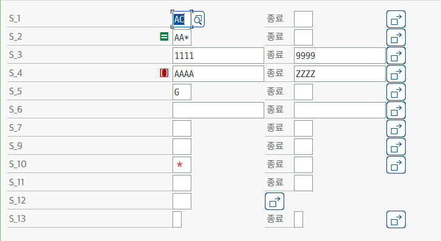 <BR>

다음 그림 12-5는 SELECT-OPTIONS에서 입력할 수 있는 Multiple Selection 입력 팝업창이다 <br>
Single Value 여러 개를 입력하거나 범위 값을 설정할 수 있다. <br>
이러한 방법으로 구성된 SELECTION TABLE은 다음 구문과 같이 OPEN SQL의 WHERE 조건에서 사용된다.
```ABAP
SELECT * FROM SPFLI WHERE CARRID IN <seltab>.
```
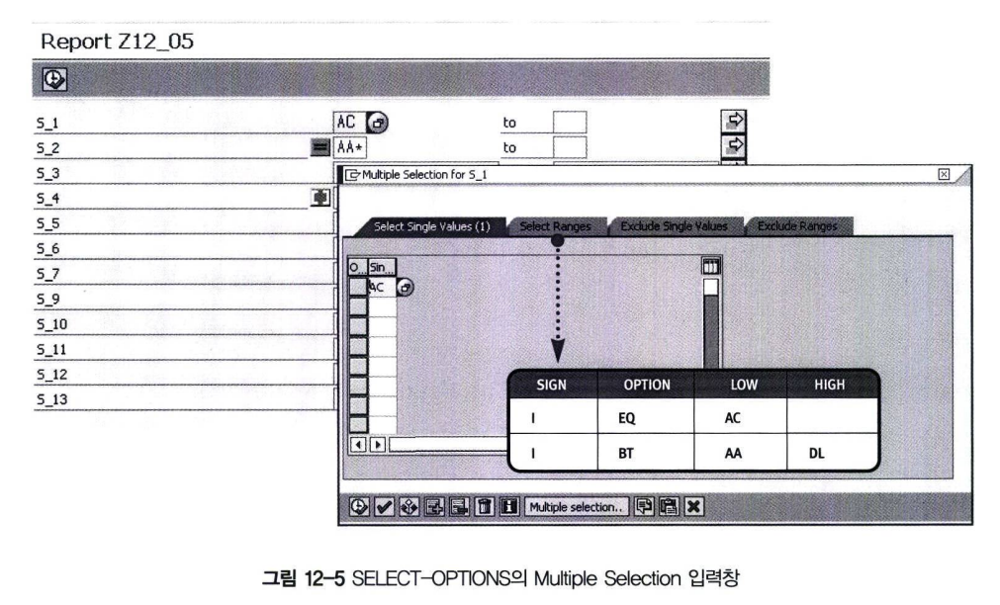

### 3.3 SELECTION-SCREEN
PARAMETER와 SELECTION-OPTION을 사용하면 ABAP 프로그램이 자동으로 빌드 내역과 길이를 조절해서 <BR>
화면(SELECTION SCREEN)을 생성한다. 시스템이 생성하는 화면을 사용자 입맛에 맞게 화면 구성 요소들을 배치하고 싶으면 <BR>
SELECTION-SCREEN 구문을 이용할 수 있다. <BR>
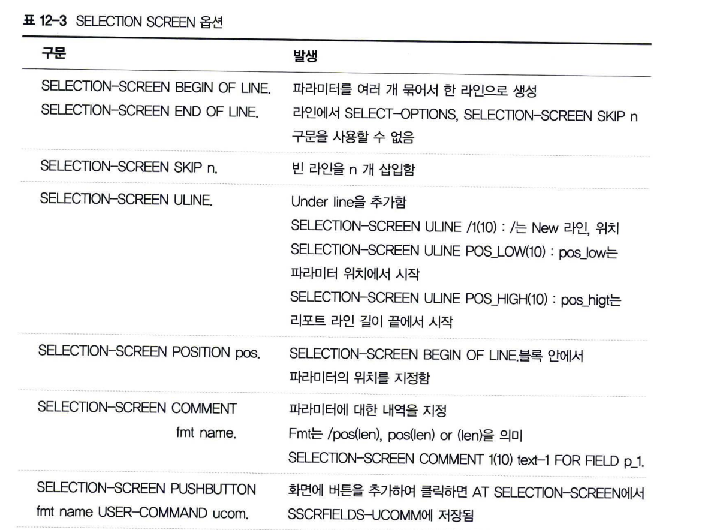<BR>
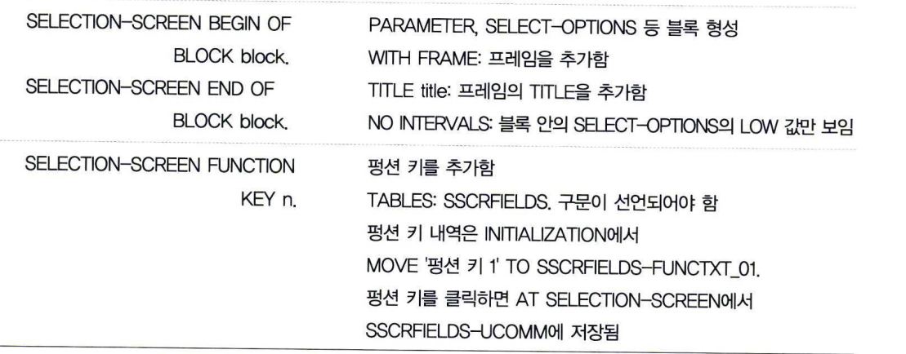 <br>
```abap
TABLES : scarr, sscrfields.

SELECTION-SCREEN BEGIN OF LINE.
SELECTION-SCREEN COMMENT 1(10) TEXT-001 FOR FIELD p_1.
PARAMETERS : p_1 LIKE scarr-carrid.

SELECTION-SCREEN POSITION POS_LOW.
PARAMETERS : p_2 LIKE scarr-carrname.

SELECTION-SCREEN END OF LINE.

SELECTION-SCREEN SKIP 2.
SELECTION-SCREEN ULINE.
SELECTION-SCREEN ULINE /1(10).
SELECTION-SCREEN ULINE pos_low(10).
SELECTION-SCREEN ULINE pos_high(10).

SELECTION-SCREEN PUSHBUTTON /pos_low(10)  TEXT-002  USER-COMMAND btn01.

SELECTION-SCREEN BEGIN OF BLOCK block WITH FRAME TITLE TEXT-003.
PARAMETERS : p_3 TYPE c.
select-options : s_1 for scarr-carrid.
SELECTION-SCREEN END OF BLOCK block.

SELECTION-SCREEN BEGIN OF BLOCK block2 WITH FRAME TITLE TEXT-004 NO INTERVALS.
PARAMETERS : p_4 TYPE c.
SELECT-OPTIONS  : s_2 FOR scarr-carrid.
SELECTION-SCREEN END OF BLOCK block2.
SELECTION-SCREEN FUNCTION KEY 1.

INITIALIZATION.
  MOVE 'Function Key 1' TO sscrfields-functxt_01.

AT SELECTION-SCREEN.
  IF sscrfields-ucomm = 'FC01'.
    MESSAGE 'You clicked Function Key 1' TYPE 'I'.
  ENDIF.

  IF sscrfields-ucomm = 'BTN01'.
    MESSAGE 'You clicked Function Key button' TYPE 'I'.
  ENDIF.
```
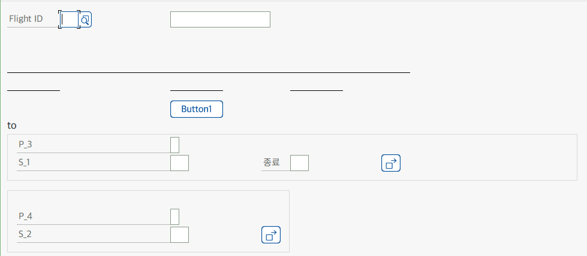

## 4 Message ID
ABAP 프로그램 화면 하단에 Message를 보여주려면 리포트 선언 첫 문장에 MESSAGE-ID를 기술해야 한다.
```abap
REPORT <Reportname> MESSAGE-ID <messgae-id>.
MESSAGE Ennn WITH <field1> ... <field4>.
```

MESSAGE ID를 생성해보자. <BR>
1. T-CODE : SE91을 이용해서 메시지 ID를 생성한다.
2. 앰퍼샌트 기호는 message ~ WITH에 사용되는 파라미터이다. <br> 예를 들어, & & 두 개를 가지는 메시지 번호 001이 존재하면, <br> ABAP프로그램에서 다음 구문 처럼 사용하게 된다. <br> **MESSAGE s001 WITH '1' '2'.**