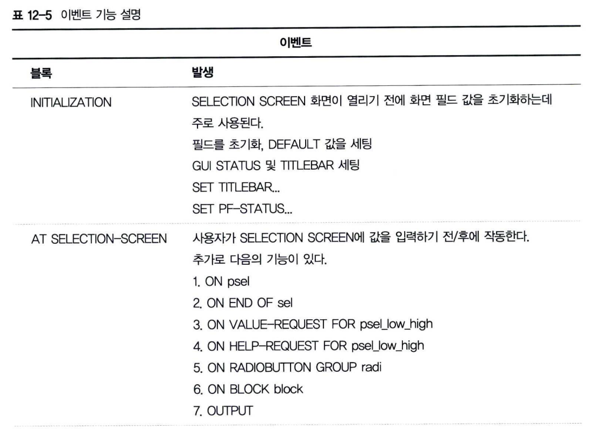
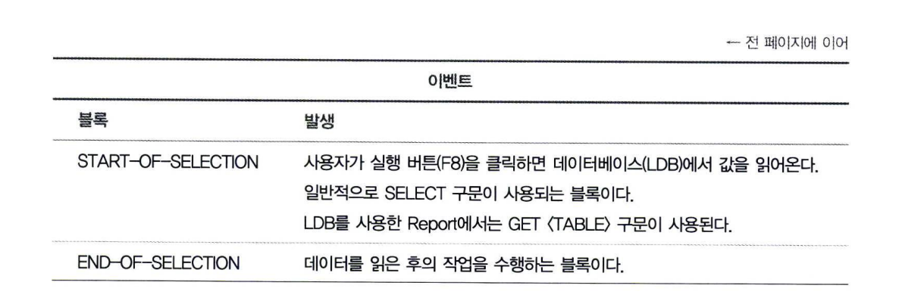
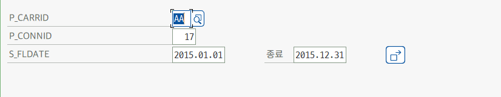
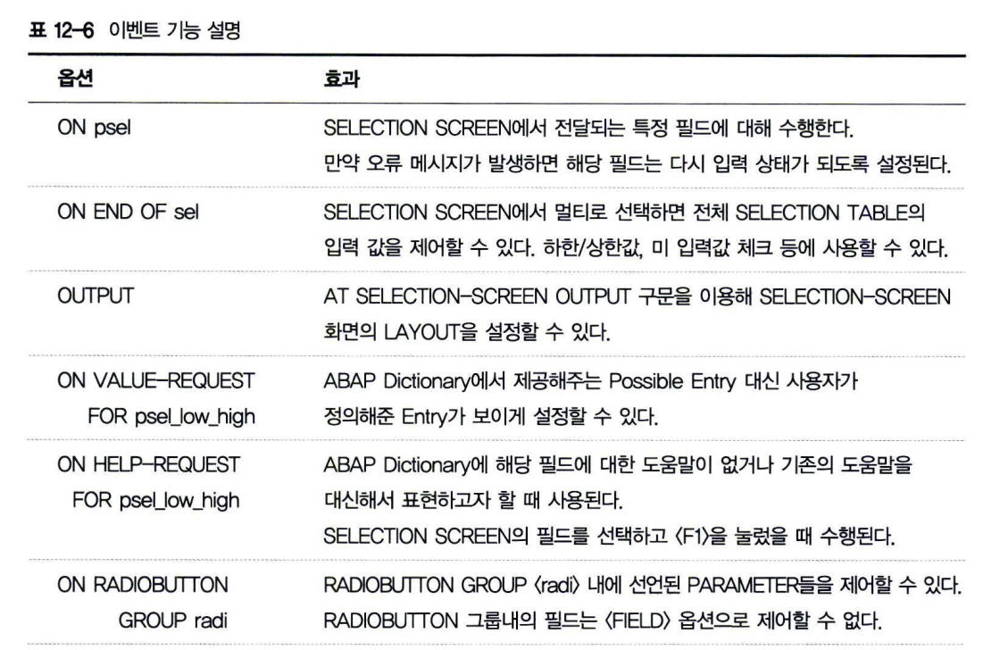
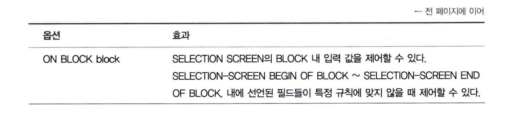
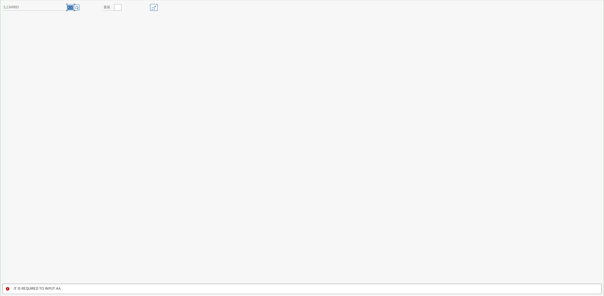
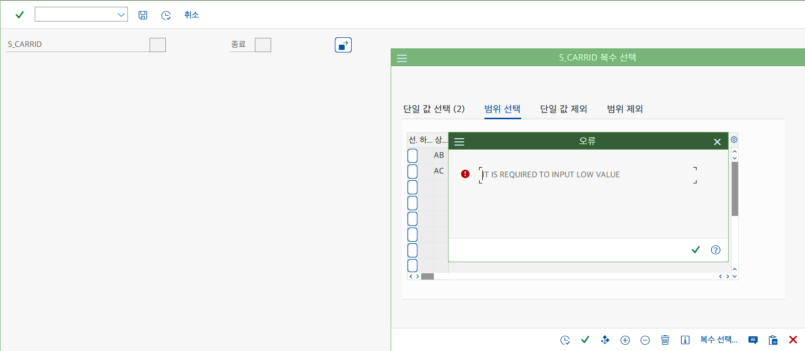
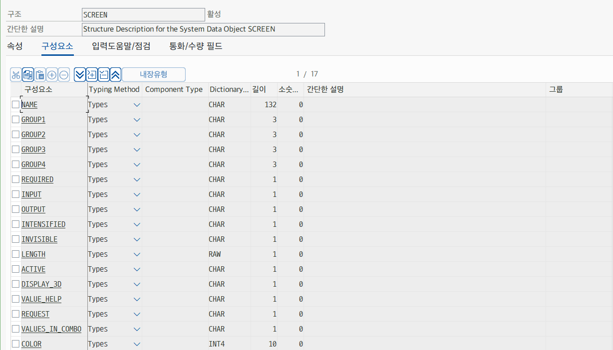
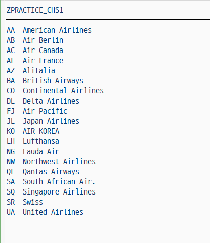

# 프로그램 구조(이벤트)
프로그램을 실행하면 화면에 보이는 필드들을 초기화하고, 사용자가 입력한 값에 대한 결과를 반환하는 사용자 이벤트에 대해서 학습한다.
```abap
INITIALIZATION.
AT SELECTION-SCREEN. " ( OUTPUT, ON VALUE REQUEST )
START-OF-SELECTION. " ( SELECT * FROM ~ 또는 GET <TABLE> ...)
END-OF-SELECTION.
```
 <BR>


## 1 INITIALIZATION
이벤트 중에서 프로그램을 실행했을 때 가장 먼저 수행되는 것은 INITIALIZATION이다. <BR>
이 이벤트는 SELECTION-SCREEN이 조회도기 전에 작동하므로 변수에 초기값을 지정할 때 흔히 사용된다. <BR>
즉, INITIALIZATION 이벤트에서 SELECTION-SCREEN에 사용되는 필드들의 초기값을 지정함으로써, 사용자가 자주 사용하는 값을 자동으로 입력되게 한다.
```ABAP
INITIALIZATION.
    p_1 = 'AA'.
```
```ABAP
TABLES : sflight.

PARAMETERS : p_carrid LIKE  sflight-carrid,
             p_connid LIKE  sflight-connid.

SELECT-OPTIONS : s_fldate FOR sflight-fldate.

INITIALIZATION.
  p_carrid = 'AA'.
  p_connid = '17'.

  s_fldate-low = '20150101'.
  s_fldate-high = '20151231'.
  APPEND s_fldate.
```
 <BR>

**SELECT-OPTION은 인터널 테이블 형태이기 때문에 반드시 APPEND 구문으로 데이터를 추가해야한다.** <BR>
**INTERNAL TABLED에서도 공부했듯이 데이터 할당과 APPEND는 항상 쌍으로 움직여야 한다는 것을 명심하자** <BR>
INITIALIZATION 이벤트에서는 위의 예제 코드와 같이 필드 초기값을 세팅하는 데 주로 사용된다. <BR>
이외 표준 프로그램에서 제공하는 메뉴와 다른 메뉴(SET PFSTATUS)를 구성할 때, <BR>
프로그램 타이틀을 지정할 때 (SET TITLE), 레이아웃 초기값 세팅할 때 등 유연성 있게 원하는 작업을 추가할 수 있다. <BR>
INITIALIZATION 이벤트에서 초기값을 세팅할 필요가 없을 때는 해당 구문을 삭제해도 프로그램 에러가 발생하지는 않지만 <BR>
프로그램 가독성 차원에서 그대로 두는 것이 바람직하다.

## 2 AT SELECTION-SCREEN
SELECTION-SCREEN에서 Input Field의 값이 변동되었을 때 실행되는 이벤트이며, <br>
INITIALIZATION과 START-OF-SELECTION 사이에 수행되어 사용자 액션에 대해 반응하고, 화면 필드를 조절한다.<BR>
예를 들어 SELECTION-SCREEN에 사업부 필드가 존재하고, 사용자는 다른 사업부의 데이터를 조회하지 못하도록 <BR>
설정해야 할 상황이 생길 수 있다. <BR>
이때는 사용자가 사업부 코드를 변경하면 AT SELECTION-SCREEN 이벤트가 자동으로 실행되기 때문에, 해당 이벤트 권한 체크 로직을 추가하면 된다.
```ABAP
AT SELECTION-SCREEN.
AUTHORITY-CHECK OBJECT 'Z_TEST' ID 'CARRID' FIELD pa_carr
                                ID 'ACTVT' FIELD '03'.
IF SY-SUBRC = 4.
    MESSAGE e000 WITH '권한이 없습니다.'
ENDIF.                                    
```
 <BR>
 <BR>

**1&#41; AT SELECTION-SCREEN &#60;ON FIELD&#62; <BR>**
SELECTION SCREEN에서 전달되는 특정 필드에 대해 수행한다.<BR>
오류 메시지가 발생하면 해당 필드는 다시 값을 입력받도록 커서가 위치하게 된다.
```ABAP
REPORT Z12_08.

TABLES : SCARR.

SELECT-OPTIONS : S_CARRID FOR SCARR-CARRID.

AT SELECTION-SCREEN ON S_CARRID.

IF S_CARRID-LOW NE 'AA'.
    MESSAGE 'IT IS REQUIRED TO INPUT AA' TYPE 'E'.
ENDIF.    
```


**2&#41; AT SELECTION-SCREEN ON END OF sel** <BR>
SELECTION SCREEN에서 여러 건의 값을 입력할 때 전체 SELECTION TABLE의 입력 값을 제어할 수 있다. <BR>
즉 하한/상한값, 미입력 값 등을 체크할 때 사용할 수 있다.
```ABAP
AT SELECTION-SCREEN ON END OF sel.
```
```ABAP
TABLES : SCARR.
SELECT-OPTIONS : S_CARRID FOR SCARR-CARRID.

AT SELECTION-SCREEN ON END OF S_CARRID.
    LOOP AT S_CARRID.
        IF S_CARRID-LOW IS INITIAL.
            MESSAGE 'IT IS REQUIRED TO INPUT LOW VALUE' TYPE 'E'.
        ENDIF.
    ENDLOOP.                    
```
SELECT-OPTION의 LOW 필드에 값을 입력하지 않고 실행하게 되면 에러 메시지 발생. <BR>
 

**3&#41; AT SELECTION-SCREEN OUTPUT** <BR>
SELECTION-SCREEN 화면의 LAYOUT 속성(강조, 조회 전용과 같은 필드 속성)을 설정할 수 있다. <BR>
아래 그림과 같이 스크린 속성을 T-CODE : SE11 에서 조회한 후에 아래 코드와 같이 추가해주면 된다. <BR>
```ABAP
AT SELECTION-SCREEN OUTPUT.
```


**4&#41; ON VALUE-REQUEST FOR psel_low_high** <BR>
ABAP Dictionary에서 제공해주는 Possible Entry 대신 사용자가 정의해준 entry가 보이게 설정할 수 있다. <br>
```abap
AT SELECTION-SCREEN ON VALUE-REQUEST FOR psel_low_high.
```

**5&#41; ON HELP-REQUEST FOR** <BR>
ABAP Dictionary에 해당 필드의 도움말이 없거나 기존의 도움말을 대신해서 표현하고자 할 때 사용된다. <br>
SELECTION SCREEN의 필드를 선택하고 F1을 눌렀을 때 수행된다. <BR>
Logical Database에 선언된 값들은 제어할 수 없으며 PARAMETERS, SELECT-OPTIONS로 선언해서 제어할 수 있다.<BR>
```ABAP
AT SELECTION-SCREEN ON HELP-REQUEST FOR <field>.
```

## START-OF-SELECTION
조회 화면의 필드에 대한 초기값 세팅 및 데이터 검증이 완료되었다면, 이제 데이터베이스에서 원하는 데이터를 가져오는 실질적인 작업을 수행해야한다. <BR>
LDB를 이용한 프로그램이라면 GET 구문, 일반 프로그램이라면 SQL 문이 수행된다. <BR>
SQL 수행 이전에 CLEAR 구문이나 로직 상의 준비 작업을 한 후에 SELECT 하는 것이 좋다. <BR>
SELECT를 수행하면서 시간이 지연될 경우 SQPGUI_PROGRESS_INDICATOR 를 사용해서 모래시계를 보여주는것도 방법중의 하나이다.
```ABAP
START-OF-SELECTION.
```
```ABAP
DATA : g_total TYPE  i,
       g_cnt   TYPE  i,
       g_index TYPE  i.

DATA : gt_sflight TYPE TABLE OF sflight WITH HEADER LINE.

START-OF-SELECTION.

  SELECT * INTO CORRESPONDING FIELDS OF TABLE gt_sflight FROM sflight.

  DESCRIBE TABLE gt_sflight LINES g_total.

  LOOP AT gt_sflight.
    g_cnt = g_cnt + 1.
    PERFORM progress_indicator USING g_cnt g_total ' Progressing...'.
  ENDLOOP.

  WRITE : 'success'.

FORM progress_indicator USING VALUE(p_cur)
                              VALUE(p_total)
                              VALUE(p_text).

  DATA : lv_text(50) TYPE c,
         lv_idx(3)   TYPE n.

  lv_idx = ( p_cur / p_total ) * 100.

  CONCATENATE lv_idx ' % : ' p_text INTO lv_text.

  CALL FUNCTION 'SAPGUI_PROGRESS_INDICATOR'
    EXPORTING
      percentage = lv_idx
      text       = lv_text
    EXCEPTIONS
      OTHERS     = 0.

ENDFORM.
```

## 4 END-OF-SELECTION
실행 환경에서 호출되는 마지막 이벤트로서 SELECT 구문에서 모든 데이터를 읽은 후 화면에 Write 하기 전에 수행된다. <br>
인터널 테이블에 저장된 데이터들을 변형하는 작업을 할 수 있다.
```abap
END-OF-SELECTION.
```
```ABAP
DATA : gs_str  TYPE scarr,
       gt_itab TYPE TABLE OF scarr.

START-OF-SELECTION.
  SELECT * INTO CORRESPONDING FIELDS OF TABLE gt_itab FROM scarr.

END-OF-SELECTION.
  LOOP AT gt_itab INTO gs_str.
    WRITE :/ gs_str-carrid, gs_str-carrname.
  ENDLOOP.
```
