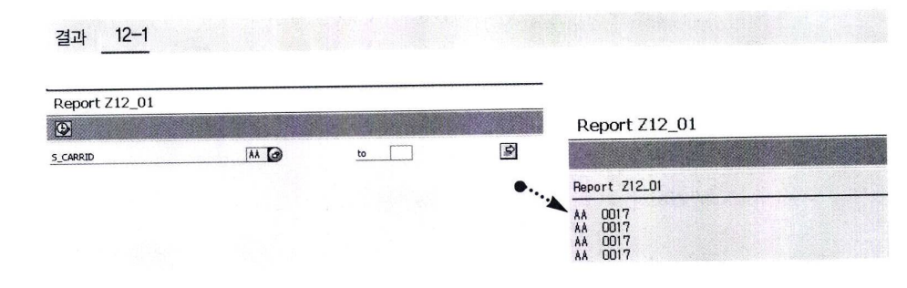

# 프로그램 생성
Report Program 생성

① 유형(Type)
- Executive Program (1)
  - T-CODE 없이 SE38에서 직접 실행 가능
  - SELECTION SCREEN과 Output List로 구성
  - Logical DB 사용 가능
- Module Pool (M)
  - Screen Painter Screen (M)
  - Screen module Processing
  - T-CODE나 Menu Function에 의해서만 실행됨
- Include (I)
  - 다음 프로그램에서 Include로 호출되는 내장형 프로그램
- Subroutine (S)
  - External PERFORM 구문에서 호출해서 사용 가능한 FORM 문을 구성
- 기타 유형
  - F~K는 Program Attribute에서 변경할 수 없으며 각각의 Builder에서 관리한다.

② Status(상태) <br>
프로그램 상태에 따라 특정 Utility 사용 불가 <br>
Ex) 시스템 프로그램을 선택하면 debug 불가

③ Authorization Group (권한 그룹) <br>
프로그램 실행/수정과 관련된 권한 그룹 할당. <br>
보안 관련 프로그램이면 권한 그룹 세팅 필요.

④ Logical database : TYPE-1인 경우만 선택 <br>
LDB를 사용해서 프로그램을 구현한다. 사용 빈도가 높은 테이블의 데이터를 조회하기 위해 JOIN이 자주 <BR>
사용되고, 조회 조건이 유사한 경우를 하나의 패키지로 생성해서 재사용 할 수 있도록 해주는 것이 LDB이다.

```ABAP
REPORT Z12_01.

DATA : gt_sflight TYPE TABLE OF sflight,
       gs_sflight TYPE sflight.

SELECTION-OPTIONS : s_carrid FOR gs_sflight-carrid.

INITIALIZATION.
    s_carrid-sign = 'I'.
    s_carrid-option = 'EQ'.
    s_carrid-low = 'AA'.
    APPEND s_carrid.

START-OF-SELECTION.
    SELECT carrid connnid
        FROM sflight
        INTO CORRESPONDING FIELDS OF TABLE gt_sflight WHERE carrid IN s_carrid.

END-OF-SELECTION.
    LOOP AT gt_sflight INTO gs_sflight.
        WRITE :/ gs_sflight-carrid, gs_sflight-connid.
    ENDLOOP.        
```

SELECTION-OPTIONS 또는 PARAMETERS로 데이터를 선언하고 리포트 프로그램을 실행 하게 되면 결과 12-1과 같이 자동으로 값을 입력받을 수 있는 화면이 생성된다. <BR>
사용자에게 조회 조건 값을 입력받을 수 있는 이 화면은 SELECTION SCREEN이라고 정의한다. <BR>
INITIALIZATION과 같은 리포트 프로그램의 각 영역에 대한 부분은 뒤에서 자세히 학습한다. <br>
