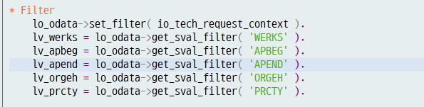
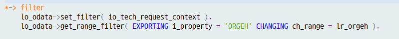

# odata에서 필터가 RANGE 변수로 들어오는경우
 <br> 파라미터로 들어오는 Filter

 <br> Range로 들어오는 Filter

필터가 RANGE로 들어올 경우에는 바로 위의 그림 처럼 사용하여야 하며 보통의 경우 Method에서 직접적으로 처리하기 때문에 Header Line을 사용할 수 없다.<br>(물론 Function으로 만들어서 서브루틴으로 처리하면 헤더라인을 사용할 수 있다. )

예시 로직은 아래와 같다.
```abap
  METHOD orgchieflistset_get_entityset.

    DATA : lv_pernr TYPE persno.

    DATA : ls_return TYPE bapiret2.

    DATA : lr_orgeh  TYPE RANGE OF orgeh.

    DATA : pt_list TYPE TABLE OF zhrs2103,
           ps_list LIKE LINE OF pt_list.

    TYPES : BEGIN OF ty_hrp1000,
              objid TYPE hrobjid,
              stext TYPE stext,
            END OF ty_hrp1000.

    TYPES : BEGIN OF ty_chief,
              orgeh TYPE orgeh,
              pernr TYPE persno,
            END OF ty_chief.

    DATA : lt_chief TYPE TABLE OF ty_chief,
           ls_chief LIKE LINE OF lt_chief.

    DATA : lt_hrp1000 TYPE TABLE OF ty_hrp1000.

*-> OData Class
    DATA : lo_odata TYPE REF TO zcl_hr_odata.
    CREATE OBJECT lo_odata.

*-> Login Pernr
    TRY.
        CALL METHOD lo_odata->get_pernr.
      CATCH /iwbep/cx_mgw_busi_exception.
        RAISE EXCEPTION lo_odata->busi_exception.
        RETURN.
    ENDTRY.

*-> Login Pernr.
    lv_pernr = lo_odata->employee-employee_id.

*-> filter
    lo_odata->set_filter( io_tech_request_context ).
    lo_odata->get_range_filter( EXPORTING i_property = 'ORGEH' CHANGING ch_range = lr_orgeh ).

*-> 부서명
    SELECT * FROM hrp1000
      WHERE objid IN @lr_orgeh
        AND plvar =  @zcl_hr_cnst=>plvar
        AND otype =  @zcl_hr_cnst=>otype-o
        AND istat =  @zcl_hr_cnst=>istat
        AND langu =  @sy-langu
        AND begda <= @sy-datum
        AND endda >= @sy-datum
       INTO CORRESPONDING FIELDS OF TABLE @lt_hrp1000.

    LOOP AT lt_hrp1000 INTO DATA(ls_hrp1000).

*-> 조직장 사번
      PERFORM get_chief_pernr IN PROGRAM saplzhr00
                                   USING ls_hrp1000-objid
                                         sy-datum
                                CHANGING ls_chief-pernr.

      ls_chief-orgeh = ls_hrp1000-objid.
      APPEND ls_chief TO lt_chief.
      CLEAR ls_chief.

*-> 사진 URL
      PERFORM get_pernr_photo_url IN PROGRAM saplzhr00
                                       USING ls_chief-pernr
                                    CHANGING ps_list-photo.

*-> 부서명
      ps_list-orgtx = zcl_hr_common=>get_objid_text( i_otype = zcl_hr_cnst=>otype-o
                                                     i_langu = sy-langu
                                                     i_objid = ls_chief-orgeh      " 위에서 구한 orgeh
                                                     i_datum = sy-datum ).

*-> 성명, 인사영역, 인사하위영역, 직책
      SELECT * FROM pa0001
              WHERE pernr  = @ls_chief-pernr
                AND orgeh  = @ls_chief-orgeh
                AND begda <= @sy-datum
                AND endda >= @sy-datum
               INTO TABLE @DATA(lt_pa0001).

      LOOP AT lt_pa0001 INTO DATA(ls_pa0001).

        ps_list-pernr = ls_pa0001-pernr.   " 사번이 필요하다고 한다면

        ps_list-ename   = ls_pa0001-ename. " 성명

        ps_list-name1 = zcl_hr_common=>get_name1( i_werks = ls_pa0001-werks ).     " 인사영역명

        ps_list-btext   = zcl_hr_common=>get_btext(  i_werks = ls_pa0001-werks     " 인사하위영역명
                                                     i_btrtl = ls_pa0001-btrtl ).

        ps_list-zzjikct = zcl_hr_common=>get_jikcht( i_werks   = ls_pa0001-werks   " 직책명
                                                     i_zzjikch = ls_pa0001-zzjikch ).
      ENDLOOP.

*-> 전화번호
      SELECT * FROM pa0105
              WHERE pernr =  @ls_chief-pernr
                AND subty = 'CELL'
                AND begda <= @sy-datum
                AND endda >= @sy-datum
              INTO TABLE @DATA(lt_pa0105_c).

*-> 이메일
      SELECT * FROM pa0105
              WHERE pernr =  @ls_chief-pernr
                AND subty = '0010'            " pa20 -> 회사메일주소
                AND begda <= @sy-datum
                AND endda >= @sy-datum
              INTO TABLE @DATA(lt_pa0105_e).

      LOOP AT lt_pa0105_c INTO DATA(ls_pa0105_c).
        ps_list-phone = ls_pa0105_c-usrid.
      ENDLOOP.

      LOOP AT lt_pa0105_e INTO DATA(ls_pa0105_e).
        ps_list-email = ls_pa0105_e-usrid_long.
      ENDLOOP.

      APPEND ps_list TO pt_list.
      CLEAR ps_list.
    ENDLOOP.

    SORT pt_list BY pernr. " 정렬 기준은 어떻게 할 것인지에 대해서 한 번 여쭤보기 / 정렬이 필요하다면
                           " 현재는 일단 사번의 오름차순대로 정렬

*-> 에러처리
    IF ls_return-type IS NOT INITIAL.
      lo_odata->create_exception2( ls_return ).
      RAISE EXCEPTION lo_odata->busi_exception.
      RETURN.
    ENDIF.

    CHECK pt_list[] IS NOT INITIAL.
    MOVE pt_list[] TO et_entityset[].

  ENDMETHOD.
```