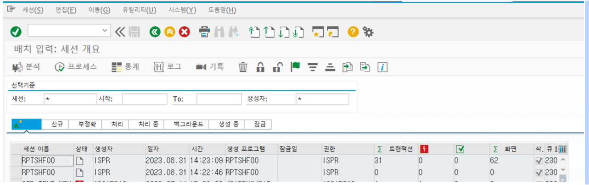

# 공휴일 달력지정

## 1 SPRO

## 2 시간관리 -> 근무일정 -> 공휴일 클래스 정의, T-CODE : SCAL

## 3 공휴일 -> 공휴일 일자 설정
  
A : 임시공휴일 선택  
B : 변경 버튼 클릭  
C : 삽입일 버튼 클릭 공휴일 일자 입력  
D : 변경 버튼 클릭  

## 4 공휴일 달력 -> 공휴일 달력에 공휴일 지정
  

공휴일 달력ID K0 선택 후 변경 버튼 클릭  
  

임시공휴일 효력 종료일 일자 조정 후 저장  

공휴일 달력 ID K0 선택 후 달력 버튼 클릭  

공휴일 등록/변경 한 연도 선택 후 연도 버튼 클릭  

공휴일 등록/변경 내역 확인  

## 5 공휴일 CTS 생성 상단 빨간색 전송 버튼 클릭 후 CTS NO 생성

## 6 근무 일정 규칙 및 근무일정 -> Batch로 근무일정 생성
  

아래와 같이 입력 후 실행버튼  
공휴일 달력 ID : 공휴일 달력 수정한 ID 
시작월 : 공휴일 수정 월년도  
종료월 : 공휴일 수정 월년도  

CTS NO 생성 및 근무일정 배치 입력 리스트 확인  

## 7 SM35 -> Batch 백그라운드 실행
6번에서 생성한 배치 프로그램 선택 후 프로세스 버튼 클릭
  

백그라운드 선택 후 프로세스 버튼 클릭  

Enter 입력 계속 해주면서 갱신  

배치 프로그램이 정상적으로 끝나면 리스트에서 삭제(에러 시 빨간불)

## 8 PT63 공휴일 적용 확인
공휴일 확인 기간 및 사원 번호 입력

공휴일 등록 확인  
